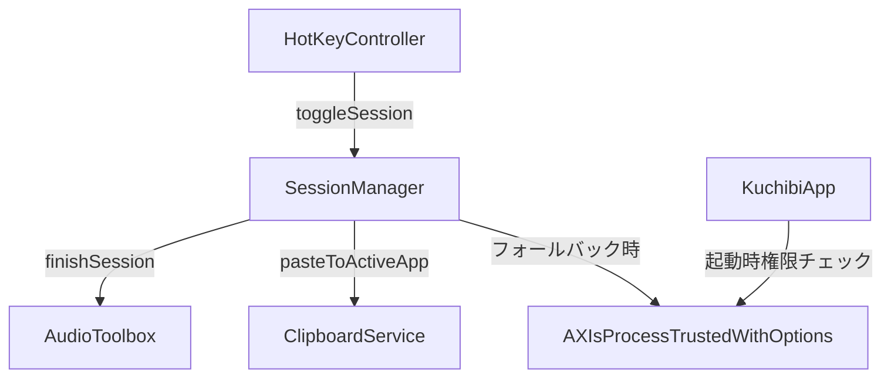
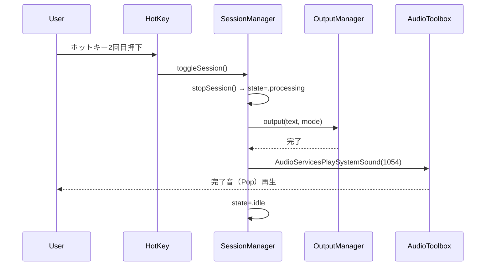
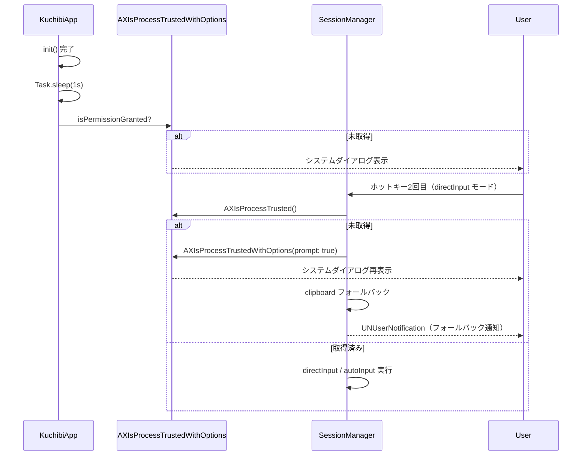

# Design Document: completion-sound-accessibility

## Overview

本機能は2つの問題を解決する。(1) ホットキー2回目押下後にクリップボードコピーまたは自動ペーストが完了したタイミングで通知音を確実に再生する。(2) directInput / autoInput モードに必要なアクセシビリティ権限が未取得の場合、アプリ起動時およびセッション終了時にシステムダイアログを通じて権限を取得できるようにする。

既存の `SessionManager` は `NSSound(named:)` で完了音を鳴らす実装を持つが、macOS 16 (Darwin 25) + MenuBarExtra 環境では ARC によるオブジェクト早期解放により音が再生されない。`AudioServicesPlaySystemSound` (AudioToolbox) への移行で根本解決する。アクセシビリティ権限については現在サイレントフォールバックのみで、ユーザーへの誘導が不十分なため `AXIsProcessTrustedWithOptions` を用いた能動的プロンプトを追加する。

**Users**: 個人ユーザー（1名）。macOS メニューバーアプリとして常駐。
**Impact**: `SessionManager.swift` と `KuchibiApp.swift` への限定的な変更。既存のプロトコル定義変更なし。

### Goals

- `AudioServicesPlaySystemSound` への置き換えにより、すべての macOS バージョン・環境で完了音を確実に再生する
- アプリ起動時（1 秒遅延）にアクセシビリティ権限プロンプトを自動表示する
- 権限不足によるフォールバック時にもプロンプトを再表示して権限取得を促す

### Non-Goals

- 通知音の種類や音量をユーザーが選択できる設定 UI（現行の `sessionSoundEnabled` の範囲内で対応）
- ペースト成功の確実な検知（CGEvent post は fire-and-forget であり、OS 側の応答確認は行わない）
- アクセシビリティ権限取得後の自動セッション再試行

## Architecture

### Existing Architecture Analysis

`SessionManagerImpl` は `@MainActor` のクラスで、`finishSession()` 内で `NSSound(named:)` を使用している。問題点：

- `sound` はローカル変数として確保されるため、`play()` 呼び出し後すぐ ARC で解放されるリスクがある
- macOS 16 + MenuBarExtra ではシステムサウンドキャッシュの挙動が変わっている可能性がある
- `AXIsProcessTrusted()` は確認のみで、`AXIsProcessTrustedWithOptions` による能動的プロンプトを使用していない

### Architecture Pattern & Boundary Map



- 選択パターン: 既存レイヤー構造を維持した最小限の拡張
- 新規コンポーネントなし（既存ファイルへの変更のみ）
- `AudioToolbox` を `SessionManager.swift` に追加 import

### Technology Stack

| Layer | Choice / Version | Role | Notes |
|-------|-----------------|------|-------|
| Sound API | AudioToolbox (macOS SDK) | システムサウンド再生 | NSSound 置き換え |
| Permission API | ApplicationServices / AXUIElement (macOS SDK) | アクセシビリティ権限プロンプト | 追加 import 不要 (`import Carbon` 経由で利用可) |

## System Flows

### 完了音再生フロー



### アクセシビリティ権限フロー



## Requirements Traceability

| Requirement | Summary | Components | Interfaces | Flows |
|-------------|---------|------------|------------|-------|
| 1.1 | clipboard 完了時に完了音 | SessionManager | AudioServicesPlaySystemSound | 完了音再生フロー |
| 1.2 | directInput/autoInput 完了時に完了音 | SessionManager | AudioServicesPlaySystemSound | 完了音再生フロー |
| 1.3 | 完了音は出力処理後に再生 | SessionManager | finishSession の await 後 | 完了音再生フロー |
| 1.4 | サウンド取得失敗時のフォールバック | SessionManager | kSystemSoundID_UserPreferredAlert | — |
| 1.5 | sessionSoundEnabled=OFF で無音 | SessionManager | AppSettings | — |
| 2.1 | 起動時権限プロンプト | KuchibiApp | AXIsProcessTrustedWithOptions | 権限フロー |
| 2.2 | directInput 使用時に権限なし → 再プロンプト | SessionManager | AXIsProcessTrustedWithOptions | 権限フロー |
| 2.3 | 権限なし → clipboard フォールバック | SessionManager | OutputManager | 権限フロー |
| 2.4 | 権限なし → ユーザー通知 | SessionManager | NotificationService | 権限フロー |
| 2.5 | セッション開始前に権限確認 | SessionManager | AXIsProcessTrusted | — |
| 3.1 | sessionSoundEnabled で完了音制御 | SessionManager | AppSettings | — |
| 3.2 | sessionSoundEnabled=ON → 開始音・完了音両方 | SessionManager | AudioServicesPlaySystemSound | — |
| 3.3 | sessionSoundEnabled=OFF → 無音 | SessionManager | — | — |

## Components and Interfaces

| Component | Domain/Layer | Intent | Req Coverage | Key Dependencies | Contracts |
|-----------|-------------|--------|--------------|-----------------|-----------|
| SessionManager | Service | 完了音 API 置き換え・アクセシビリティプロンプト追加 | 1.1–1.5, 2.2–2.5, 3.1–3.3 | AudioToolbox (P0), AppSettings (P0) | State |
| KuchibiApp | App Entry | 起動時アクセシビリティ権限プロンプト | 2.1 | AXIsProcessTrustedWithOptions (P0) | — |

### Service Layer

#### SessionManager の変更点

| Field | Detail |
|-------|--------|
| Intent | 完了音 API を NSSound から AudioServicesPlaySystemSound に置き換え、アクセシビリティ権限プロンプトを追加 |
| Requirements | 1.1, 1.2, 1.3, 1.4, 1.5, 2.2, 2.3, 2.4, 2.5, 3.1, 3.2, 3.3 |

**Responsibilities & Constraints**

- `finishSession()` 内の `NSSound(named:)` 呼び出しを `AudioServicesPlaySystemSound` に置き換える
- `sessionSoundEnabled` が true のとき、出力処理 (`await outputManager.output(...)`) 完了後に完了音を再生する
- `directInput` / `autoInput` モードで `accessibilityTrusted()` が false の場合、`AXIsProcessTrustedWithOptions([kAXTrustedCheckOptionPrompt: true] as CFDictionary)` を呼んでダイアログを表示する
- `startSession()` 内の `NSSound(named: "Tink")` も同様に `AudioServicesPlaySystemSound` に置き換える

**Dependencies**

- Outbound: `AudioToolbox` — 完了音・開始音の再生 (P0)
- Outbound: `AppSettings.sessionSoundEnabled` — 音再生の ON/OFF 判定 (P0)
- Outbound: `AXIsProcessTrustedWithOptions` — アクセシビリティ権限プロンプト (P0)

**Contracts**: State [x]

##### State Management

- 変更なし。既存の `state: SessionState` (.idle / .recording / .processing) を維持
- 追加状態なし（権限プロンプトは fire-and-forget で SessionState に影響しない）

##### Service Interface（変更後の内部シグネチャ）

```swift
// SessionManager.swift への変更（既存の finishSession 内）
import AudioToolbox

private enum SystemSound {
    static let sessionStart: SystemSoundID = 1057  // Tink 相当
    static let sessionEnd: SystemSoundID = 1054    // Pop 相当
    static let fallback: SystemSoundID = SystemSoundID(kSystemSoundID_UserPreferredAlert)
}

// 完了音再生（finishSession 内の NSSound 置き換え）
if appSettings.sessionSoundEnabled {
    AudioServicesPlaySystemSound(SystemSound.sessionEnd)
}

// アクセシビリティ権限プロンプト（フォールバック時）
@discardableResult
private func requestAccessibilityPermissionIfNeeded() -> Bool {
    // AXIsProcessTrustedWithOptions を呼びシステムダイアログを表示
    // 戻り値: 権限取得済みなら true
}
```

- Preconditions: `appSettings.sessionSoundEnabled` が参照可能であること
- Postconditions: 完了音は `await outputManager.output(...)` 完了後に再生される
- Invariants: 権限プロンプト表示は SessionState を変更しない

**Implementation Notes**

- Integration: `import AudioToolbox` を `SessionManager.swift` に追加。`NSSound` の import は `AppKit` 経由なので削除不要だが、NSSound の使用箇所をすべて AudioServices に置き換える
- Validation: `SystemSound.sessionStart / sessionEnd` の ID は macOS 内部定数。変更リスクがある場合は `kSystemSoundID_UserPreferredAlert` (4096) にフォールバック可能
- Risks: AudioToolbox サウンド ID の非公式性。将来の macOS で ID が変わった場合、アラートサウンドフォールバックで対応

#### KuchibiApp の変更点

| Field | Detail |
|-------|--------|
| Intent | アプリ起動後 1 秒でアクセシビリティ権限を確認し、未取得ならプロンプトを表示 |
| Requirements | 2.1 |

**Responsibilities & Constraints**

- `init()` 内の非同期 Task で `Task.sleep(for: .seconds(1))` 後に `AXIsProcessTrusted()` を確認
- 未取得の場合のみ `AXIsProcessTrustedWithOptions([kAXTrustedCheckOptionPrompt: true] as CFDictionary)` を呼ぶ
- 取得済みの場合はプロンプトを出さない（不要なダイアログを避ける）

**Dependencies**

- Outbound: `AXIsProcessTrustedWithOptions` — アクセシビリティ権限ダイアログ表示 (P0)

**Contracts**: なし（起動時の副作用のみ）

**Implementation Notes**

- Integration: `KuchibiApp.init()` の既存の非同期 Task（モデルロード）と並行して別 Task を起動
- Risks: 起動直後（1 秒以内）にユーザーが操作するケースでダイアログと操作が重なる可能性があるが、個人用アプリとして許容範囲

## Error Handling

### Error Strategy

- **音再生失敗**: `AudioServicesPlaySystemSound` は戻り値なし。失敗はサイレント。ログ出力のみ対応
- **権限拒否**: ダイアログでユーザーが「許可しない」を選択した場合、`AXIsProcessTrustedWithOptions` は false を返す。UNUserNotification による既存のエラー通知は維持

### Error Categories and Responses

- システムサウンド再生エラー: `os.Logger` でデバッグログ出力（ユーザー向け通知なし）
- アクセシビリティ権限拒否: 既存の `notificationService.sendErrorNotification(error: .accessibilityPermissionDenied)` を維持

### Monitoring

- 既存の `os.Logger` パターンを維持。新規ログカテゴリは追加しない

## Testing Strategy

### Unit Tests

1. `SessionManager.finishSession()` — `sessionSoundEnabled=true` 時に AudioServices が呼ばれることをモックで確認
2. `SessionManager.finishSession()` — `sessionSoundEnabled=false` 時に AudioServices が呼ばれないことを確認
3. `SessionManager.finishSession()` — directInput モードで `accessibilityTrusted=false` 時に `requestAccessibilityPermissionIfNeeded()` が呼ばれることを確認（`accessibilityTrusted` クロージャのモック差し替え）
4. `KuchibiApp` 起動フロー — アクセシビリティ権限未取得時のプロンプト呼び出しを確認（`AXIsProcessTrustedWithOptions` のモック）

### Integration Tests

1. `sessionSoundEnabled` を UserDefaults 経由で変更した場合に次のセッション完了時に音の有無が切り替わることを確認
2. アクセシビリティ権限取得済みの状態で directInput モードが正常に動作することを確認
