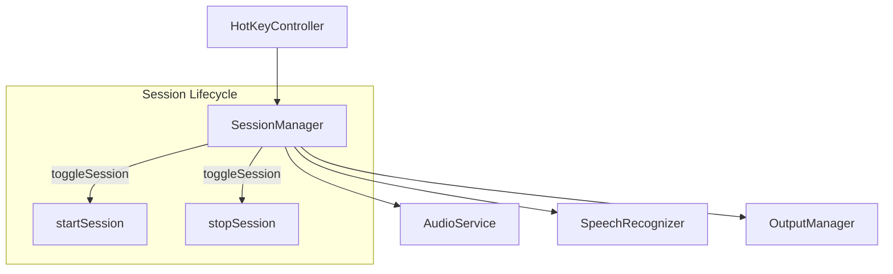

# Design Document: hotkey-toggle-session

## Overview

Purpose: セッションのライフサイクルをホットキーによる手動制御に統一し、無音タイムアウト機能を完全に削除する。

Users: kuchibi ユーザーがホットキーで録音の開始・停止を完全に制御できるようになる。

Impact: 既存の `SessionManager` から無音タイムアウトロジックを削除し、`AppSettings` / `SettingsView` / テストから関連コードを除去する。既存のホットキートグル動作（`toggleSession`）はそのまま維持。

### Goals
- ホットキー2回押しによる録音の手動開始・停止
- 無音タイムアウトの完全削除（コード簡素化）

### Non-Goals
- ホットキーのカスタマイズ
- 録音時間の上限設定
- 無音タイムアウトのオプション化（完全削除を選択）

## Architecture

### Existing Architecture Analysis

現在のセッションフロー:
```
HotKeyController → SessionManager.toggleSession()
                    ├── startSession() → startSilenceTimeout()
                    └── stopSession() → timeoutTask.cancel()
```

- `toggleSession()`: idle → recording / recording → processing の切替は既に正しく動作
- `startSilenceTimeout()`: `startSession()` と `handleRecognitionEvent()` の `.textChanged` / `.lineCompleted` で呼ばれる
- `timeoutTask`: 無音検出後に `finishSession(error: .silenceTimeout)` を呼ぶ

削除対象:
- `SessionManager`: `timeoutTask` プロパティ、`startSilenceTimeout()` メソッド、関連呼び出し3箇所
- `AppSettings`: `silenceTimeout` 関連の全コード（プロパティ、Keys、init、reset）
- `SettingsView`: 無音タイムアウト TextField
- `KuchibiError.silenceTimeout`: case 削除（使用箇所の確認が必要）

### Architecture Pattern & Boundary Map



変更後は `timeoutTask` による自動停止パスが完全に消え、`toggleSession()` が唯一のセッション制御ポイントとなる。

### Technology Stack

変更なし。既存の Swift / SwiftUI / async-await パターンをそのまま使用。

## Requirements Traceability

| Requirement | Summary | Components | Changes |
|-------------|---------|------------|---------|
| 1.1 | ホットキー1回目で録音開始 | SessionManager | 変更なし（既存動作） |
| 1.2 | ホットキー再押下まで録音継続 | SessionManager | startSilenceTimeout 呼び出し削除 |
| 1.3 | ホットキー2回目で停止・一括入力 | SessionManager | 変更なし（既存動作） |
| 2.1 | 無音タイムアウト無効化 | SessionManager | timeoutTask / startSilenceTimeout 削除 |
| 2.2 | 設定UIからタイムアウト項目削除 | AppSettings, SettingsView | silenceTimeout 関連コード削除 |

## Components and Interfaces

| Component | Domain/Layer | Intent | Req Coverage | Changes |
|-----------|-------------|--------|--------------|---------|
| SessionManager | Services | タイムアウトロジック削除 | 1.2, 2.1 | 削除のみ |
| AppSettings | Services | silenceTimeout 関連削除 | 2.2 | 削除のみ |
| SettingsView | Views | タイムアウトUI削除 | 2.2 | 削除のみ |
| KuchibiError | Models | silenceTimeout case 削除 | 2.1 | 削除のみ |
| NotificationService | Services | タイムアウト通知削除 | 2.1 | 削除のみ |

### Services

#### SessionManager

| Field | Detail |
|-------|--------|
| Intent | 無音タイムアウトロジックの完全削除 |
| Requirements | 1.2, 2.1 |

削除対象:
- `timeoutTask` プロパティ
- `startSilenceTimeout()` メソッド全体
- `startSession()` 内の `startSilenceTimeout()` 呼び出し（1箇所）
- `handleRecognitionEvent()` 内の `startSilenceTimeout()` 呼び出し（2箇所）
- `stopSession()` 内の `timeoutTask?.cancel()`
- `finishSession()` 内の `timeoutTask?.cancel()` と `timeoutTask = nil`

#### AppSettings

| Field | Detail |
|-------|--------|
| Intent | silenceTimeout 設定の完全削除 |
| Requirements | 2.2 |

削除対象:
- `defaultSilenceTimeout` 定数
- `Keys.silenceTimeout` キー
- `silenceTimeout` Published プロパティ（didSet 含む）
- init 内の silenceTimeout 復元ロジック
- `resetToDefaults()` 内の silenceTimeout 関連行

#### SettingsView

| Field | Detail |
|-------|--------|
| Intent | 無音タイムアウトの設定UIを削除 |
| Requirements | 2.2 |

削除対象: `RecognitionSettingsTab` 内の `LabeledContent("無音タイムアウト")` ブロック

## Testing Strategy

### 既存テストの更新
- `SessionManagerTests`: silenceTimeout 関連テストを削除
- `AppSettingsTests`: silenceTimeout のデフォルト値・永続化・リセット関連テストを削除
- `NotificationServiceTests`: silenceTimeout 通知テストを削除

### 確認テスト
- `toggleSession()` が既存通り idle ↔ recording を切り替えること（既存テストで担保）
- `stopSession()` 後に `finishSession()` で認識結果が一括出力されること（既存テストで担保）
