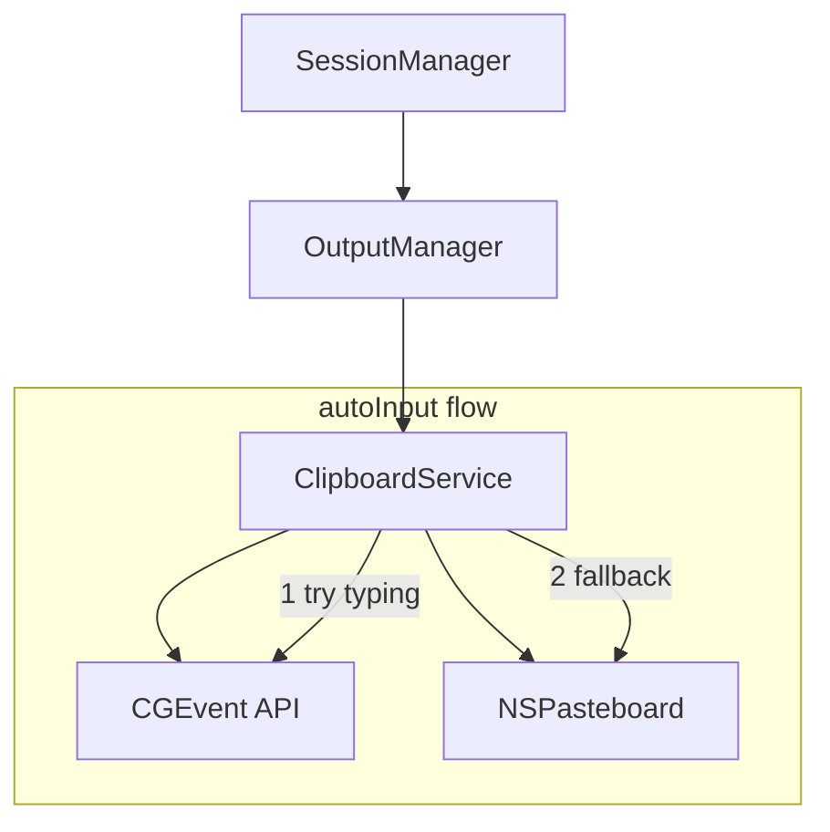
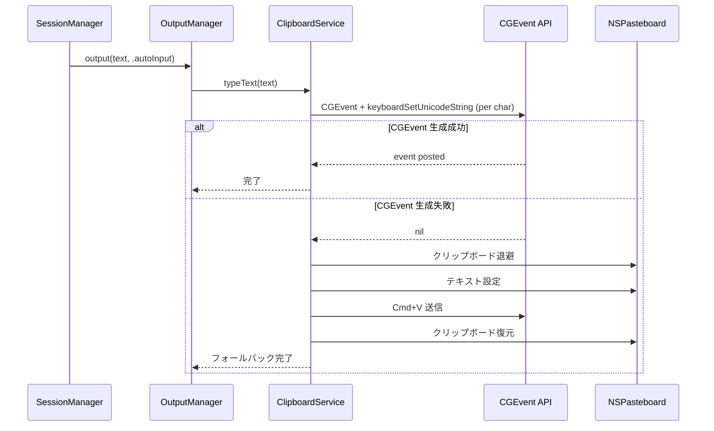

# Design Document: input-ux-improvement

## Overview

Purpose: 音声認識結果のテキスト出力において、クリップボードを経由せずカーソル位置に直接タイピング入力する `autoInput` モードを追加する。

Users: kuchibi ユーザーが音声入力後、カーソル位置に自動的にテキストが入力される体験を得る。

Impact: 既存の `OutputMode` enum に新しい case を追加し、`ClipboardService` に直接タイピングメソッドを追加する。既存モードへの影響はない。

### Goals
- CGEvent + `keyboardSetUnicodeString` による Unicode テキスト直接入力の実現
- 入力失敗時のクリップボード貼り付けへの自動フォールバック
- 設定UIでの3モード選択と新規インストール時のデフォルト変更

### Non-Goals
- 入力先アプリケーションの種類判定による自動モード切替
- ストリーミング入力（認識中のリアルタイム文字入力）
- 入力速度のチューニングUI

## Architecture

### Existing Architecture Analysis

現在の出力パイプライン:

```
SessionManager → OutputManager → ClipboardService
                  (mode分岐)      (実処理)
```

- `OutputMode` enum: `clipboard` / `directInput` の2値
- `OutputManagerImpl`: mode に応じて `ClipboardService` のメソッドを呼び分け
- `ClipboardServiceImpl`: クリップボード操作と CGEvent による Cmd+V 送信を担当
- `AppSettings`: `OutputMode` を UserDefaults で永続化

拡張ポイントは明確で、`OutputMode` に case 追加 → `OutputManager` の switch 分岐追加 → `ClipboardService` に新メソッド追加の流れで実装可能。

### Architecture Pattern & Boundary Map



- Selected pattern: 既存の Strategy パターン（OutputMode による分岐）を維持・拡張
- Domain boundaries: 出力ロジックは `ClipboardService` 内に閉じる。`OutputManager` は振り分けのみ
- Existing patterns preserved: protocol-based DI、async/await、UserDefaults 永続化
- New components rationale: 新規コンポーネント不要。既存クラスへのメソッド・case 追加のみ

### Technology Stack

| Layer | Choice / Version | Role in Feature | Notes |
|-------|------------------|-----------------|-------|
| Services | ClipboardServiceImpl | 直接タイピング入力とフォールバック処理 | CGEvent API 使用 |
| System API | CoreGraphics CGEvent | Unicode テキストのキーボードイベント生成 | `keyboardSetUnicodeString` |
| Storage | UserDefaults | `autoInput` モード設定の永続化 | 既存パターン踏襲 |
| UI | SwiftUI Picker | 3モード選択UI | 既存 Picker 拡張 |

## System Flows



## Requirements Traceability

| Requirement | Summary | Components | Interfaces | Flows |
|-------------|---------|------------|------------|-------|
| 1.1 | CGEvent による直接タイピング入力 | ClipboardService | typeText | autoInput flow |
| 1.2 | 入力失敗時のフォールバック | ClipboardService | typeText → pasteToActiveApp | fallback flow |
| 1.3 | クリップボード非破壊 | ClipboardService | typeText | autoInput flow |
| 2.1 | OutputMode に autoInput 追加 | OutputMode | - | - |
| 2.2 | 設定UI に選択肢追加 | SettingsView | - | - |
| 2.3 | 表示名「自動入力（推奨）」 | SettingsView | - | - |
| 2.4 | デフォルト値を autoInput に変更 | AppSettings | - | - |
| 3.1 | 自動フォールバック | ClipboardService | typeText | fallback flow |
| 3.2 | フォールバック時のクリップボード復元 | ClipboardService | pasteToActiveApp | fallback flow |
| 3.3 | フォールバック時の信頼性 | ClipboardService | pasteToActiveApp | fallback flow |

## Components and Interfaces

| Component | Domain/Layer | Intent | Req Coverage | Key Dependencies | Contracts |
|-----------|-------------|--------|--------------|------------------|-----------|
| OutputMode | Models | 出力モード定義 | 2.1 | - | - |
| ClipboardService | Services | 直接タイピング入力とフォールバック | 1.1, 1.2, 1.3, 3.1, 3.2, 3.3 | CGEvent (P0) | Service |
| OutputManager | Services | モード分岐 | 1.1 | ClipboardService (P0) | Service |
| AppSettings | Services | デフォルト値・永続化 | 2.4 | UserDefaults (P0) | State |
| SettingsView | Views | UI表示 | 2.2, 2.3 | AppSettings (P0) | - |

### Models

#### OutputMode

| Field | Detail |
|-------|--------|
| Intent | 出力モードの列挙型に `autoInput` case を追加 |
| Requirements | 2.1 |

変更内容: `case autoInput` を追加。`RawValue` は `"autoInput"` とし UserDefaults 互換性を維持。

### Services

#### ClipboardService

| Field | Detail |
|-------|--------|
| Intent | CGEvent による直接タイピング入力メソッドの追加 |
| Requirements | 1.1, 1.2, 1.3, 3.1, 3.2, 3.3 |

Responsibilities & Constraints:
- Unicode テキストを1文字ずつ CGEvent キーボードイベントとして送信
- CGEvent 生成失敗時に既存 `pasteToActiveApp` へフォールバック
- 直接タイピング時はクリップボードに一切触れない

Dependencies:
- External: CoreGraphics CGEvent API — Unicode キーイベント生成 (P0)
- Inbound: OutputManager — `typeText` 呼び出し (P0)

Contracts: Service [x]

##### Service Interface
```swift
protocol ClipboardServicing {
    func copyToClipboard(text: String)
    func pasteToActiveApp(text: String) async
    func typeText(_ text: String) async  // 新規追加
}
```

`typeText` メソッドの仕様:
- Preconditions: アクセシビリティ権限が付与されていること
- Postconditions: テキストがアクティブアプリのカーソル位置に入力される。失敗時はクリップボード経由で貼り付けられる
- Invariants: 成功時、ユーザーのクリップボード内容は変更されない

内部処理フロー:
1. テキストを1文字ずつ処理
2. 各文字について `CGEvent(keyboardEventSource:virtualKey:keyDown:)` で keyDown/keyUp イベントを生成（virtualKey = 0）
3. `keyboardSetUnicodeString` で UTF-16 文字列をアタッチ
4. `.cghidEventTap` にポスト
5. CGEvent 生成が nil の場合、即座に `pasteToActiveApp` にフォールバック

#### OutputManager

| Field | Detail |
|-------|--------|
| Intent | `autoInput` mode の分岐追加 |
| Requirements | 1.1 |

変更内容: `output(text:mode:)` の switch に `case .autoInput` を追加し、`clipboardService.typeText(text)` を呼び出す。

### Services (Settings)

#### AppSettings

| Field | Detail |
|-------|--------|
| Intent | デフォルト出力モードを `autoInput` に変更 |
| Requirements | 2.4 |

変更内容:
- `defaultOutputMode` を `.autoInput` に変更
- `resetToDefaults()` も `.autoInput` にリセットされる（`defaultOutputMode` を参照しているため自動的に対応）

Implementation Notes:
- 既存ユーザーの UserDefaults に保存済みの値は維持される（破壊的変更なし）
- `OutputMode(rawValue:)` で `"autoInput"` が正しくデコードされることを確認

### Views

#### SettingsView (GeneralSettingsTab)

| Field | Detail |
|-------|--------|
| Intent | 出力モード Picker に `autoInput` 選択肢を追加 |
| Requirements | 2.2, 2.3 |

変更内容: Picker 内に `Text("自動入力（推奨）").tag(OutputMode.autoInput)` を先頭に追加。

## Error Handling

### Error Strategy
- CGEvent 生成失敗（nil 返却）: `typeText` 内で検出し、`pasteToActiveApp` にフォールバック
- フォールバック時の Cmd+V 送信失敗: 既存の `sendPasteKeyEvent` の動作に従い、テキストをクリップボードに残す

### Error Categories and Responses
- System Errors: CGEvent 生成失敗 → 自動フォールバック（ユーザー通知不要）
- System Errors: フォールバックも失敗 → テキストをクリップボードに残す（既存動作）

## Testing Strategy

### Unit Tests
- `OutputMode.autoInput` の rawValue エンコード・デコード
- `AppSettings` のデフォルト値が `.autoInput` であること
- `AppSettings` の既存保存値（`.clipboard` / `.directInput`）が正しく復元されること

### Integration Tests
- `OutputManagerImpl` が `.autoInput` 時に `typeText` を呼び出すこと
- `typeText` で CGEvent 生成失敗時に `pasteToActiveApp` へフォールバックすること

### E2E Tests
- 設定画面で3つの出力モードが表示されること
- `autoInput` モードでテキストエディタにテキストが入力されること
