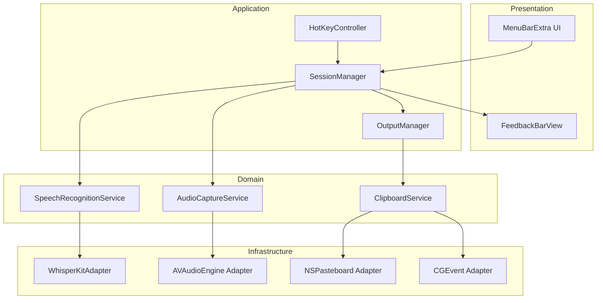
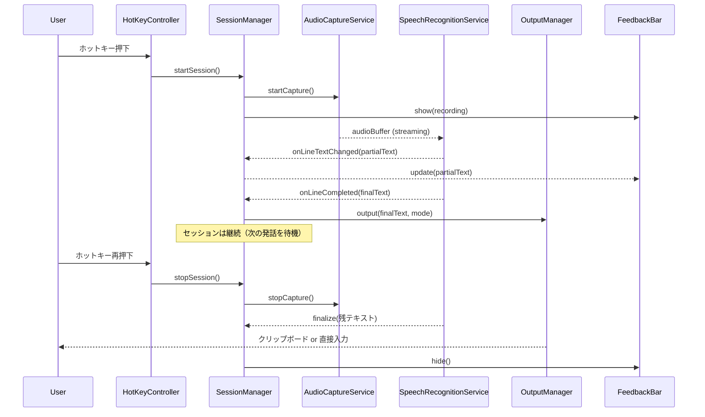
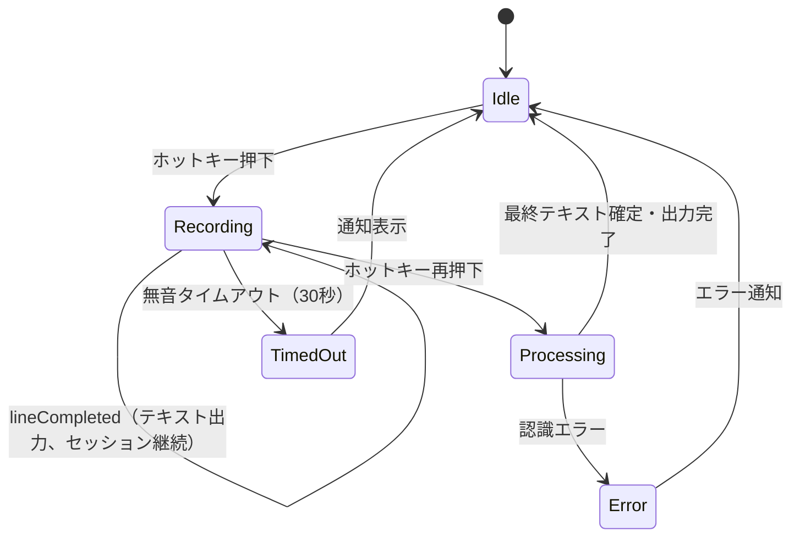
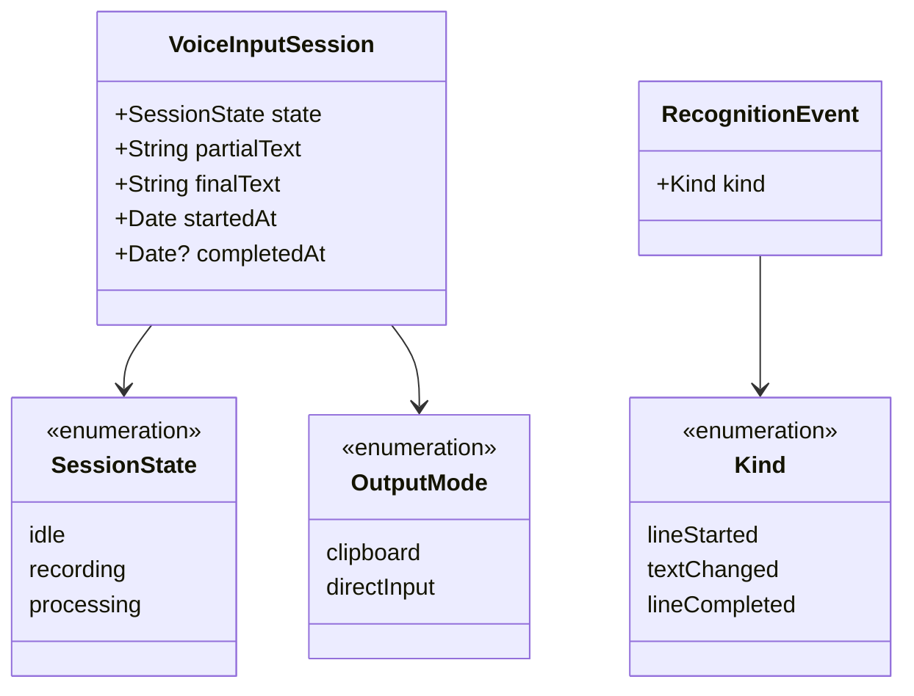

# Design Document

## Overview

Purpose: macOS上でバックグラウンド常駐し、ホットキー操作により日本語音声をリアルタイムにテキスト変換する個人用音声入力アプリケーションを提供する。

Users: 開発者本人が日常のテキスト入力作業（メッセージ、ドキュメント、コード内コメント等）において音声入力を利用する。

Impact: ローカル完結のAI音声認識により、外部サービスに依存しないプライベートかつ低レイテンシの音声入力環境を実現する。

### Goals
- WhisperKit を使用した高精度の日本語音声認識
- グローバルホットキーによるシームレスな音声入力の開始・停止制御
- クリップボードコピーおよびアクティブアプリへの直接入力による柔軟なテキスト出力
- メニューバー常駐による邪魔にならないバックグラウンド動作

### Non-Goals
- マルチユーザー対応やネットワーク経由のアクセス
- 日本語以外の言語サポート（初期リリース）
- App Store配布やサンドボックス対応
- 音声データの保存・再生機能
- 高度なテキスト編集・後処理機能（句読点自動挿入等）

## Architecture

> 詳細な調査ノートは `research.md` を参照。

### Architecture Pattern & Boundary Map

レイヤード構成にイベント駆動の音声パイプラインを組み合わせたアーキテクチャを採用する。各レイヤーは明確な責務を持ち、インターフェースを通じて疎結合に連携する。個人用アプリの規模に対して適切な複雑さを維持する。



Architecture Integration:
- Selected pattern: Layered + Event-Driven。音声データの流れはストリーミングパイプラインとしてイベント駆動で処理し、アプリケーション制御はレイヤード構成で管理する。
- Domain boundaries: Audio Capture / Speech Recognition / Text Output の3つのドメインを分離し、SessionManagerがオーケストレーションを担当。
- New components rationale: 各コンポーネントは要件の個別の責務に対応し、単一責任の原則を維持。

### Technology Stack

| Layer | Choice / Version | Role in Feature | Notes |
|-------|------------------|-----------------|-------|
| UI Framework | SwiftUI + MenuBarExtra (macOS 14+) | メニューバーUI、録音オーバーレイ | macOS 14 Sonoma以上を対象 |
| App Framework | Swift 5.9+ / Swift Package Manager | アプリケーション構築・依存管理 | Xcodeプロジェクトベース |
| ASR Engine | WhisperKit (SPM, from: "0.9.0") | 音声→テキスト変換 | CoreML モデル、HuggingFace から自動ダウンロード |
| Audio Capture | AVAudioEngine (Apple SDK) | マイク音声キャプチャ | リアルタイムPCMバッファ取得 |
| Global Hotkey | HotKey (SPM) | グローバルホットキー登録 | Carbon API wrapper |
| Clipboard | NSPasteboard (AppKit) | クリップボード操作 | システム標準API |
| Key Simulation | CGEvent (CoreGraphics) | キーストロークシミュレーション | Accessibility権限必要 |
| Notification | UserNotifications (Apple SDK) | エラー・状態通知 | macOS通知センター連携 |

> 技術選定の詳細な比較・根拠は `research.md` の Design Decisions セクションを参照。

## System Flows

### 音声入力セッションフロー



Key Decisions:
- ホットキーのトグル方式（1回目: 開始、2回目: 停止）を採用
- lineCompleted でセッションを自動終了せず、テキスト出力のみ行いセッションを継続する
- セッション終了はユーザーのホットキー再押下または30秒の無音タイムアウトで発生
- ストリーミング中はpartialTextをフィードバックバーに逐次表示
- 出力モードはOutputManagerが設定に応じて切り替え

### エラー・タイムアウトフロー



## Requirements Traceability

| Requirement | Summary | Components | Interfaces | Flows |
|-------------|---------|------------|------------|-------|
| 1.1 | メニューバー常駐アイコン | MenuBarExtra UI | AppDelegate | - |
| 1.2 | Dock非表示バックグラウンド動作 | Info.plist (LSUIElement) | - | - |
| 1.3 | 状態メニュー表示 | MenuBarExtra UI | MenuBarView | - |
| 1.4 | ログイン時自動起動 | LaunchAtLogin | SMAppService | - |
| 2.1 | ホットキーで音声入力開始 | HotKeyController, SessionManager | HotKeyController | 音声入力セッションフロー |
| 2.2 | ホットキーで音声入力停止・確定 | HotKeyController, SessionManager | HotKeyController | 音声入力セッションフロー |
| 2.3 | グローバルホットキー受付 | HotKeyController | HotKey (SPM) | - |
| 2.4 | 録音中インジケーター | FeedbackBarView | FeedbackBarWindowController | 音声入力セッションフロー |
| 3.1 | WhisperKit ローカル音声認識 | SpeechRecognitionService, WhisperKitAdapter | SpeechRecognitionService | 音声入力セッションフロー |
| 3.2 | 日本語テキスト変換 | WhisperKitAdapter | SpeechRecognitionService | 音声入力セッションフロー |
| 3.3 | ローカル完結処理 | WhisperKitAdapter | - | - |
| 3.4 | マイク音声キャプチャ | AudioCaptureService, MicAdapter | AudioCaptureService | 音声入力セッションフロー |
| 3.5 | マイク権限要求通知 | AudioCaptureService | PermissionManager | - |
| 4.1 | クリップボードコピー | OutputManager, ClipboardService | OutputManager | 音声入力セッションフロー |
| 4.2 | 直接入力モード | OutputManager, ClipboardService | OutputManager | 音声入力セッションフロー |
| 4.3 | ストリーミング表示 | SessionManager, Recording Overlay | OverlayWindow | 音声入力セッションフロー |
| 4.4 | カーソル位置テキスト挿入 | ClipboardService, KeyEventAdapter | ClipboardService | - |
| 5.1 | モデル読み込みエラー通知 | SpeechRecognitionService | NotificationService | エラーフロー |
| 5.2 | 無音タイムアウト | SessionManager | SessionManager | エラー・タイムアウトフロー |
| 5.3 | 完了フィードバック | SessionManager | FeedbackService | 音声入力セッションフロー |
| 5.4 | エラー通知・安全終了 | SessionManager | NotificationService | エラーフロー |

## Components and Interfaces

| Component | Domain/Layer | Intent | Req Coverage | Key Dependencies | Contracts |
|-----------|-------------|--------|--------------|------------------|-----------|
| KuchibiApp | Presentation | アプリエントリポイント、MenuBarExtra定義 | 1.1, 1.2, 1.3 | SessionManager (P0) | State |
| FeedbackBarView | Presentation | 音量レベル可視化・認識途中テキスト表示 | 2.4, 4.3 | SessionManager (P0) | State |
| SessionManager | Application | 音声入力セッションのライフサイクル管理 | 2.1, 2.2, 4.3, 5.2, 5.3, 5.4 | AudioCaptureService (P0), SpeechRecognitionService (P0), OutputManager (P0) | Service, State |
| HotKeyController | Application | グローバルホットキーの登録・イベント処理 | 2.1, 2.2, 2.3 | HotKey SPM (P0), SessionManager (P0) | Service |
| OutputManager | Application | テキスト出力モード管理・実行 | 4.1, 4.2, 4.4 | ClipboardService (P0) | Service |
| AudioCaptureService | Domain | マイク音声のリアルタイムキャプチャ | 3.4, 3.5 | AVAudioEngine (P0) | Service |
| SpeechRecognitionService | Domain | WhisperKit を使用した音声→テキスト変換 | 3.1, 3.2, 3.3, 5.1 | WhisperKitAdapter (P0) | Service |
| ClipboardService | Domain | クリップボード操作・キーストロークシミュレーション | 4.1, 4.2, 4.4 | NSPasteboard (P0), CGEvent (P1) | Service |
| WhisperKitAdapter | Infrastructure | WhisperKit SPM ライブラリのラッパー | 3.1, 3.2 | WhisperKit SPM (P0) | Service |
| NotificationService | Infrastructure | macOS通知センターへの通知送信 | 5.1, 5.4 | UserNotifications (P0) | Service |

### Application Layer

#### SessionManager

| Field | Detail |
|-------|--------|
| Intent | 音声入力セッションのライフサイクルを管理し、各サービスを協調動作させる |
| Requirements | 2.1, 2.2, 4.3, 5.2, 5.3, 5.4 |

Responsibilities & Constraints:
- 音声入力セッションの状態管理（Idle / Recording / Processing）
- AudioCaptureService → SpeechRecognitionService → OutputManager のパイプラインオーケストレーション
- 無音タイムアウト監視（30秒）によるセッション自動終了
- lineCompleted イベントではセッションを終了せず、テキスト出力のみ行い録音を継続
- 認識途中テキスト(partialText)のUI通知

Dependencies:
- Outbound: AudioCaptureService — 音声キャプチャ制御 (P0)
- Outbound: SpeechRecognitionService — 音声認識実行 (P0)
- Outbound: OutputManager — 認識結果出力 (P0)
- Outbound: NotificationService — エラー・状態通知 (P1)
- Inbound: HotKeyController — セッション開始/停止指示 (P0)
- Inbound: KuchibiApp — UI状態バインディング (P1)

Contracts: Service [x] / State [x]

##### Service Interface
```swift
enum SessionState {
    case idle
    case recording
    case processing
}

enum OutputMode {
    case clipboard
    case directInput
}

protocol SessionManaging: ObservableObject {
    var state: SessionState { get }
    var partialText: String { get }
    var outputMode: OutputMode { get set }

    func startSession() -> Void
    func stopSession() -> Void
}
```
- Preconditions: `startSession()`は`state == .idle`の場合のみ有効
- Postconditions: `stopSession()`実行後、最終テキストが確定・出力されstateが`.idle`に遷移。`lineCompleted`イベントではセッションは終了せず、テキスト出力後に録音を継続
- Invariants: 同時に複数のセッションは存在しない

##### State Management
- State model: `SessionState`列挙型 + `partialText`文字列 + `outputMode`設定
- Persistence: outputModeのみUserDefaultsに永続化
- Concurrency: MainActor上で状態更新、音声処理は非同期タスクで実行

#### HotKeyController

| Field | Detail |
|-------|--------|
| Intent | グローバルホットキーを登録し、押下イベントをSessionManagerに伝達する |
| Requirements | 2.1, 2.2, 2.3 |

Responsibilities & Constraints:
- HotKeyライブラリを使用したグローバルホットキーの登録
- トグル方式による開始/停止の切り替え
- アプリケーション起動時にホットキーを登録、終了時に解除

Dependencies:
- External: HotKey SPM — ホットキー登録 (P0)
- Outbound: SessionManager — セッション制御 (P0)

Contracts: Service [x]

##### Service Interface
```swift
protocol HotKeyControlling {
    func register() -> Void
    func unregister() -> Void
}
```
- Preconditions: `register()`はアプリ起動後に1回呼び出し
- Postconditions: ホットキー押下でSessionManagerのstartSession/stopSessionが呼び出される

Implementation Notes:
- デフォルトホットキーはコード内で定数定義（例: Cmd+Shift+Space）
- 将来的にUserDefaultsで変更可能にする余地を残す

#### OutputManager

| Field | Detail |
|-------|--------|
| Intent | 認識結果テキストを設定された出力モードに応じて出力する |
| Requirements | 4.1, 4.2, 4.4 |

Dependencies:
- Outbound: ClipboardService — テキスト出力実行 (P0)
- Inbound: SessionManager — 出力指示 (P0)

Contracts: Service [x]

##### Service Interface
```swift
protocol OutputManaging {
    func output(text: String, mode: OutputMode) async -> Void
}
```
- Preconditions: textは空でない文字列
- Postconditions: clipboardモード時はクリップボードにコピー完了、directInputモード時はアクティブアプリにテキスト挿入完了

### Domain Layer

#### AudioCaptureService

| Field | Detail |
|-------|--------|
| Intent | マイクからのリアルタイム音声をPCMバッファとしてキャプチャする |
| Requirements | 3.4, 3.5 |

Responsibilities & Constraints:
- AVAudioEngineを使用したマイク入力のリアルタイムキャプチャ
- PCMバッファをAsyncStreamとして提供
- マイク権限の確認・要求

Dependencies:
- External: AVAudioEngine (Apple SDK) — 音声入力 (P0)

Contracts: Service [x]

##### Service Interface
```swift
protocol AudioCapturing {
    var isCapturing: Bool { get }

    func startCapture() -> AsyncStream<AVAudioPCMBuffer>
    func stopCapture() -> Void
    func requestMicrophonePermission() async -> Bool
}
```
- Preconditions: `startCapture()`の前にマイク権限が付与されていること
- Postconditions: `stopCapture()`でAsyncStreamが終了
- Invariants: キャプチャ中は単一のAVAudioEngine入力タップが有効

#### SpeechRecognitionService

| Field | Detail |
|-------|--------|
| Intent | 音声バッファを WhisperKit モデルに逐次投入し、テキストを生成する |
| Requirements | 3.1, 3.2, 3.3, 5.1 |

Responsibilities & Constraints:
- WhisperKitAdapter を通じたモデルの初期化・管理
- ストリーミング音声データの逐次処理
- partialText/finalTextのコールバック提供
- すべての処理をローカルで完結

Dependencies:
- Outbound: WhisperKitAdapter — モデル実行 (P0)
- Inbound: SessionManager — 音声バッファ入力 (P0)

Contracts: Service [x]

##### Service Interface
```swift
struct RecognitionEvent {
    enum Kind {
        case lineStarted
        case textChanged(partial: String)
        case lineCompleted(final: String)
    }
    let kind: Kind
}

protocol SpeechRecognizing {
    var isModelLoaded: Bool { get }

    func loadModel() async throws -> Void
    func processAudioStream(_ stream: AsyncStream<AVAudioPCMBuffer>) -> AsyncStream<RecognitionEvent>
}
```
- Preconditions: `processAudioStream`の前に`loadModel()`が成功していること
- Postconditions: 入力ストリーム終了後、最後のlineCompletedイベントが発行される
- Invariants: 外部ネットワーク通信を行わない

#### ClipboardService

| Field | Detail |
|-------|--------|
| Intent | クリップボード操作とキーストロークシミュレーションによるテキスト出力 |
| Requirements | 4.1, 4.2, 4.4 |

Responsibilities & Constraints:
- NSPasteboardを使用したクリップボードへの書き込み
- CGEventを使用したCmd+Vキーストロークシミュレーション
- 直接入力時のクリップボード内容の退避・復元

Dependencies:
- External: NSPasteboard (AppKit) — クリップボード操作 (P0)
- External: CGEvent (CoreGraphics) — キーシミュレーション (P1)

Contracts: Service [x]

##### Service Interface
```swift
protocol ClipboardServicing {
    func copyToClipboard(text: String) -> Void
    func pasteToActiveApp(text: String) async -> Void
}
```
- Preconditions: `pasteToActiveApp`にはAccessibility権限が必要
- Postconditions: `pasteToActiveApp`完了後、元のクリップボード内容が復元される

Implementation Notes:
- `pasteToActiveApp`の処理フロー: 現在のクリップボード退避 → テキストをクリップボードに設定 → CGEventでCmd+V送信 → 短い遅延後にクリップボード復元
- CGEvent送信にはTCC (Transparency, Consent, and Control)のAccessibility権限が必要

### Infrastructure Layer

#### WhisperKitAdapter

| Field | Detail |
|-------|--------|
| Intent | WhisperKit SPM ライブラリを SpeechRecognitionService のインターフェースに適合させるアダプター |
| Requirements | 3.1, 3.2 |

Dependencies:
- External: WhisperKit SPM — ASRエンジン (P0)

Contracts: Service [x]

##### Service Interface
```swift
protocol SpeechRecognitionAdapting {
    func initialize(modelName: String) async throws -> Void
    func addAudio(_ buffer: AVAudioPCMBuffer) -> Void
    func getPartialText() -> String
    func finalize() async -> String
}
```

Implementation Notes:
- モデル名のデフォルト: `whisper-base`（精度と速度のバランスを重視）
- モデルは HuggingFace から自動ダウンロード、`~/.cache/whisperkit/` に保存される
- CoreML モデルを使用し Apple Silicon 上で最適化
- 累積バッファ方式で音声を蓄積し、finalize 時に一括認識

## Data Models

### Domain Model



Business rules & invariants:
- VoiceInputSessionは同時に1つのみ存在可能
- stateの遷移: idle → recording → processing → idle
- partialTextはrecording状態中のみ更新される
- finalTextはprocessing完了時に確定される

### Logical Data Model

永続化が必要なデータはOutputModeの設定値のみ。UserDefaultsに保存する。

Structure Definition:
- `outputMode: String` — "clipboard" | "directInput"
- `hotkey: String` — ホットキー設定（将来用）

## Error Handling

### Error Strategy

Swiftの`Result`型とSwift Concurrencyの`throws`を使用した型安全なエラー処理を採用する。

### Error Categories and Responses

```swift
enum KuchibiError: Error {
    case modelLoadFailed(underlying: Error)
    case microphonePermissionDenied
    case microphoneUnavailable
    case recognitionFailed(underlying: Error)
    case accessibilityPermissionDenied
    case silenceTimeout
}
```

| Error | Category | Response |
|-------|----------|----------|
| modelLoadFailed | System | macOS通知でエラー内容表示、メニューバーアイコンをエラー状態に変更 |
| microphonePermissionDenied | User | システム環境設定への誘導通知を表示 |
| microphoneUnavailable | System | macOS通知で「マイクが利用できません」と表示 |
| recognitionFailed | System | macOS通知でエラー表示、セッションを安全に終了 |
| accessibilityPermissionDenied | User | 直接入力モード使用時にシステム環境設定への誘導通知を表示 |
| silenceTimeout | Business Logic | セッション自動終了、完了サウンドの代わりにタイムアウト通知 |

### Monitoring

個人用アプリのため、外部モニタリングは不要。
- OSログフレームワーク(`os.Logger`)を使用したデバッグログ出力
- Subsystem: `com.kuchibi.app`

## Testing Strategy

### Unit Tests
- SessionManager: 状態遷移（idle → recording → processing → idle）の正確性
- OutputManager: 出力モードに応じたClipboardServiceメソッドの呼び出し分岐
- RecognitionEvent: イベント種別ごとのデータ整合性
- KuchibiError: 各エラーケースの生成・メッセージ取得

### Integration Tests
- AudioCaptureService → SpeechRecognitionService: 音声バッファの受け渡しとテキスト出力
- SessionManager → OutputManager → ClipboardService: 認識完了からテキスト出力までのパイプライン
- HotKeyController → SessionManager: ホットキーイベントによるセッション制御

### E2E Tests
- ホットキー押下 → 音声録音 → テキスト認識 → クリップボードへのコピー完了
- ホットキー押下 → 音声録音 → テキスト認識 → アクティブアプリへの直接入力完了
- タイムアウト: ホットキー押下 → 無音状態 → 自動セッション終了・通知表示
