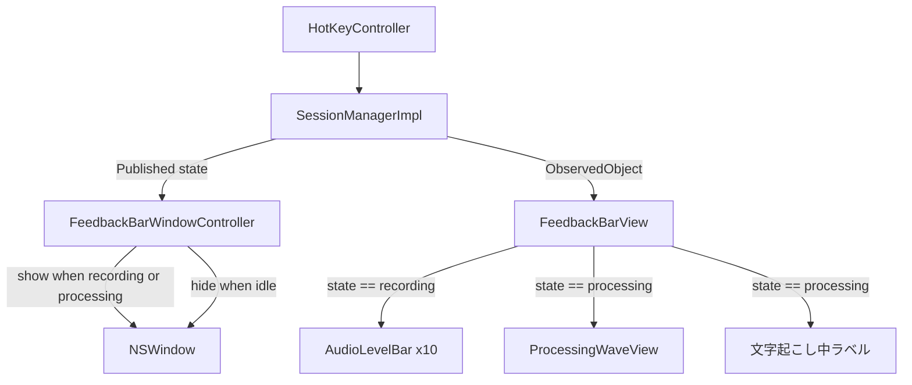
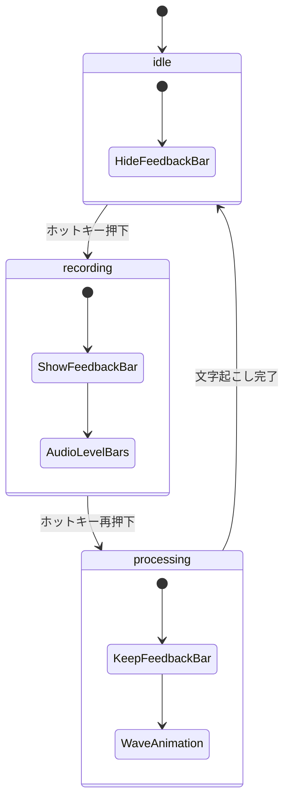

# Design Document: processing-indicator

## Overview

本機能は、macOS 音声入力アプリ「くちび」において録音停止後の文字起こし処理中（`.processing` 状態）にフィードバックバーを表示し続け、専用のウェーブアニメーションと処理中ラベルでユーザーに状態を伝える。

**Purpose**: 録音停止後に視覚フィードバックが消えることによるユーザーの不安を解消し、アプリが正常に動作していることを伝える。
**Users**: くちびを使用する単一ユーザーが、ホットキー操作ごとにアプリの状態を把握するために利用する。
**Impact**: 既存の `FeedbackBarView` と `FeedbackBarWindowController` を拡張し、`.processing` 状態での表示内容を追加する。

### Goals

- `.processing` 中もフィードバックバーウィンドウを表示し続ける
- 録音中（音量バー）と処理中（ウェーブアニメーション）を視覚的に区別する
- ウィンドウの再生成なしに状態遷移時の表示切り替えを実現する

### Non-Goals

- アニメーション速度・カラーのユーザー設定化
- 複数ウィンドウや通知センターへの表示
- `.processing` の進捗率表示（WhisperKit 内部処理のため取得不可）

## Requirements Traceability

| Requirement | Summary | Components | Interfaces | Flows |
|-------------|---------|------------|------------|-------|
| 1.1 | recording → processing 遷移時にウィンドウを維持 | FeedbackBarWindowController | $state Combine | 状態遷移フロー |
| 1.2 | processing → idle 遷移時にウィンドウを非表示 | FeedbackBarWindowController | $state Combine | 状態遷移フロー |
| 1.3 | processing 中はウィンドウを表示し続ける | FeedbackBarWindowController | $state Combine | - |
| 1.4 | idle → recording 遷移時にウィンドウを表示 | FeedbackBarWindowController | $state Combine | 状態遷移フロー |
| 2.1 | processing 中は音量バーの代わりにアニメーション表示 | FeedbackBarView | sessionManager.state | - |
| 2.2 | 自律アニメーションの再生 | ProcessingWaveView | @State animating | - |
| 2.3 | processing 遷移時にアニメーション即時開始 | ProcessingWaveView | onAppear | - |
| 2.4 | processing 終了時にアニメーション停止 | ProcessingWaveView | onDisappear | - |
| 2.5 | 録音中アニメーションと視覚的に区別できるデザイン | ProcessingWaveView, AudioLevelBar | - | - |
| 3.1 | 処理中ラベルの表示 | FeedbackBarView | sessionManager.state | - |
| 3.2 | processing 中は partialText を非表示 | FeedbackBarView | sessionManager.state | - |
| 3.3 | 日本語ラベルで直感的に理解できるテキスト | FeedbackBarView | - | - |
| 4.1 | recording → processing 遷移でウィンドウ維持 | FeedbackBarWindowController | - | 状態遷移フロー |
| 4.2 | processing → idle でウィンドウ非表示 | FeedbackBarWindowController | - | 状態遷移フロー |
| 4.3 | ウィンドウ再生成なしに表示内容切り替え | FeedbackBarView + ObservableObject | @Published state | - |

## Architecture

### Existing Architecture Analysis

既存アーキテクチャは SwiftUI MVVM パターン:

- `SessionManagerImpl`: `ObservableObject`。`@Published var state: SessionState` で状態を公開
- `FeedbackBarWindowController`: `SessionManagerImpl.$state` を Combine で購読し、ウィンドウの show/hide を制御
- `FeedbackBarView`: `@ObservedObject var sessionManager` を保持し、SwiftUI の自動再レンダリングで表示を更新

### Architecture Pattern & Boundary Map



- 選択パターン: Observer + SwiftUI Reactive Rendering（既存パターンの継続）
- 新規境界: `ProcessingWaveView`（独立した自律アニメーションコンポーネント）
- 既存パターン保持: `$state` Combine 購読、`@ObservedObject` バインディング
- ステアリングコンプライアンス: 既存の依存方向を維持（SessionManager → View）

### Technology Stack

| Layer | Choice / Version | Role in Feature | Notes |
|-------|------------------|-----------------|-------|
| UI / View | SwiftUI（macOS 14+） | 状態別ビュー切り替え、アニメーション表示 | 既存スタック |
| State Management | Combine + @Published | `$state` 購読によるウィンドウ制御 | 既存スタック |
| Animation | SwiftUI Animation API | ウェーブアニメーション（.easeInOut, repeatForever, delay） | 追加ライブラリ不要 |
| Window Management | AppKit NSWindow | フローティングウィンドウのライフサイクル | 既存スタック |

## System Flows



状態遷移の要点: `recording → processing` 時はウィンドウを維持したまま SwiftUI が自動再レンダリングを行い、表示コンテンツのみ切り替わる。

## Components and Interfaces

| Component | Domain/Layer | Intent | Req Coverage | Key Dependencies | Contracts |
|-----------|--------------|--------|--------------|-----------------|-----------|
| FeedbackBarWindowController | Window Management | $state 購読によるウィンドウ show/hide | 1.1, 1.2, 1.3, 1.4, 4.1, 4.2 | SessionManagerImpl (P0) | State |
| FeedbackBarView | UI / View | state に応じた表示コンテンツ切り替え | 2.1, 3.1, 3.2, 3.3, 4.3 | SessionManagerImpl (P0) | State |
| ProcessingWaveView | UI / View | 処理中ウェーブアニメーション | 2.2, 2.3, 2.4, 2.5 | なし（自律） | State |
| AudioLevelBar | UI / View | 録音中の音量バー（既存、変更なし） | 2.5（対比） | AudioLevel Float (P1) | - |

### Window Management Layer

#### FeedbackBarWindowController

| Field | Detail |
|-------|--------|
| Intent | `SessionManagerImpl.$state` を Combine で購読し、`.recording` または `.processing` 中にフローティングウィンドウを表示する |
| Requirements | 1.1, 1.2, 1.3, 1.4, 4.1, 4.2 |

**Responsibilities & Constraints**

- `state == .recording || state == .processing` の場合にのみ `show()` を呼び出す
- `show()` は `guard window == nil` でべき等性を保つ（既存設計）
- ウィンドウの作成・破棄は `show()`/`hide()` に集約し、状態判定ロジックは sink クロージャのみ

**Dependencies**

- Inbound: `SessionManagerImpl.$state` — 状態変化の通知（P0）
- Outbound: `NSWindow` — ウィンドウの表示・非表示（P0）

**Contracts**: State [x]

##### State Management

- 状態モデル: `window: NSWindow?`（nil = 非表示、非 nil = 表示中）
- 遷移条件: `recording | processing → show()`, `idle → hide()`
- べき等性: `guard window == nil` により重複 `show()` 呼び出しを防止

**Implementation Notes**

- Integration: `sink` クロージャ内の条件を `state == .recording` から `state == .recording || state == .processing` に変更するのみ
- Risks: `processing` が瞬時に終わる場合もウィンドウが表示されるが、正常動作（ちらつきの可能性は低い）

### UI / View Layer

#### FeedbackBarView

| Field | Detail |
|-------|--------|
| Intent | `sessionManager.state` を参照し、`.recording` 中は音量バー、`.processing` 中はウェーブアニメーション + ラベルに表示を切り替える |
| Requirements | 2.1, 3.1, 3.2, 3.3, 4.3 |

**Responsibilities & Constraints**

- `sessionManager.state == .processing` の場合: `ProcessingWaveView` + "文字起こし中..." ラベルを表示
- `sessionManager.state == .recording` の場合: 既存の `AudioLevelBar` 群 + `partialText` を表示
- 状態判定ロジックを View 内に完結させる（ViewModel 追加は不要）

**Dependencies**

- Inbound: `SessionManagerImpl.state` — 表示内容の切り替えキー（P0）
- Inbound: `SessionManagerImpl.audioLevel` — 録音中の音量バー制御（P1）
- Inbound: `SessionManagerImpl.partialText` — 録音中の部分テキスト（P1）
- Outbound: `ProcessingWaveView` — 処理中アニメーション（P1）

**Contracts**: State [x]

##### State Management

```swift
// FeedbackBarView body 内の分岐
if sessionManager.state == .processing {
    ProcessingWaveView()
    Text("文字起こし中...")
} else {
    // 既存の AudioLevelBar + partialText
}
```

- 状態変化は `@ObservedObject` により SwiftUI が自動検知・再レンダリング
- `partialText` は `.processing` ブランチでは表示しない（3.2）

**Implementation Notes**

- Integration: `@ObservedObject var sessionManager` は既存のため追加プロパティ不要
- Validation: `partialText` の表示条件を processing ブランチでは評価しない
- Risks: なし

#### ProcessingWaveView

| Field | Detail |
|-------|--------|
| Intent | 5本バーが中央を頂点とする山型ウェーブで上下に繰り返しアニメーションし、文字起こし処理中を視覚的に表現する自律コンポーネント |
| Requirements | 2.2, 2.3, 2.4, 2.5 |

**Responsibilities & Constraints**

- 外部入力を受け取らず、内部 `@State` のみでアニメーションを制御する
- `onAppear` でアニメーション開始、`onDisappear` で停止する
- バーの高さは `[min: 4pt, max: 10/16/20/16/10 pt]` の山型分布で、`AudioLevelBar`（最大 20pt フラット分布）と視覚的に区別できる

**Dependencies**

- なし（完全自律コンポーネント）

**Contracts**: State [x]

##### State Management

- 状態モデル: `@State private var animating: Bool`
- アニメーション: `.easeInOut(duration: 0.45).repeatForever(autoreverses: true).delay(Double(index) * 0.09)`
- ライフサイクル: `onAppear { animating = true }` / `onDisappear { animating = false }`

**Implementation Notes**

- Integration: `FeedbackBarView` 内から `ProcessingWaveView()` として初期化するだけ（引数なし）
- Risks: アニメーションが `onDisappear` 前に終了しない場合でも SwiftUI がビュー破棄時に自動クリーンアップ

## Error Handling

### Error Strategy

本機能は純粋な UI レイヤーの拡張であり、エラー発生ポイントはない。ウィンドウ表示に失敗する場合（`NSScreen.main == nil`）は既存の `guard` で処理される。

### Monitoring

- 既存の `os.Logger`（`SessionManager`）が状態遷移をログ出力するため、追加のロギングは不要

## Testing Strategy

### Unit Tests

- `FeedbackBarWindowController` の状態判定: `.processing` 遷移時に `show()` が呼ばれること
- `FeedbackBarWindowController` の状態判定: `.idle` 遷移時に `hide()` が呼ばれること
- `FeedbackBarWindowController` のべき等性: 既に表示中に `.processing` → `.recording` に遷移しても重複ウィンドウが生成されないこと

### UI / Snapshot Tests

- `FeedbackBarView` の `.recording` 状態レンダリング（音量バー + partialText）
- `FeedbackBarView` の `.processing` 状態レンダリング（ウェーブアニメーション + "文字起こし中..."）
- `ProcessingWaveView` の初期表示（animating = false 状態）

### Integration Tests

- ホットキー2回押下のシミュレーション: `idle → recording → processing → idle` の全遷移でウィンドウ表示状態が正しいこと
