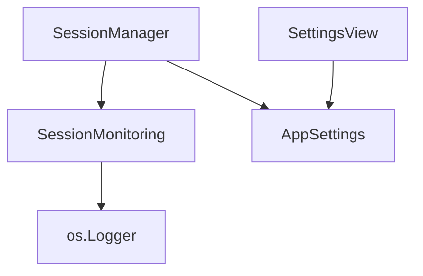
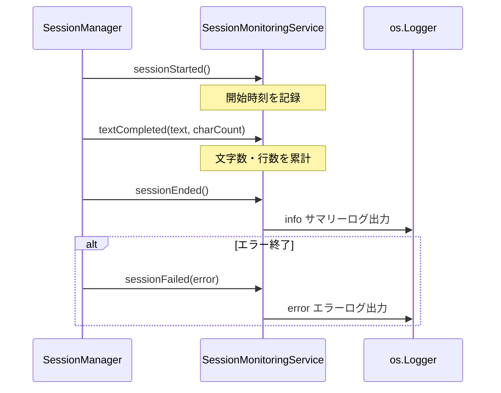

# Design Document

## Overview

Purpose: セッション単位の認識メトリクス（継続時間、確定行数、合計文字数、エラー種別）を収集し、os.Logger でサマリーログを出力する。
Users: 開発者（自分）が Console.app で認識品質を確認し、設定チューニングの判断材料とする。
Impact: SessionManager にモニタリングサービスを追加注入し、セッションイベントに応じてメトリクスを収集する。

### Goals
- セッション完了時に認識統計のサマリーログを出力する
- エラー終了時にエラー種別をログに記録する
- 設定でモニタリングのオン・オフを切り替え可能にする

### Non-Goals
- メトリクスの永続的な保存やファイル出力
- 統計のグラフ表示やダッシュボード
- リアルタイムのパフォーマンスモニタリング

## Architecture

### Existing Architecture Analysis

- SessionManager は既にプロトコルベース DI で AudioCapturing, SpeechRecognizing, OutputManaging, NotificationServicing, AudioPreprocessing, TextPostprocessing を注入
- `os.Logger` による基本ログ出力が SessionManager 内に存在
- AppSettings で全設定を一元管理し、SettingsView から操作

### Architecture Pattern & Boundary Map



Architecture Integration:
- Selected pattern: 既存の Protocol + DI パターンを踏襲
- Domain boundaries: メトリクス収集とログ出力を SessionMonitoring プロトコルに分離
- Existing patterns preserved: init パラメータでの依存注入、デフォルト引数による実装提供
- New components rationale: SessionMonitoringService はメトリクス管理とログ出力の責務を SessionManager から分離するために必要

### Technology Stack

| Layer | Choice / Version | Role in Feature | Notes |
|-------|------------------|-----------------|-------|
| Services | Swift, os.Logger | メトリクス収集・ログ出力 | 既存 Logger 基盤を利用 |
| Data | SessionMetrics (値オブジェクト) | セッション単位のメトリクス保持 | メモリ上のみ、永続化なし |
| Settings | AppSettings, UserDefaults | モニタリング有効フラグの永続化 | 既存パターンに準拠 |

## System Flows



SessionManager がセッションライフサイクルの各ポイントで MonitoringService のメソッドを呼び出す。モニタリングが無効の場合は SessionManager 側で呼び出しをスキップする。

## Requirements Traceability

| Requirement | Summary | Components | Interfaces | Flows |
|-------------|---------|------------|------------|-------|
| 1.1 | セッション開始時刻の記録 | SessionMonitoringService | sessionStarted | Session Flow |
| 1.2 | セッション継続時間の算出 | SessionMonitoringService, SessionMetrics | sessionEnded | Session Flow |
| 1.3 | 確定テキスト文字数の累計 | SessionMonitoringService, SessionMetrics | textCompleted | Session Flow |
| 1.4 | 確定行数の記録 | SessionMonitoringService, SessionMetrics | textCompleted | Session Flow |
| 1.5 | エラー種別の記録 | SessionMonitoringService | sessionFailed | Session Flow |
| 2.1 | サマリーログの出力 | SessionMonitoringService | sessionEnded | Session Flow |
| 2.2 | エラーログの出力 | SessionMonitoringService | sessionFailed | Session Flow |
| 3.1 | モニタリング有効フラグ | AppSettings | monitoringEnabled | - |
| 3.2 | 無効時のメトリクス収集スキップ | SessionManager | - | Session Flow |
| 3.3 | 設定 UI | SettingsView | - | - |

## Components and Interfaces

| Component | Domain/Layer | Intent | Req Coverage | Key Dependencies | Contracts |
|-----------|--------------|--------|--------------|------------------|-----------|
| SessionMetrics | Models | セッション単位のメトリクス値オブジェクト | 1.1, 1.2, 1.3, 1.4, 1.5 | なし | State |
| SessionMonitoringService | Services | メトリクス収集・ログ出力 | 1.1-1.5, 2.1, 2.2 | os.Logger (P0) | Service |
| AppSettings (変更) | Services | モニタリング有効フラグの追加 | 3.1 | UserDefaults (P0) | State |
| SessionManager (変更) | Services | モニタリングサービスの統合 | 3.2 | SessionMonitoring (P1) | Service |
| SettingsView (変更) | Views | モニタリング設定 Toggle の追加 | 3.3 | AppSettings (P0) | - |

### Models

#### SessionMetrics

| Field | Detail |
|-------|--------|
| Intent | セッション単位のメトリクスを保持する値オブジェクト |
| Requirements | 1.1, 1.2, 1.3, 1.4, 1.5 |

Responsibilities & Constraints:
- セッション開始から完了までのメトリクスを保持
- イミュータブルな最終結果は sessionEnded 時に生成

Contracts: State

##### State Management

```swift
struct SessionMetrics {
    let startTime: Date
    let duration: TimeInterval
    let completedLineCount: Int
    let totalCharacterCount: Int
    let error: KuchibiError?
}
```

### Services

#### SessionMonitoringService

| Field | Detail |
|-------|--------|
| Intent | メトリクスの収集とセッションサマリーのログ出力 |
| Requirements | 1.1, 1.2, 1.3, 1.4, 1.5, 2.1, 2.2 |

Responsibilities & Constraints:
- セッション開始時に内部状態をリセットし開始時刻を記録
- テキスト確定ごとに行数・文字数を加算
- セッション完了時にメトリクスを集計し info レベルでサマリーログを出力
- エラー終了時に error レベルでログを出力

Dependencies:
- External: os.Logger -- ログ出力 (P0)

Contracts: Service

##### Service Interface

```swift
protocol SessionMonitoring {
    func sessionStarted()
    func textCompleted(text: String)
    func sessionEnded()
    func sessionFailed(error: KuchibiError)
}
```

- Preconditions: `sessionStarted()` が `sessionEnded()` / `sessionFailed()` より先に呼ばれる
- Postconditions: `sessionEnded()` 呼び出し後、サマリーログが出力される。`sessionFailed()` 呼び出し後、エラーログが出力される
- Invariants: 1 セッション内で `sessionStarted()` は 1 回のみ呼ばれる

Implementation Notes:
- `os.Logger(subsystem: "com.kuchibi.app", category: "Monitoring")` を使用
- サマリーログ形式: `"セッション完了: 継続時間=X.Xs, 行数=N, 文字数=M"`
- エラーログ形式: `"セッションエラー: 種別=XXX, 継続時間=X.Xs"`

#### SessionManager (変更)

| Field | Detail |
|-------|--------|
| Intent | モニタリングサービスの統合 |
| Requirements | 3.2 |

Responsibilities & Constraints:
- init で `SessionMonitoring` を依存注入（デフォルト引数で実装提供）
- `appSettings.monitoringEnabled` が true の場合のみモニタリングメソッドを呼び出す
- `startSession()` で `sessionStarted()` を呼び出す
- `handleRecognitionEvent(.lineCompleted)` で `textCompleted(text:)` を呼び出す
- `finishSession()` で `sessionEnded()` を呼び出す
- エラー終了パスで `sessionFailed(error:)` を呼び出す

Dependencies:
- Inbound: SessionMonitoring -- メトリクス収集 (P1)

### Views

#### SettingsView (変更)

| Field | Detail |
|-------|--------|
| Intent | モニタリング設定 Toggle の追加 |
| Requirements | 3.3 |

Implementation Notes:
- 「後処理」セクションの後に「モニタリング」セクションを追加
- `Toggle("セッションモニタリング", isOn: $appSettings.monitoringEnabled)`

## Data Models

### Domain Model

SessionMetrics は値オブジェクトとしてセッション完了時に生成される。永続化は行わない。

- startTime: Date -- セッション開始時刻
- duration: TimeInterval -- セッション継続時間（秒）
- completedLineCount: Int -- 確定した行数
- totalCharacterCount: Int -- 合計文字数
- error: KuchibiError? -- エラー終了時のエラー種別（正常終了時は nil）

## Error Handling

### Error Strategy

モニタリング自体のエラーはアプリの動作に影響を与えない。ログ出力の失敗は無視する。

### Error Categories and Responses

- セッションエラー: `sessionFailed(error:)` で KuchibiError を受け取り、種別を error レベルでログ出力
- モニタリング内部エラー: 発生しない設計（メモリ上の加算とログ出力のみ）

## Testing Strategy

### Unit Tests
- SessionMonitoringService: sessionStarted/textCompleted/sessionEnded の呼び出しでメトリクスが正しく集計される
- SessionMonitoringService: sessionFailed でエラー種別がログ出力される
- AppSettings: monitoringEnabled のデフォルト値・永続化・リセットの検証
- SessionManager: モニタリング有効時にモニタリングメソッドが呼び出される
- SessionManager: モニタリング無効時にモニタリングメソッドが呼び出されない
