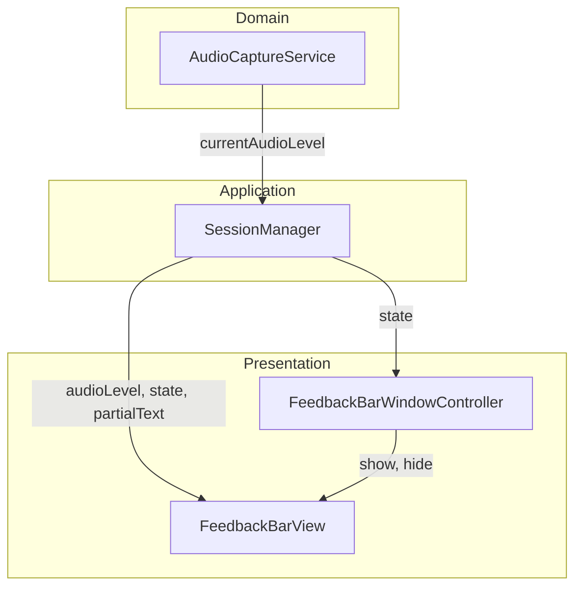
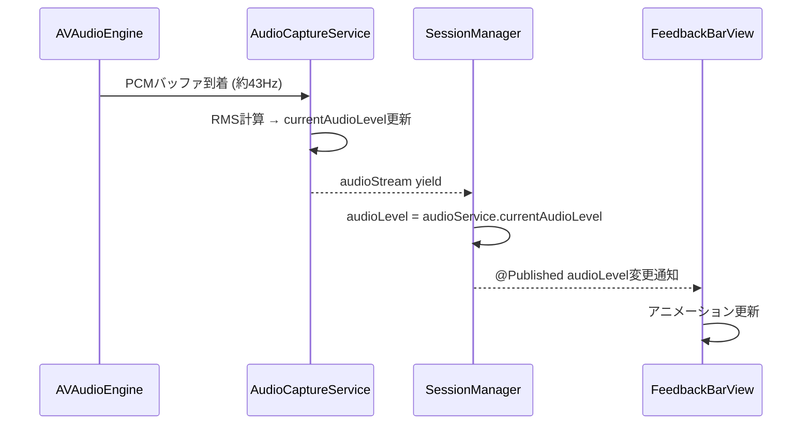

# Design Document

## Overview

Purpose: 音声入力セッション中の視覚フィードバックを改善し、画面下部にバー型インジケーターを表示して音量レベルと認識テキストをリアルタイムに可視化する。

Users: 開発者本人が音声入力中にマイク入力状態と認識進捗を視覚的に確認する。

Impact: 既存の RecordingOverlayView と OverlayWindowController を新しいバー型UIに置き換える。SessionManager に音量レベル公開機能を追加する。

### Goals
- 画面下部に控えめなバー型インジケーターを表示し、作業を邪魔しない
- マイク入力の音量レベルをリアルタイムにアニメーションで可視化
- 認識途中テキストをバー内に表示
- 既存の画面上部オーバーレイを完全に置き換え

### Non-Goals
- 音量レベルの数値表示やdBメーター
- バーの位置やサイズのユーザーカスタマイズ
- 音声波形（waveform）の詳細表示
- 録音データの保存・再生

## Architecture

### Existing Architecture Analysis

変更対象:
- `RecordingOverlayView` — 新しい `FeedbackBarView` に置き換え
- `OverlayWindowController` — ウィンドウの位置・サイズを変更し `FeedbackBarWindowController` に改名
- `AudioCaptureServiceImpl` — 音量レベル計算を追加
- `AudioCapturing` プロトコル — `currentAudioLevel` プロパティを追加
- `SessionManagerImpl` — `audioLevel` Published プロパティを追加

維持するパターン:
- Combine `$state` 監視によるウィンドウ表示/非表示制御
- `@ObservedObject` による SessionManager-View バインディング
- NSWindow フローティングウィンドウ方式

### Architecture Pattern & Boundary Map



Architecture Integration:
- Selected pattern: 既存のレイヤード構成を維持。AudioCaptureService → SessionManager → View の単方向データフロー。
- Domain boundaries: 音量計算は Domain 層（AudioCaptureService）、UI表示は Presentation 層（FeedbackBarView）で分離。
- New components rationale: FeedbackBarView は既存 RecordingOverlayView の置き換え。音量レベルはバッファ処理の副産物として自然に計算可能。

### Technology Stack

| Layer | Choice / Version | Role in Feature | Notes |
|-------|------------------|-----------------|-------|
| UI Framework | SwiftUI + NSWindow | バー型インジケーターの描画・アニメーション | 既存と同一 |
| Audio | AVAudioEngine (Apple SDK) | 音量レベル計算元のPCMバッファ提供 | 既存と同一 |
| State管理 | Combine (@Published) | 音量レベル・状態のリアクティブ配信 | 既存と同一 |

## System Flows

### 音量レベルデータフロー



Key Decisions:
- 音量レベルはオーディオタップのコールバック内で計算（追加タイマー不要）
- SessionManager は textChanged イベント受信時に audioLevel を同期更新

## Requirements Traceability

| Requirement | Summary | Components | Interfaces | Flows |
|-------------|---------|------------|------------|-------|
| 1.1 | 画面下部にバー表示 | FeedbackBarWindowController | show() | - |
| 1.2 | セッション終了時に非表示 | FeedbackBarWindowController | hide() | - |
| 1.3 | 前面表示・フォーカス非奪取 | FeedbackBarWindowController | NSWindow設定 | - |
| 1.4 | 控えめな高さ | FeedbackBarView | レイアウト定義 | - |
| 2.1 | 音量レベル取得・反映 | AudioCaptureService, SessionManager | currentAudioLevel, audioLevel | 音量レベルデータフロー |
| 2.2 | 音量に応じたアニメーション | FeedbackBarView | audioLevel binding | 音量レベルデータフロー |
| 2.3 | 無音時の最小アニメーション | FeedbackBarView | audioLevel == 0判定 | - |
| 2.4 | 十分な更新頻度 | AudioCaptureService | バッファ到着時計算 | 音量レベルデータフロー |
| 3.1 | partialTextをバー内に表示 | FeedbackBarView | partialText binding | - |
| 3.2 | テキストのリアルタイム更新 | FeedbackBarView, SessionManager | @Published partialText | - |
| 3.3 | 空テキスト時の表示制御 | FeedbackBarView | 条件付きレンダリング | - |
| 4.1 | 既存オーバーレイの置き換え | FeedbackBarView, FeedbackBarWindowController | - | - |
| 4.2 | SessionManager状態連携の維持 | SessionManager | $state, $partialText | - |

## Components and Interfaces

| Component | Domain/Layer | Intent | Req Coverage | Key Dependencies | Contracts |
|-----------|-------------|--------|--------------|------------------|-----------|
| FeedbackBarView | Presentation | 音量バーと認識テキストを表示するSwiftUIビュー | 1.4, 2.2, 2.3, 3.1, 3.2, 3.3 | SessionManager (P0) | State |
| FeedbackBarWindowController | Presentation | バー型ウィンドウの生成・配置・表示制御 | 1.1, 1.2, 1.3, 4.1 | SessionManager (P0) | Service |
| AudioCaptureService (拡張) | Domain | 音量レベル計算の追加 | 2.1, 2.4 | AVAudioEngine (P0) | Service |
| SessionManager (拡張) | Application | audioLevel プロパティの公開 | 2.1, 4.2 | AudioCaptureService (P0) | State |

### Presentation Layer

#### FeedbackBarView

| Field | Detail |
|-------|--------|
| Intent | 音量レベルのアニメーション表示と認識テキストの表示を行うバー型SwiftUIビュー |
| Requirements | 1.4, 2.2, 2.3, 3.1, 3.2, 3.3 |

Responsibilities & Constraints:
- 音量レベル（0.0〜1.0）に応じた複数バーのアニメーション表示
- 認識途中テキストの表示（空の場合は非表示）
- 高さを控えめに制限（約36pt）
- 半透明マテリアル背景で他のコンテンツを邪魔しない

Dependencies:
- Inbound: SessionManager — audioLevel, partialText, state (P0)

Contracts: State [x]

##### State Management
- State model: `@ObservedObject SessionManagerImpl` から `audioLevel: Float` と `partialText: String` を監視
- Concurrency: MainActor上でSwiftUIが自動管理

Implementation Notes:
- 音量バーは複数の縦棒（8〜12本）で構成し、各棒の高さが audioLevel に連動
- `withAnimation(.linear(duration: 0.05))` で滑らかな更新
- 無音時（audioLevel ≈ 0）はバーを最小高さで表示

#### FeedbackBarWindowController

| Field | Detail |
|-------|--------|
| Intent | バー型ウィンドウの生成、画面下部への配置、セッション状態に応じた表示/非表示制御 |
| Requirements | 1.1, 1.2, 1.3, 4.1 |

Responsibilities & Constraints:
- NSWindow を画面最下部に全幅で配置
- フローティングレベルでフォーカスを奪わない
- SessionManager の `$state` を Combine で監視し recording 時に表示、それ以外で非表示。lineCompleted ではセッションが継続するため、ユーザーがホットキーで停止するか無音タイムアウトになるまで表示を維持

Dependencies:
- Inbound: SessionManager — state監視 (P0)

Contracts: Service [x]

##### Service Interface
```swift
@MainActor
final class FeedbackBarWindowController {
    init(sessionManager: SessionManagerImpl)
    func show()
    func hide()
}
```
- Preconditions: `show()` は NSScreen.main が利用可能であること
- Postconditions: `show()` 後、ウィンドウが画面下部に表示される。`hide()` 後、ウィンドウが非表示になる

Implementation Notes:
- NSWindow設定: `.borderless`, `.floating`, `ignoresMouseEvents = true`, `canJoinAllSpaces`
- 配置: `screenFrame.origin.x`, `screenFrame.origin.y` に幅=画面幅、高さ=36で配置
- 既存 OverlayWindowController と同じ Combine パターンを使用

### Domain Layer

#### AudioCaptureService (拡張)

| Field | Detail |
|-------|--------|
| Intent | 音声キャプチャ時にPCMバッファからRMS音量レベルを計算して公開する |
| Requirements | 2.1, 2.4 |

Responsibilities & Constraints:
- オーディオタップコールバック内でRMS値を計算
- `currentAudioLevel` プロパティとして公開（0.0〜1.0）
- キャプチャ停止時は 0.0 にリセット

Dependencies:
- External: AVAudioEngine — PCMバッファ (P0)

Contracts: Service [x]

##### Service Interface
```swift
protocol AudioCapturing {
    var isCapturing: Bool { get }
    var currentAudioLevel: Float { get }

    func startCapture() throws -> AsyncStream<AVAudioPCMBuffer>
    func stopCapture()
    func requestMicrophonePermission() async -> Bool
}
```
- Preconditions: `currentAudioLevel` はキャプチャ中のみ有効な値
- Postconditions: `stopCapture()` 後、`currentAudioLevel` は 0.0
- Invariants: 値の範囲は常に 0.0〜1.0

Implementation Notes:
- RMS計算: `floatChannelData` の第1チャンネルからサンプル値の二乗平均平方根を算出
- `min(rms * 3.0, 1.0)` で感度補正（小さい声でも反応するよう増幅）

### Application Layer

#### SessionManager (拡張)

| Field | Detail |
|-------|--------|
| Intent | AudioCaptureService の音量レベルを @Published として UI 層に公開する |
| Requirements | 2.1, 4.2 |

Responsibilities & Constraints:
- `@Published audioLevel: Float` を追加
- 音声認識イベント処理時に `audioService.currentAudioLevel` を読み取り更新
- セッション終了時（ホットキー再押下または無音タイムアウト）に 0.0 にリセット。lineCompleted ではリセットしない

Dependencies:
- Outbound: AudioCaptureService — currentAudioLevel (P0)
- Inbound: FeedbackBarView — audioLevel 監視 (P0)

Contracts: State [x]

##### State Management
- State model: 既存の `state`, `partialText` に `audioLevel: Float` を追加
- Concurrency: MainActor上で更新

## Error Handling

### Error Strategy

音量レベル計算は既存のオーディオパイプラインの副産物であり、新たなエラーカテゴリは発生しない。

- 音量レベル計算でバッファデータが不正な場合: 0.0 を返す（サイレントフォールバック）
- ウィンドウ表示に失敗した場合: ログ出力のみ（既存パターンと同一）

## Testing Strategy

### Unit Tests
- AudioCaptureService: `currentAudioLevel` がキャプチャ中に 0.0〜1.0 の範囲で値を返すこと
- AudioCaptureService: `stopCapture()` 後に `currentAudioLevel` が 0.0 であること
- SessionManager: recording 状態で `audioLevel` が更新されること
- SessionManager: idle 状態で `audioLevel` が 0.0 であること

### Integration Tests
- セッション開始 → 音量レベル更新 → テキスト表示 → セッション終了の一連フロー
- 既存の SessionManager テストがリグレッションなく通ること
