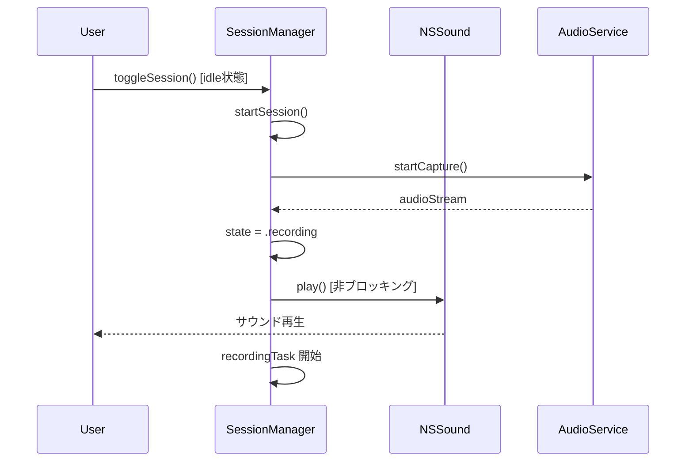

# Design Document

## Overview

セッション開始時にシステムサウンドを再生し、ユーザーが録音バーを見ていなくても音で開始を認識できるようにする。

### Goals
- 録音セッション開始時にシステムサウンドを鳴らす
- サウンド再生が録音処理をブロックしない

### Non-Goals
- サウンドの種類をユーザーが選択する機能
- セッション終了時のサウンド再生
- サウンドの有効/無効を切り替える設定

## Architecture

### Existing Architecture Analysis

- `SessionManager.startSession()` がセッションライフサイクルを管理
- 音声キャプチャ成功後に `state = .recording` を設定してセッション開始を確定
- 既存の依存注入パターン（プロトコルベース DI）に従う

### Architecture Pattern & Boundary Map

- Selected pattern: 既存の `SessionManager` への直接統合
- 既存パターンの維持: プロトコルベース DI、`@MainActor` 制約
- 新規コンポーネント: なし（`NSSound` API を `startSession()` 内で直接呼び出し）

### Technology Stack

| Layer | Choice / Version | Role in Feature | Notes |
|-------|------------------|-----------------|-------|
| Services | `NSSound` (AppKit) | システムサウンド再生 | macOS 組み込み、追加依存なし |

## System Flows



## Requirements Traceability

| Requirement | Summary | Components | Interfaces | Flows |
|-------------|---------|------------|------------|-------|
| 1.1 | ホットキー押下でセッション開始時にサウンド再生 | SessionManager | startSession() | セッション開始フロー |
| 1.2 | サウンド再生が録音処理をブロックしない | SessionManager | NSSound.play() | 非同期再生 |

## Components and Interfaces

| Component | Domain/Layer | Intent | Req Coverage | Key Dependencies | Contracts |
|-----------|--------------|--------|--------------|------------------|-----------|
| SessionManager | Services | セッション開始時にサウンド再生を追加 | 1.1, 1.2 | NSSound (P1) | Service |

### Services

#### SessionManager（既存・変更）

| Field | Detail |
|-------|--------|
| Intent | `startSession()` 内でセッション開始確定後にシステムサウンドを再生 |
| Requirements | 1.1, 1.2 |

Responsibilities & Constraints:
- `state = .recording` 設定直後にサウンドを再生
- サウンド再生はオプショナルチェイン（`?.play()`）で安全にスキップ
- `NSSound.play()` は非ブロッキングのため、録音処理への影響なし

Dependencies:
- External: `NSSound` (AppKit) — システムサウンド再生 (P1)

##### Service Interface

変更箇所（`startSession()` 内）:

```swift
// state = .recording 設定直後に追加
NSSound(named: NSSound.Name("Tink"))?.play()
```

- Preconditions: `state == .recording`（セッション開始が確定済み）
- Postconditions: システムサウンドが非同期で再生される（失敗時は無音）
- Invariants: サウンド再生の成否が録音処理に影響しない

## Error Handling

### Error Strategy
- `NSSound(named:)` が `nil` を返す場合: オプショナルチェインにより無音で継続
- サウンド再生自体の失敗: `play()` は `Bool` を返すが、戻り値は無視（録音が主機能）

## Testing Strategy

### Unit Tests
- セッション開始時にサウンド再生が呼ばれることの検証（DI で確認）
- サウンド再生が録音フローをブロックしないことの検証
