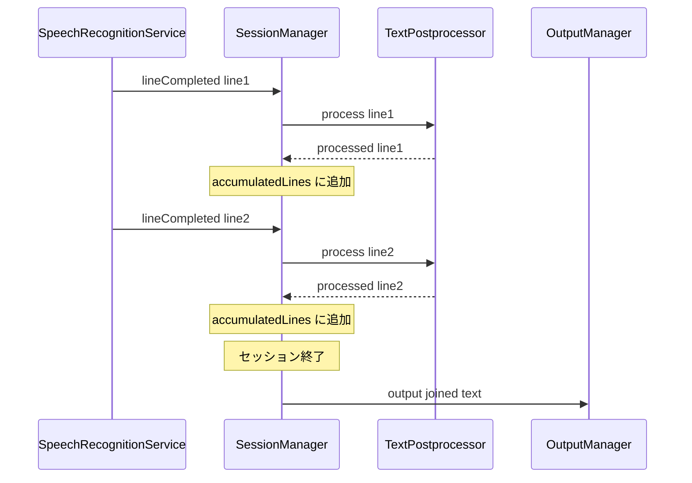
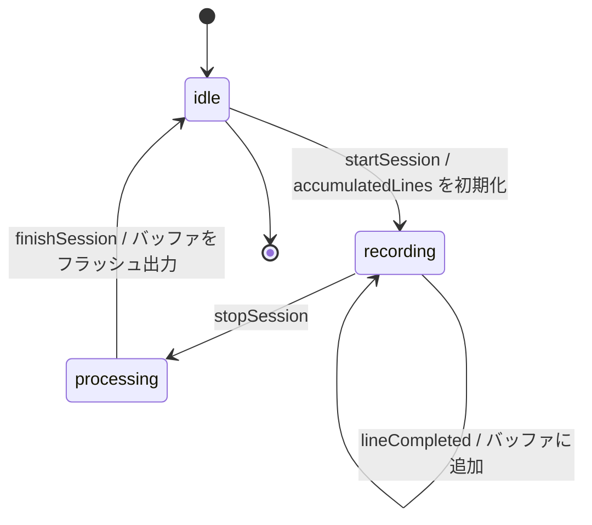
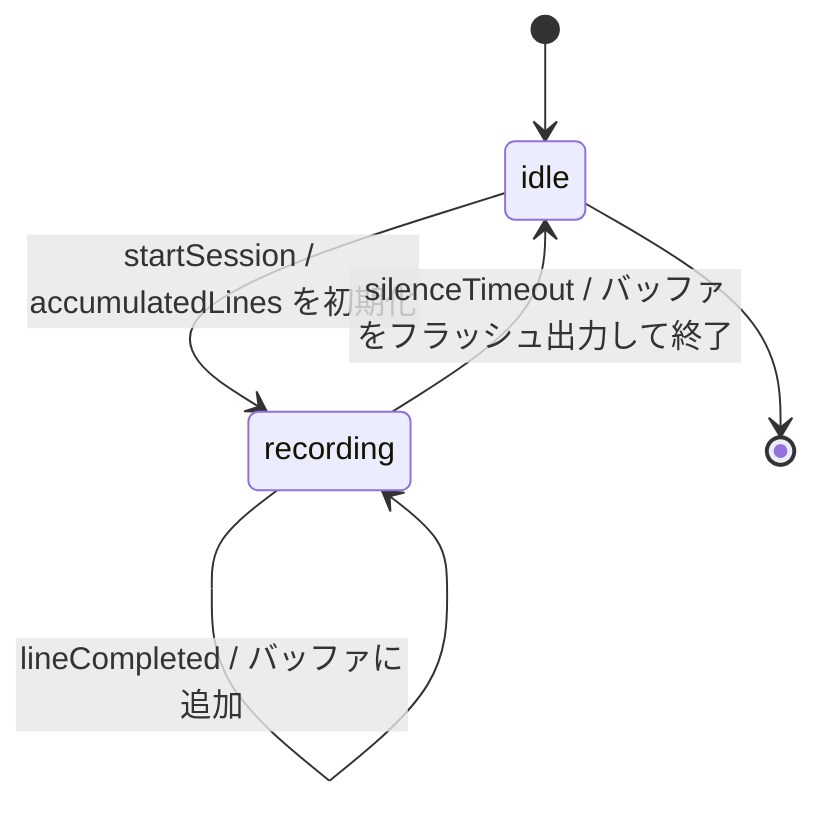

# Design Document

## Overview

Purpose: セッション中に認識されたすべてのテキストを蓄積し、セッション終了時に一括出力する。
Users: 音声入力を利用するユーザーが、複数の発話セグメントを含む完全なテキストを取得するために使用する。
Impact: SessionManager の `.lineCompleted` ハンドラから即時出力を除去し、バッファ蓄積 + 終了時フラッシュに変更する。

### Goals
- セッション中の全認識テキストを失わずに蓄積する
- セッション終了時に蓄積テキストを結合して一括出力する
- テキスト後処理が行単位で正しく適用される状態を維持する

### Non-Goals
- ストリーミング出力（リアルタイム文字入力）の実装
- セッション間でのテキスト永続化
- バッファ内容の UI 表示（既存の `partialText` による部分表示は維持）

## Architecture

### Existing Architecture Analysis

SessionManager は `@MainActor` で保護された `ObservableObject` であり、セッションのライフサイクル（idle → recording → processing → idle）を管理する。`.lineCompleted` イベントごとに `OutputManager` を即座に呼び出す設計であり、テキスト蓄積の仕組みは存在しない。

変更対象:
- `SessionManager.swift`: `.lineCompleted` ハンドラの出力ロジック、`finishSession()` のフラッシュ処理
- `SessionManagerTests.swift`: 蓄積・一括出力の検証テスト追加

既存パターンの維持:
- プロトコルベースの依存注入
- `@MainActor` によるスレッド安全性
- `AppSettings` による設定参照
- Swift Testing フレームワーク (`@Suite`, `@Test`, `#expect`)

### Architecture Pattern & Boundary Map



Architecture Integration:
- Selected pattern: SessionManager 内部バッファ。セッションライフサイクルと密結合した状態であり、分離する意義が薄い
- Domain boundaries: SessionManager がテキスト蓄積の責務を持ち、OutputManager は結合済みテキストの出力のみを担当
- Existing patterns preserved: プロトコルベースの DI、`@MainActor` 分離、AppSettings 参照
- New components rationale: 新規コンポーネントなし。既存の SessionManager にプロパティとロジックを追加

### Technology Stack

| Layer | Choice / Version | Role in Feature | Notes |
|-------|------------------|-----------------|-------|
| Services | Swift `[String]` 配列 | テキスト蓄積バッファ | SessionManager 内プライベートプロパティ |
| Testing | Swift Testing | 蓄積・出力の検証 | 既存テストスイートの拡張 |

## System Flows

### 正常終了フロー



### 無音タイムアウトフロー



無音タイムアウト時は `startSilenceTimeout()` 内で `finishSession(error:)` が呼ばれ、同一のフラッシュ処理が実行される。

## Requirements Traceability

| Requirement | Summary | Components | Interfaces | Flows |
|-------------|---------|------------|------------|-------|
| 1.1 | lineCompleted テキストをバッファに追加 | SessionManager | handleRecognitionEvent | 正常終了フロー |
| 1.2 | recording 中は OutputManager に即座に渡さない | SessionManager | handleRecognitionEvent | 正常終了フロー |
| 1.3 | セッション開始時にバッファを初期化 | SessionManager | startSession | 正常終了フロー |
| 2.1 | 終了時に全テキストを結合して出力 | SessionManager | finishSession | 正常終了フロー |
| 2.2 | 蓄積テキストが空の場合は出力しない | SessionManager | finishSession | 正常終了フロー |
| 2.3 | 無音タイムアウト時も蓄積テキストを出力 | SessionManager | finishSession | 無音タイムアウトフロー |
| 3.1 | 後処理有効時は処理済みテキストをバッファに追加 | SessionManager, TextPostprocessor | handleRecognitionEvent | 正常終了フロー |
| 3.2 | 後処理無効時は元テキストをバッファに追加 | SessionManager | handleRecognitionEvent | 正常終了フロー |

## Components and Interfaces

| Component | Domain/Layer | Intent | Req Coverage | Key Dependencies | Contracts |
|-----------|--------------|--------|--------------|------------------|-----------|
| SessionManager | Services | テキスト蓄積とセッション終了時一括出力 | 1.1, 1.2, 1.3, 2.1, 2.2, 2.3, 3.1, 3.2 | OutputManager (P0), TextPostprocessor (P1) | State |

### Services

#### SessionManager (変更)

| Field | Detail |
|-------|--------|
| Intent | セッション中の認識テキストを蓄積し、終了時に一括出力する |
| Requirements | 1.1, 1.2, 1.3, 2.1, 2.2, 2.3, 3.1, 3.2 |

Responsibilities & Constraints
- lineCompleted イベントごとに後処理済み（または未処理の）テキストをバッファに追加する
- recording 状態中は OutputManager を呼び出さない
- セッション終了時（正常・タイムアウト問わず）にバッファ内テキストを改行結合して OutputManager に出力する
- バッファが空の場合は OutputManager を呼び出さない
- `@MainActor` による排他制御を維持する

Dependencies
- Outbound: OutputManager — 結合テキストの出力 (P0)
- Outbound: TextPostprocessor — 行単位のテキスト後処理 (P1)
- Inbound: SpeechRecognitionService — RecognitionEvent ストリーム (P0)

Contracts: State [x]

##### State Management

State model:

```swift
// 新規追加プロパティ
private var accumulatedLines: [String] = []
```

State transitions:
- `startSession()`: `accumulatedLines = []`（バッファ初期化、要件 1.3）
- `handleRecognitionEvent(.lineCompleted)`: `accumulatedLines.append(processedText)`（要件 1.1, 3.1, 3.2）
- `finishSession()`: バッファが空でなければ `outputManager.output(text: accumulatedLines.joined(separator: "\n"), mode: mode)` を呼び出す（要件 2.1, 2.2, 2.3）。その後 `accumulatedLines = []`

Concurrency strategy: `@MainActor` により全操作がメインスレッドで直列実行される。追加の同期機構は不要。

Implementation Notes
- `finishSession()` は `outputManager.output()` の呼び出しのために `async` に変更する必要がある
- `finishSession()` の呼び出し箇所（`recordingTask` クロージャ内、`startSilenceTimeout` クロージャ内）はすでに async コンテキストのため、`await` 追加のみで対応可能
- `.lineCompleted` ハンドラから `outputManager.output()` の直接呼び出しを除去する
- `monitoring.textCompleted(text:)` の呼び出しは行単位で維持する（モニタリングは蓄積とは独立）

## Data Models

### Domain Model

テキスト蓄積バッファは SessionManager のプライベート状態であり、外部に公開しない。

- Aggregate: SessionManager（セッションライフサイクルのルートエンティティ）
- Value Object: `accumulatedLines: [String]`（認識済みテキストの順序付きリスト）
- Invariant: `accumulatedLines` は recording 状態でのみ要素が追加され、セッション開始時に必ず空に初期化される

永続化は行わない。セッション終了時にバッファはクリアされる。

## Error Handling

### Error Strategy

蓄積テキストに関する固有のエラーシナリオはない。既存のエラーハンドリング（無音タイムアウト、マイク障害等）がそのまま適用される。

- 無音タイムアウト: `finishSession(error: .silenceTimeout)` が呼ばれる際、蓄積テキストがあればフラッシュ出力してからエラー通知を行う
- セッション異常終了: `finishSession()` が呼ばれれば蓄積テキストはフラッシュされる

## Testing Strategy

### Unit Tests

- `accumulatedLines` がセッション開始時に空に初期化されることの検証
- 単一 `lineCompleted` 後にセッション終了で OutputManager が1回だけ呼ばれることの検証
- 複数 `lineCompleted` 後にセッション終了で結合テキストが出力されることの検証
- `lineCompleted` 発生時に OutputManager が即座に呼ばれないことの検証
- 蓄積テキストが空の場合に OutputManager が呼ばれないことの検証

### Integration Tests

- 無音タイムアウト時に蓄積テキストが出力されることの検証
- テキスト後処理有効時に処理済みテキストがバッファに追加されることの検証
- テキスト後処理無効時に元テキストがバッファに追加されることの検証
