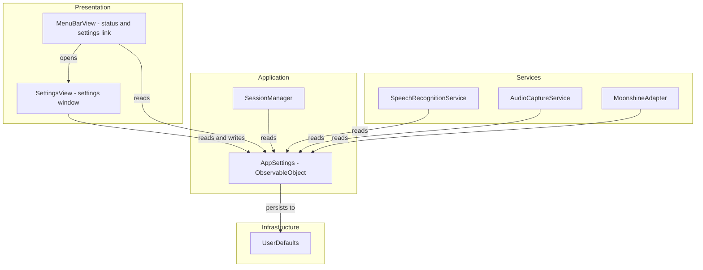
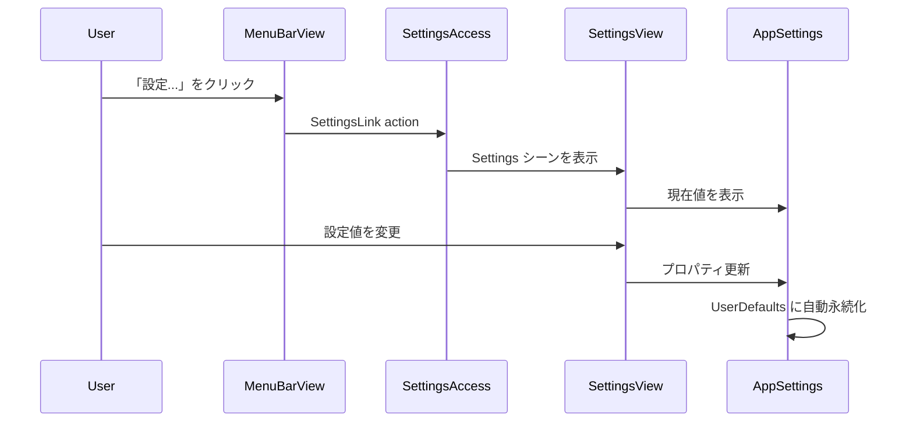
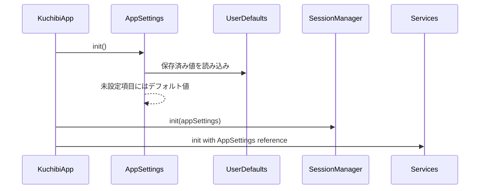

# Design Document

## Overview

kuchibi アプリケーションに SwiftUI Settings シーンを追加し、散在するハードコード設定値を一元管理する基盤を構築する。MenuBarView に混在している出力モード選択とログイン時起動トグルを設定ウィンドウに移行し、MenuBarView はステータス表示と設定画面への導線に簡素化する。

### Goals
- メニューバーから設定ウィンドウを開けるようにする
- 全設定値を `AppSettings` クラスに集約し、UserDefaults で永続化する
- 既存設定（出力モード、ログイン時起動）を設定ウィンドウに移行する
- 後続 spec（model-selection, audio-preprocessing 等）の設定項目を収容できるカテゴリ構造を持つ

### Non-Goals
- モデル選択UI の実装（model-selection spec で対応）
- 音声前処理・後処理の設定項目追加（各 spec で対応）
- ホットキーのカスタマイズ UI（将来検討）

## Architecture

### Existing Architecture Analysis

現在のアーキテクチャは Layered + Event-Driven:
- KuchibiApp が全サービスを初期化し、SessionManager に DI
- MenuBarView が出力モード選択とログイン時起動トグルを直接保持
- 設定永続化は SessionManager 内の UserDefaults（outputMode のみ）と SMAppService
- その他の設定値は各サービスクラスにハードコード

### Architecture Pattern & Boundary Map



- Selected pattern: 既存の Layered アーキテクチャを維持し、AppSettings を Application 層に追加
- Domain/feature boundaries: AppSettings が設定の読み書きを一元管理。各サービスは AppSettings を参照するのみ
- Existing patterns preserved: プロトコル経由の DI パターン、ObservableObject による状態管理
- New components rationale: AppSettings（設定集約）、SettingsView（設定UI）の2つのみ追加

### Technology Stack

| Layer | Choice / Version | Role in Feature | Notes |
|-------|------------------|-----------------|-------|
| UI | SwiftUI Settings + TabView | 設定ウィンドウの表示とカテゴリナビゲーション | macOS 標準パターン |
| Settings Access | SettingsAccess v2.1.0+ (SPM) | MenuBarExtra から Settings シーンを開く | MenuBarExtra の既知制限を解決 |
| Persistence | UserDefaults / @AppStorage | 設定値の永続化 | macOS 標準。AppSettings 内では UserDefaults を直接使用 |

## System Flows

### 設定ウィンドウの表示フロー



### 設定の復元フロー



## Requirements Traceability

| Requirement | Summary | Components | Interfaces | Flows |
|-------------|---------|------------|------------|-------|
| 1.1 | メニューから「設定...」で設定ウィンドウ表示 | MenuBarView, SettingsView | SettingsLink | 設定ウィンドウ表示フロー |
| 1.2 | SwiftUI Settings シーンで実装 | KuchibiApp, SettingsView | Settings scene | - |
| 1.3 | 設定ウィンドウ中もメニューバーとホットキー維持 | KuchibiApp | - | - |
| 1.4 | 再選択で既存ウィンドウを前面に | SettingsAccess | SettingsLink | - |
| 2.1 | 全設定を単一の設定管理層で永続化 | AppSettings | UserDefaults | 設定復元フロー |
| 2.2 | 起動時に設定値を復元して適用 | AppSettings, KuchibiApp | init | 設定復元フロー |
| 2.3 | ハードコード値にデフォルト値を定義 | AppSettings | defaultValues | - |
| 2.4 | デフォルト値への一括リセット | AppSettings, SettingsView | resetToDefaults() | - |
| 3.1 | 出力モードを設定ウィンドウに移動 | SettingsView, AppSettings | outputMode property | - |
| 3.2 | ログイン時起動を設定ウィンドウに移動 | SettingsView | launchAtLogin toggle | - |
| 3.3 | MenuBarView から設定コントロールを除去 | MenuBarView | - | - |
| 3.4 | MenuBarView にステータスと「設定...」を残す | MenuBarView | - | - |
| 4.1 | カテゴリ別に分類して表示 | SettingsView | TabView | - |
| 4.2 | ラベルと現在値を表示 | SettingsView | Form controls | - |
| 4.3 | 今後の設定項目を収容できる構造 | SettingsView | TabView tabs | - |
| 4.4 | タブナビゲーション | SettingsView | TabView | - |

## Components and Interfaces

| Component | Domain/Layer | Intent | Req Coverage | Key Dependencies | Contracts |
|-----------|-------------|--------|--------------|-----------------|-----------|
| AppSettings | Application | 全設定値の集約・永続化・デフォルト管理 | 2.1-2.4, 3.1 | UserDefaults (P0) | State |
| SettingsView | Presentation | 設定ウィンドウのUI | 1.1-1.4, 3.1-3.2, 4.1-4.4 | AppSettings (P0), SettingsAccess (P0) | - |
| MenuBarView | Presentation | ステータス表示と設定導線（既存改修） | 3.3-3.4 | AppSettings (P0) | - |
| KuchibiApp | Application | シーン構成と DI（既存改修） | 1.2-1.3, 2.2 | AppSettings (P0), SettingsAccess (P0) | - |

### Application Layer

#### AppSettings

| Field | Detail |
|-------|--------|
| Intent | 全設定値の一元管理、UserDefaults 永続化、デフォルト値提供 |
| Requirements | 2.1, 2.2, 2.3, 2.4, 3.1 |

Responsibilities & Constraints:
- 全設定プロパティを `@Published` で公開し、変更時に `UserDefaults` へ自動保存
- デフォルト値を static プロパティで定義
- 後続 spec で追加される設定項目もこのクラスに追加する拡張ポイント
- セッション中の設定変更は次回セッション開始時に反映

Dependencies:
- External: UserDefaults — 設定永続化 (P0)

Contracts: State

##### State Management

```swift
@MainActor
final class AppSettings: ObservableObject {
    // MARK: - Default Values
    static let defaultOutputMode: OutputMode = .clipboard
    static let defaultSilenceTimeout: TimeInterval = 30
    static let defaultModelName: String = "moonshine-tiny-ja"
    static let defaultUpdateInterval: Double = 0.5
    static let defaultBufferSize: Int = 1024

    // MARK: - Published Properties
    @Published var outputMode: OutputMode
    @Published var silenceTimeout: TimeInterval
    @Published var modelName: String
    @Published var updateInterval: Double
    @Published var bufferSize: Int

    // init: UserDefaults から復元、未設定はデフォルト値
    // 各 @Published の didSet で UserDefaults に保存

    func resetToDefaults()
    // 全プロパティをデフォルト値に戻し、UserDefaults もクリア
}
```

- Persistence: UserDefaults のキー名は `"setting.<propertyName>"` の命名規則
- Consistency: `@Published` の `didSet` で即座に永続化。起動時に `init` で復元

Implementation Notes:
- `outputMode` は既存の SessionManager から移行。SessionManager の `outputMode` プロパティは AppSettings を参照する形に変更
- 後続 spec で追加されるプロパティ（ノイズ抑制オン・オフ、後処理設定等）も同じパターンで追加

#### KuchibiApp（既存改修）

| Field | Detail |
|-------|--------|
| Intent | AppSettings の初期化、Settings シーン追加、DI グラフの更新 |
| Requirements | 1.2, 1.3, 2.2 |

Responsibilities & Constraints:
- `AppSettings` を `@StateObject` として保持し、全サービスに渡す
- `Settings` シーンを `body` に追加
- 既存の MenuBarExtra シーンと Settings シーンを並列に宣言

Implementation Notes:
- `body` に `Settings { SettingsView(appSettings: appSettings) }` を追加
- SessionManager の init に `appSettings` パラメータを追加
- SettingsAccess の `openSettingsAccess()` は MenuBarExtra 内では不要。MenuBarExtra 内では SettingsAccess のカスタム `SettingsLink` を使用

### Presentation Layer

#### SettingsView

| Field | Detail |
|-------|--------|
| Intent | 設定ウィンドウのカテゴリ別 UI |
| Requirements | 1.1, 1.4, 3.1, 3.2, 4.1, 4.2, 4.3, 4.4 |

Responsibilities & Constraints:
- TabView でカテゴリを分離（「一般」「音声認識」）
- 各タブ内は `Form` で設定項目を表示
- 「デフォルトに戻す」ボタンを画面下部に配置

Dependencies:
- Inbound: AppSettings — 設定値の読み書き (P0)
- External: SettingsAccess — Settings シーンへのアクセス (P0)

Implementation Notes:
- 「一般」タブ: 出力モード Picker、ログイン時起動 Toggle
- 「音声認識」タブ: 現時点ではモデル名（読み取り専用表示）、無音タイムアウト。後続 spec でモデル選択等を追加
- ログイン時起動は SMAppService を直接呼び出す。AppSettings では永続化せず、SMAppService の状態を正とする
- 「デフォルトに戻す」ボタンは `appSettings.resetToDefaults()` を呼び出す

#### MenuBarView（既存改修）

| Field | Detail |
|-------|--------|
| Intent | ステータス表示と設定画面への導線に簡素化 |
| Requirements | 3.3, 3.4 |

Responsibilities & Constraints:
- 出力モード Picker とログイン時起動 Toggle を除去
- ステータステキスト、「設定...」ボタン、終了ボタンのみ残す

Implementation Notes:
- SettingsAccess のカスタム `SettingsLink` を使用して「設定...」メニュー項目を実装
- ステータス表示は既存のまま維持（待機中/録音中.../認識処理中...）

## Data Models

### Domain Model

設定値のドメインモデル:
- `AppSettings` が唯一の集約ルート
- `OutputMode` enum は既存のまま維持（`.clipboard`, `.directInput`）
- 各設定プロパティは独立した値オブジェクト（プリミティブ型）
- 不変条件: `silenceTimeout > 0`, `bufferSize > 0`, `updateInterval > 0`

### Physical Data Model

UserDefaults キー設計:

| Key | Type | Default | Description |
|-----|------|---------|-------------|
| `setting.outputMode` | String (rawValue) | `"clipboard"` | 出力モード |
| `setting.silenceTimeout` | Double | `30.0` | 無音タイムアウト（秒） |
| `setting.modelName` | String | `"moonshine-tiny-ja"` | モデル名 |
| `setting.updateInterval` | Double | `0.5` | 途中結果更新間隔（秒） |
| `setting.bufferSize` | Int | `1024` | 音声バッファサイズ |

## Error Handling

### Error Strategy
- 設定値の読み込みに失敗した場合、デフォルト値にフォールバック（UserDefaults の標準動作）
- SMAppService のログイン時起動設定失敗は、既存と同様にログ出力 + UI状態のロールバック
- 不正な設定値（負数等）は setter で検証し、無効な値を拒否

## Testing Strategy

### Unit Tests
- `AppSettings` の初期化でデフォルト値が正しくセットされること
- `AppSettings` のプロパティ変更が UserDefaults に永続化されること
- `resetToDefaults()` で全プロパティがデフォルト値に戻ること
- UserDefaults に保存済みの値がある場合、init で正しく復元されること

### Integration Tests
- KuchibiApp から AppSettings が SessionManager に渡され、outputMode が反映されること
- 設定変更後のアプリ再起動で設定が維持されること

### UI Tests
- メニューバーの「設定...」から設定ウィンドウが表示されること
- タブ切り替えが動作すること
- 「デフォルトに戻す」で設定がリセットされること
