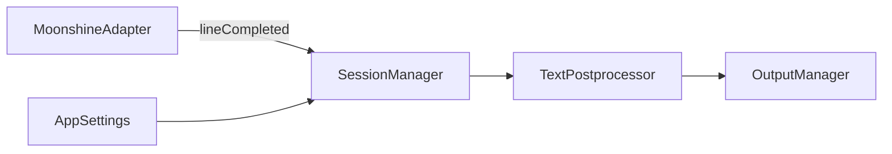
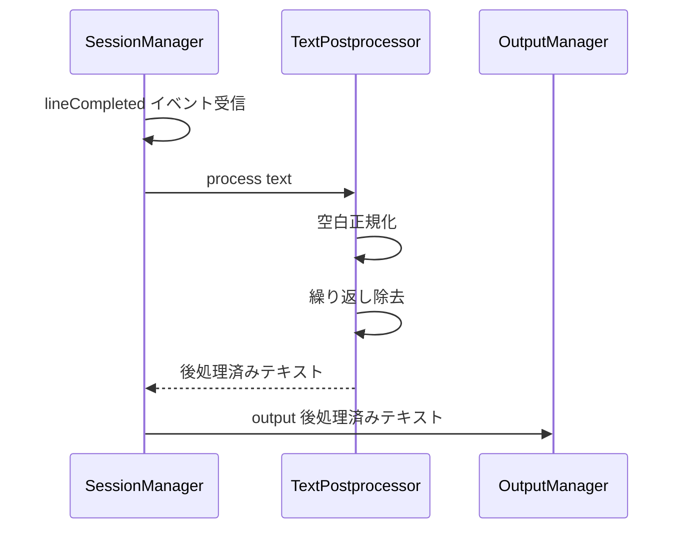

# Technical Design: text-postprocessing

## Overview

moonshine の認識結果テキストに後処理を適用し、日本語テキストとしての品質を向上させる。現在は MoonshineAdapter が複数行のテキストをスペースで結合した結果がそのまま出力されるため、日本語文字間に不要なスペースが含まれたり、認識エラーによる繰り返しフレーズが残る。

TextPostprocessor コンポーネントを新設し、空白正規化と繰り返し除去の2つの変換を適用する。AudioPreprocessor（音声入力側の前処理）と対称的な設計で、テキスト出力側の後処理として SessionManager のパイプラインに組み込む。

### Goals

- 日本語文字間の不要なスペースを除去し自然なテキストを生成
- 認識エラーによる繰り返しフレーズを除去
- 後処理のオン・オフを AppSettings で管理

### Non-Goals

- 句読点の自動挿入（NLP モデルが必要で本機能のスコープ外）
- 文法チェックや表現の修正
- 翻訳やローカライゼーション処理

## Architecture

### Existing Architecture Analysis

テキスト出力パイプラインは以下の構成:

1. `MoonshineAdapterImpl` — 認識テキストを `lineCompleted` コールバックで返す。複数行はスペースで結合
2. `SessionManagerImpl.handleRecognitionEvent` — `lineCompleted` イベントで `outputManager.output()` を呼び出す
3. `OutputManagerImpl` — ClipboardService 経由でテキストを出力

SessionManager の `handleRecognitionEvent` 内で `outputManager.output()` を呼ぶ前にテキスト変換を挿入する。

### Architecture Pattern & Boundary Map



Architecture Integration:
- Selected pattern: パイプラインパターン。AudioPreprocessor（入力側）と対称的に TextPostprocessor（出力側）を配置
- Domain boundaries: TextPostprocessor はテキスト変換のみを担当。入出力は純粋な String
- Existing patterns preserved: プロトコルベースの依存注入、AppSettings による設定管理
- New components rationale: テスト容易性と単一責務の原則。純粋関数的な設計
- Steering compliance: 既存パターンを維持

### Technology Stack

| Layer | Choice / Version | Role in Feature | Notes |
|-------|------------------|-----------------|-------|
| テキスト処理 | Swift Regex | 日本語文字判定と正規表現置換 | macOS 14+ 標準 |
| 設定管理 | AppSettings / UserDefaults | 後処理オン・オフの永続化 | 既存の設定基盤を拡張 |

## System Flows

### テキスト後処理フロー



後処理が無効の場合は TextPostprocessor をスキップし、元のテキストをそのまま OutputManager に渡す。

## Requirements Traceability

| Requirement | Summary | Components | Interfaces | Flows |
|-------------|---------|------------|------------|-------|
| 1.1 | 先頭末尾の空白除去 | TextPostprocessor | TextPostprocessing | テキスト後処理フロー |
| 1.2 | 日本語文字間のスペース除去 | TextPostprocessor | TextPostprocessing | テキスト後処理フロー |
| 1.3 | 英数字と日本語間のスペース保持 | TextPostprocessor | TextPostprocessing | テキスト後処理フロー |
| 1.4 | 連続スペースの正規化 | TextPostprocessor | TextPostprocessing | テキスト後処理フロー |
| 2.1 | 3文字以上の繰り返し除去 | TextPostprocessor | TextPostprocessing | テキスト後処理フロー |
| 2.2 | 2文字以下の繰り返し保持 | TextPostprocessor | TextPostprocessing | テキスト後処理フロー |
| 3.1 | 後処理オン・オフ設定 | AppSettings | - | - |
| 3.2 | 無効時は元テキストを出力 | SessionManager | - | テキスト後処理フロー |
| 3.3 | 有効時は後処理済みテキストを出力 | SessionManager | - | テキスト後処理フロー |

## Components and Interfaces

| Component | Domain/Layer | Intent | Req Coverage | Key Dependencies | Contracts |
|-----------|--------------|--------|--------------|------------------|-----------|
| TextPostprocessor | Text Processing | テキストの空白正規化と繰り返し除去 | 1.1, 1.2, 1.3, 1.4, 2.1, 2.2 | なし | Service |
| AppSettings (拡張) | Configuration | 後処理設定の追加 | 3.1 | UserDefaults (P0) | State |
| SessionManager (改修) | Orchestration | 後処理パイプラインの統合 | 3.2, 3.3 | TextPostprocessor (P0), AppSettings (P0) | - |
| SettingsView (拡張) | UI | 後処理設定の表示 | 3.1 | AppSettings (P0) | - |

### Text Processing

#### TextPostprocessor

| Field | Detail |
|-------|--------|
| Intent | 認識結果テキストの空白正規化と繰り返しフレーズ除去を実行する |
| Requirements | 1.1, 1.2, 1.3, 1.4, 2.1, 2.2 |

Responsibilities & Constraints:
- String を受け取り、後処理済みの String を返す純粋関数的な設計
- 空白正規化: トリム、日本語文字間スペース除去、連続スペース正規化
- 繰り返し除去: 3 文字以上の連続同一フレーズを 1 つに集約
- 外部依存なし（Swift 標準ライブラリのみ）

Dependencies:
- External: なし

Contracts: Service [x]

##### Service Interface

```swift
protocol TextPostprocessing {
    func process(_ text: String) -> String
}
```

- Preconditions: なし（空文字列も受け付ける）
- Postconditions: 正規化済みテキストを返す。空文字列入力には空文字列を返す
- Invariants: 同じ入力に対して常に同じ出力を返す（純粋関数）

Implementation Notes:
- Integration: SessionManager が `lineCompleted` ハンドリングで `textPostprocessor.process()` を呼び出す
- Validation: 空文字列チェックは呼び出し側（SessionManager）が実施済み
- Risks: 正規表現が意図しない変換を行う可能性。ユニットテストで網羅的に検証

### Configuration

#### AppSettings (拡張)

| Field | Detail |
|-------|--------|
| Intent | テキスト後処理のオン・オフ設定プロパティを追加する |
| Requirements | 3.1 |

追加プロパティ:

| Property | Type | Default | UserDefaults Key |
|----------|------|---------|------------------|
| `textPostprocessingEnabled` | `Bool` | `true` | `setting.textPostprocessingEnabled` |

### Orchestration

#### SessionManager (改修)

| Field | Detail |
|-------|--------|
| Intent | テキスト後処理を出力前に適用する |
| Requirements | 3.2, 3.3 |

Implementation Notes:
- `handleRecognitionEvent` の `lineCompleted` 分岐で、`appSettings.textPostprocessingEnabled` が `true` の場合のみ `textPostprocessor.process()` を呼び出す
- TextPostprocessor は SessionManager の初期化時に注入

### UI

#### SettingsView (拡張)

| Field | Detail |
|-------|--------|
| Intent | 後処理設定の UI を追加する |
| Requirements | 3.1 |

Implementation Notes:
- 「音声認識」タブの前処理セクションの後に後処理の Toggle を追加

## Data Models

### Domain Model

テキスト後処理は String → String の変換であり、永続的なデータモデルは不要。設定値のみ UserDefaults に保存。

## Error Handling

### Error Strategy

テキスト後処理は純粋な文字列操作のため、例外が発生しない設計。正規表現はコンパイル時に検証される静的パターンを使用。

## Testing Strategy

### Unit Tests

- TextPostprocessor の空白正規化: 先頭末尾トリム、日本語文字間スペース除去、英数字間スペース保持、連続スペース正規化
- TextPostprocessor の繰り返し除去: 3 文字以上の繰り返し集約、2 文字以下の保持
- TextPostprocessor の複合テスト: 空白正規化と繰り返し除去の組み合わせ
- AppSettings の新規プロパティ: デフォルト値、永続化、リセット

### Integration Tests

- SessionManager での後処理統合: 後処理有効時にテキストが変換されることを検証
- 後処理無効時の透過: 設定オフ時に元テキストがそのまま出力されることを検証
