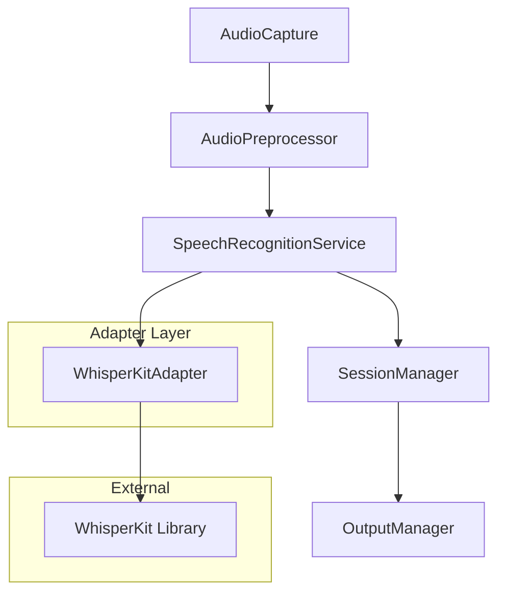
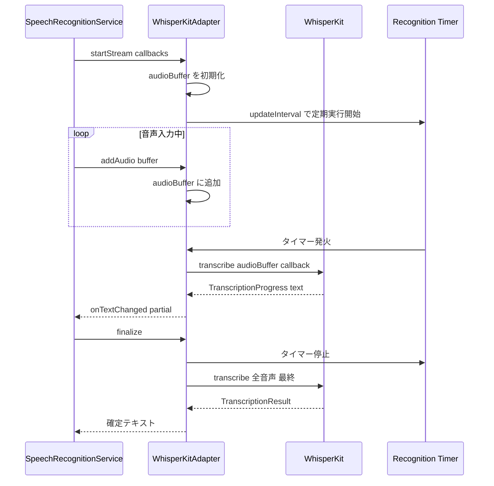
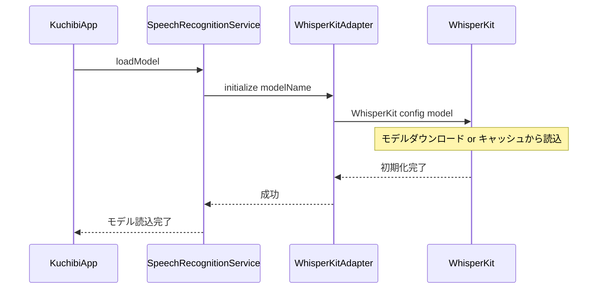

# Design Document

## Overview

Purpose: 音声認識エンジンを Moonshine から WhisperKit に差し替え、日本語認識精度を大幅に向上させる。
Users: 日本語音声入力を行うユーザーが、より正確なテキスト変換を得るために使用する。
Impact: `MoonshineAdapting` プロトコルを汎用名 `SpeechRecognitionAdapting` にリネームし、WhisperKit アダプターを新規実装する。SpeechRecognitionService とそのテストの参照を更新し、KuchibiApp の DI サイトを差し替える。

### Goals

- 日本語音声認識精度の向上（Moonshine からの移行）
- 音声認識アダプタープロトコルの汎用化
- 既存パイプライン（テキスト蓄積、後処理、出力）との完全互換性維持

### Non-Goals

- Moonshine アダプターの保持（完全に WhisperKit に置換する）
- リアルタイム文字起こしの低遅延最適化（精度を優先）
- 設定 UI でのモデル選択機能追加（AppSettings の値変更で対応可能だが UI は対象外）

## Architecture

### Existing Architecture Analysis

現在のパイプライン:

```
AudioCapture → AudioPreprocessor → SpeechRecognitionService → SessionManager → OutputManager
                                        |
                                   MoonshineAdapting (adapter)
```

`SpeechRecognitionService` が `MoonshineAdapting` プロトコルを通じてアダプターを利用する。アダプターは `startStream` でコールバックベースのイベント通知を行い、`addAudio` で音声データを逐次投入する。

変更対象:
- `MoonshineAdapting.swift`: プロトコル名を `SpeechRecognitionAdapting` にリネーム
- `MoonshineAdapter.swift`: 削除（WhisperKit アダプターに置換）
- `SpeechRecognitionService.swift`: プロトコル参照更新、デフォルトモデル名変更
- `KuchibiApp.swift`: DI サイトの差し替え
- `AppSettings.swift`: デフォルトモデル名変更
- Mock/テスト: プロトコル名の更新

既存パターンの維持:
- プロトコルベースの依存注入
- `AsyncStream<RecognitionEvent>` によるイベント配信
- `@MainActor` によるスレッド安全性

### Architecture Pattern & Boundary Map



Architecture Integration:
- Selected pattern: アダプターパターン（既存踏襲）。`SpeechRecognitionAdapting` プロトコルに準拠する WhisperKit アダプターを実装
- Domain boundaries: アダプターが WhisperKit API の詳細を隠蔽し、SpeechRecognitionService は認識エンジンの実装を知らない
- Existing patterns preserved: プロトコルベースの DI、AsyncStream イベント配信、AppSettings による設定管理
- New components rationale: `WhisperKitAdapter` は既存の `MoonshineAdapterImpl` と同等の責務を持つ新規実装

### Technology Stack

| Layer | Choice / Version | Role in Feature | Notes |
|-------|------------------|-----------------|-------|
| ASR Engine | WhisperKit (from: "0.9.0") | 音声認識処理 | SPM 依存として追加 |
| ASR Model | whisper-base (CoreML) | 日本語音声認識モデル | HuggingFace から自動ダウンロード |
| Services | Swift (既存) | アダプター実装、サービス層 | 既存パターンの踏襲 |
| Testing | Swift Testing (既存) | テストスイートの更新 | Mock のリネームと新規テスト |

## System Flows

### 認識処理フロー



### モデル初期化フロー



## Requirements Traceability

| Requirement | Summary | Components | Interfaces | Flows |
|-------------|---------|------------|------------|-------|
| 1.1 | WhisperKit モデル読込・初期化 | WhisperKitAdapter | initialize | モデル初期化フロー |
| 1.2 | 16kHz モノラル PCM Float32 の認識処理 | WhisperKitAdapter | addAudio, startStream | 認識処理フロー |
| 1.3 | セッション停止時の最終認識 | WhisperKitAdapter | finalize | 認識処理フロー |
| 2.1 | 部分テキストの定期通知 | WhisperKitAdapter | startStream onTextChanged | 認識処理フロー |
| 2.2 | 確定テキストの通知 | WhisperKitAdapter | startStream onLineCompleted | 認識処理フロー |
| 2.3 | finalize 結果の lineCompleted 発行 | SpeechRecognitionService | processAudioStream | 認識処理フロー |
| 3.1 | 汎用プロトコルへの準拠 | WhisperKitAdapter | SpeechRecognitionAdapting | - |
| 3.2 | 同一 RecognitionEvent ストリーム生成 | SpeechRecognitionService | processAudioStream | 認識処理フロー |
| 3.3 | SessionManager 修正不要 | SessionManager | - | - |
| 4.1 | プロトコルの汎用命名 | SpeechRecognitionAdapting | protocol definition | - |
| 4.2 | 依存注入によるアダプター切替 | KuchibiApp | init DI site | モデル初期化フロー |

## Components and Interfaces

| Component | Domain/Layer | Intent | Req Coverage | Key Dependencies | Contracts |
|-----------|--------------|--------|--------------|------------------|-----------|
| SpeechRecognitionAdapting | Protocol | 音声認識エンジンの汎用抽象化 | 4.1 | - | Service |
| WhisperKitAdapter | Services | WhisperKit API のアダプター実装 | 1.1, 1.2, 1.3, 2.1, 2.2, 3.1 | WhisperKit (P0) | Service |
| SpeechRecognitionService | Services | プロトコル参照の更新 | 2.3, 3.2 | SpeechRecognitionAdapting (P0) | Service |
| KuchibiApp | App | DI サイトの差し替え | 4.2 | WhisperKitAdapter (P0) | - |

### Protocol Layer

#### SpeechRecognitionAdapting (リネーム)

| Field | Detail |
|-------|--------|
| Intent | 音声認識エンジンの汎用アダプタープロトコル定義 |
| Requirements | 4.1 |

Responsibilities & Constraints
- `MoonshineAdapting` から `SpeechRecognitionAdapting` へのリネーム
- API シグネチャは変更なし
- ファイル名を `SpeechRecognitionAdapting.swift` に変更

Contracts: Service [x]

##### Service Interface

```swift
protocol SpeechRecognitionAdapting {
    func initialize(modelName: String) async throws
    func startStream(
        onTextChanged: @escaping (String) -> Void,
        onLineCompleted: @escaping (String) -> Void
    ) throws
    func addAudio(_ buffer: AVAudioPCMBuffer)
    func getPartialText() -> String
    func finalize() async -> String
}
```

- Preconditions: `initialize` が `startStream` より先に呼ばれること
- Postconditions: `finalize` 後はストリームが停止し、確定テキストが返される
- Invariants: `startStream` と `finalize` の間でのみ `addAudio` が有効

### Services

#### WhisperKitAdapter

| Field | Detail |
|-------|--------|
| Intent | WhisperKit ライブラリをラップし、SpeechRecognitionAdapting に準拠するアダプター |
| Requirements | 1.1, 1.2, 1.3, 2.1, 2.2, 3.1 |

Responsibilities & Constraints
- WhisperKit の初期化（モデルダウンロード・ロード）
- 音声データのバッファリング（`[Float]` 配列への蓄積）
- タイマーベースの定期認識実行と部分テキスト通知
- セッション終了時の最終認識実行
- `DecodingOptions(language: "ja")` による日本語明示指定

Dependencies
- External: WhisperKit — 音声認識エンジン (P0)
- Inbound: SpeechRecognitionService — 音声データの投入とイベント受信 (P0)

Contracts: Service [x] / State [x]

##### Service Interface

```swift
final class WhisperKitAdapter: SpeechRecognitionAdapting {
    func initialize(modelName: String) async throws
    func startStream(
        onTextChanged: @escaping (String) -> Void,
        onLineCompleted: @escaping (String) -> Void
    ) throws
    func addAudio(_ buffer: AVAudioPCMBuffer)
    func getPartialText() -> String
    func finalize() async -> String
}
```

- Preconditions: `initialize` で WhisperKit インスタンスが正常に生成されていること
- Postconditions: `finalize` で全蓄積音声の認識結果が返される
- Error: モデルダウンロード失敗、認識処理エラーは `KuchibiError.modelLoadFailed` としてラップ

##### State Management

State model:

```swift
private var whisperKit: WhisperKit?
private var audioBuffer: [Float] = []
private var latestText: String = ""
private var recognitionTimer: Timer?
private var onTextChanged: ((String) -> Void)?
private var onLineCompleted: ((String) -> Void)?
```

State transitions:
- `initialize`: `WhisperKit` インスタンスを生成（`WhisperKitConfig` で model と modelRepo を指定）
- `startStream`: `audioBuffer` を初期化、コールバックを保持、認識タイマーを開始
- `addAudio`: `AVAudioPCMBuffer` から `[Float]` に変換し `audioBuffer` に追加
- タイマー発火: `audioBuffer` を `transcribe()` に渡し、コールバックで部分テキスト通知
- `finalize`: タイマー停止、全音声の最終認識を実行、確定テキストを返す

Concurrency strategy: `addAudio` はメインスレッドから呼ばれる（AudioPreprocessor の AsyncStream 経由）。認識タイマーの実行と `addAudio` のバッファ追加が競合しないよう、アクターまたはロックで保護する。

Implementation Notes
- `AVAudioPCMBuffer` → `[Float]` 変換は既存の MoonshineAdapter と同様のパターンで実装
- タイマー間隔は `AppSettings.updateInterval`（デフォルト 0.5 秒）を使用。初期実装ではハードコードで 0.5 秒とし、設定連携は後続で対応可能
- WhisperKit の `transcribe` は async であるため、タイマーから Task で呼び出す
- `onLineCompleted` は認識中には呼ばず、`finalize` 時に確定テキストとして呼ぶ設計とする。SpeechRecognitionService 側の `lineCompletedEmitted` ロジックがフォールバックとして機能する

#### SpeechRecognitionService (変更)

| Field | Detail |
|-------|--------|
| Intent | プロトコル参照を `SpeechRecognitionAdapting` に更新、デフォルトモデル名変更 |
| Requirements | 2.3, 3.2 |

Responsibilities & Constraints
- `adapter: MoonshineAdapting` → `adapter: SpeechRecognitionAdapting` に変更
- `defaultModelName` を WhisperKit 用モデル名に変更
- `processAudioStream` のロジックは変更なし（要件 3.2）

Dependencies
- Inbound: SessionManager — イベントストリーム消費 (P0)
- Outbound: SpeechRecognitionAdapting — アダプター呼び出し (P0)

Implementation Notes
- `lineCompletedEmitted` フォールバックロジック（要件 2.3）は既存のまま維持
- デフォルトモデル名の値は WhisperKit のモデル指定に合わせる（例: `"base"`）

## Data Models

### Domain Model

WhisperKit 固有のデータモデルはアダプター内部に閉じ込める。外部に公開するデータは既存の `RecognitionEvent` のみ。

- Value Object: `audioBuffer: [Float]` — 蓄積された音声サンプル（WhisperKitAdapter 内部）
- Invariant: `audioBuffer` は `startStream` で初期化され、`finalize` 後にクリアされる
- 永続化不要

## Error Handling

### Error Strategy

WhisperKit 固有のエラーは `KuchibiError` にマッピングする。

- モデルダウンロード / ロード失敗: `KuchibiError.modelLoadFailed(underlying:)` — 既存のエラー型を再利用
- 認識処理エラー: ログ出力のみ。部分的な失敗は無視し、次回のタイマー発火で再試行
- ネットワークエラー（初回モデルダウンロード時）: `modelLoadFailed` としてラップし、通知サービス経由でユーザーに通知

### Error Categories and Responses

- 初期化エラー: モデルファイルが存在しない / ダウンロード失敗 → エラー通知、セッション開始を拒否
- 認識エラー: `transcribe` の例外 → ログ出力、`latestText` をフォールバック値として使用
- バッファエラー: `floatChannelData` が nil → ログ出力、データを破棄（既存パターン踏襲）

## Testing Strategy

### Unit Tests

- WhisperKitAdapter: `initialize` 成功時に WhisperKit インスタンスが生成されること
- WhisperKitAdapter: `addAudio` で内部バッファにデータが追加されること
- WhisperKitAdapter: `finalize` で蓄積音声の認識結果が返されること
- WhisperKitAdapter: `startStream` のコールバックで部分テキストが通知されること
- SpeechRecognitionService: プロトコル変更後も既存テストが通ること

### Integration Tests

- KuchibiApp: WhisperKitAdapter が DI サイトで正しく注入されること
- End-to-end: 音声入力から認識テキスト出力まで既存パイプラインが動作すること
- SessionManager: エンジン変更後も蓄積・一括出力が正常に動作すること（要件 3.3 の検証）

### Migration Strategy

- MoonshineVoice SPM 依存を WhisperKit SPM 依存に差し替え
- `MoonshineAdapting` → `SpeechRecognitionAdapting` の一括リネーム
- `MoonshineAdapterImpl` → `WhisperKitAdapter` の新規実装
- 全テストの Mock を更新（`MockMoonshineAdapter` → `MockSpeechRecognitionAdapter`）
- `AppSettings.defaultModelName` を WhisperKit 用に変更
