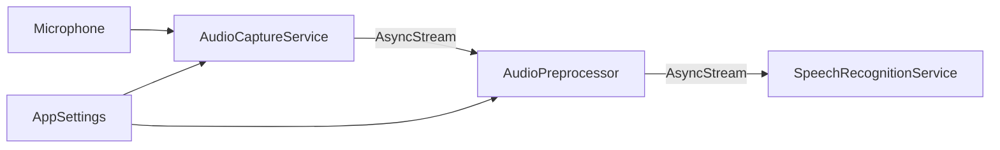
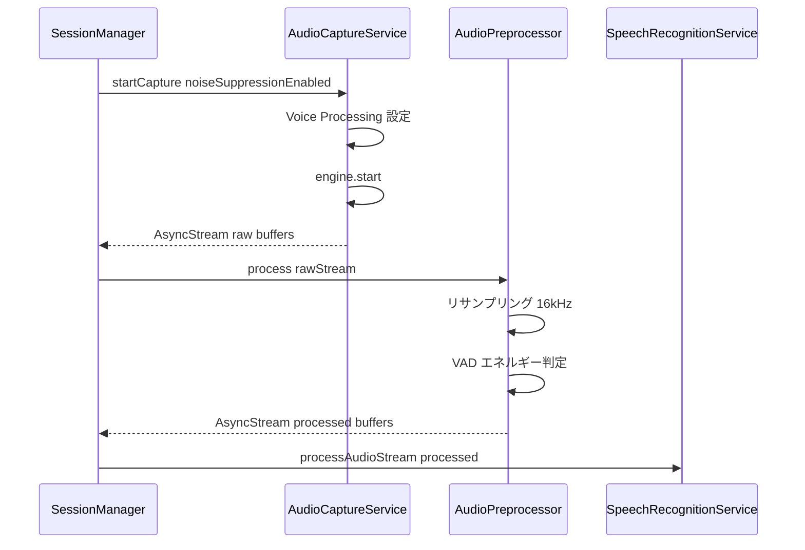
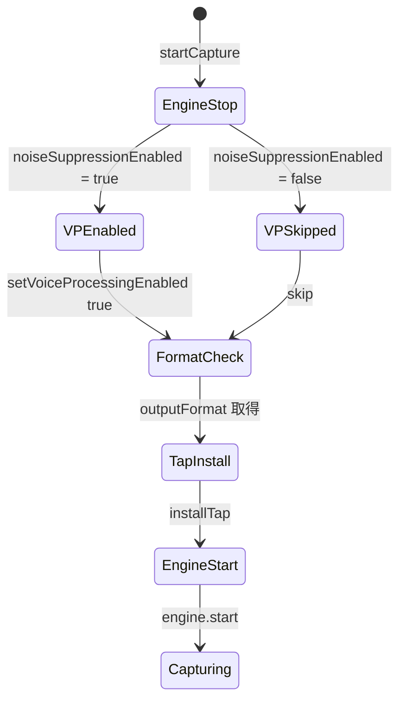

# Technical Design: audio-preprocessing

## Overview

kuchibi の音声キャプチャパイプラインに前処理レイヤーを追加し、マイク入力から認識エンジンに渡す音声品質を向上させる。現在は `AudioCaptureServiceImpl` が取得した生の AVAudioPCMBuffer をそのまま `SpeechRecognitionServiceImpl` に渡しているが、環境ノイズの影響を受けやすく、無音区間も含めてすべて認識エンジンに送信している。

この設計では、macOS Voice Processing によるノイズ抑制、エネルギーベース VAD による無音区間フィルタリング、AVAudioConverter による 16kHz リサンプリングの3つの前処理を導入する。既存の AudioCapturing プロトコルを維持しつつ、新たな AudioPreprocessor コンポーネントをパイプラインに挿入する。

### Goals

- macOS Voice Processing を活用したノイズ抑制の提供
- エネルギーベース VAD による無音区間の除外で認識効率を向上
- 16kHz モノラルへのリサンプリングでモデル入力フォーマットを最適化
- 各前処理のオン・オフと感度を AppSettings で管理

### Non-Goals

- WebRTC VAD や外部ライブラリによる高度な VAD（エネルギーベースで十分）
- 複数マイクへの同時対応
- リアルタイムのノイズ抑制パラメータ調整（セッション単位で適用）
- 音声の増幅やイコライザー処理

## Architecture

### Existing Architecture Analysis

現在の音声パイプラインは以下の構成:

1. `AudioCaptureServiceImpl` — AVAudioEngine でマイク入力を取得し、`AsyncStream<AVAudioPCMBuffer>` を返す
2. `SessionManagerImpl` — `audioService.startCapture()` で取得したストリームを `speechService.processAudioStream()` に渡す
3. `SpeechRecognitionServiceImpl` — ストリームのバッファを `MoonshineAdapterImpl.addAudio()` に送る

パイプラインの接続は SessionManager が担っており、AudioCapturing と SpeechRecognizing の間に前処理を挿入する自然なポイントが存在する。

### Architecture Pattern & Boundary Map



Architecture Integration:
- Selected pattern: パイプラインパターン。AudioPreprocessor を AudioCaptureService と SpeechRecognitionService の間に配置
- Domain boundaries: AudioCaptureService は音声取得、AudioPreprocessor は前処理変換、SpeechRecognitionService は認識処理を担当
- Existing patterns preserved: AsyncStream によるバッファ受け渡し、プロトコルベースの依存注入、AppSettings による設定管理
- New components rationale: AudioPreprocessor は単一責務の原則に基づき、前処理ロジックを独立させてテスト容易性を確保
- Steering compliance: 既存のプロトコル・DI パターンを維持

### Technology Stack

| Layer | Choice / Version | Role in Feature | Notes |
|-------|------------------|-----------------|-------|
| Audio I/O | AVAudioEngine | マイク入力と Voice Processing | macOS 標準フレームワーク |
| ノイズ抑制 | AVAudioIONode Voice Processing | ハードウェアレベルのノイズ抑制 | `setVoiceProcessingEnabled(_:)` |
| リサンプリング | AVAudioConverter | サンプルレート変換 | コールバック形式の convert を使用 |
| 設定管理 | AppSettings / UserDefaults | 前処理パラメータの永続化 | 既存の設定基盤を拡張 |

## System Flows

### 音声前処理パイプライン



処理順序: ノイズ抑制（AudioCaptureService 内で Voice Processing として適用）→ リサンプリング → VAD フィルタリング。VAD をリサンプリング後に配置することで、サンプルレートに依存しない一貫した閾値判定が可能。

### ノイズ抑制の有効化フロー



## Requirements Traceability

| Requirement | Summary | Components | Interfaces | Flows |
|-------------|---------|------------|------------|-------|
| 1.1 | Voice Processing ノイズ抑制適用 | AudioCaptureService | AudioCapturing | ノイズ抑制有効化フロー |
| 1.2 | ノイズ抑制オン・オフ設定 | AppSettings | - | - |
| 1.3 | ノイズ抑制後の音声を認識エンジンに渡す | AudioCaptureService, SessionManager | AudioCapturing | 音声前処理パイプライン |
| 1.4 | ノイズ抑制無効時は生データを渡す | AudioCaptureService | AudioCapturing | ノイズ抑制有効化フロー |
| 2.1 | バッファのエネルギーレベル計算と発話判別 | AudioPreprocessor | AudioPreprocessing | 音声前処理パイプライン |
| 2.2 | 無音バッファを認識エンジンに送信しない | AudioPreprocessor | AudioPreprocessing | 音声前処理パイプライン |
| 2.3 | VAD オン・オフ設定 | AppSettings | - | - |
| 2.4 | VAD 感度閾値の調整 | AppSettings | - | - |
| 3.1 | 16kHz モノラルリサンプリング | AudioPreprocessor | AudioPreprocessing | 音声前処理パイプライン |
| 3.2 | AVAudioConverter 使用 | AudioPreprocessor | AudioPreprocessing | - |
| 3.3 | 16kHz モノラル時はスキップ | AudioPreprocessor | AudioPreprocessing | - |

## Components and Interfaces

| Component | Domain/Layer | Intent | Req Coverage | Key Dependencies | Contracts |
|-----------|--------------|--------|--------------|------------------|-----------|
| AudioPreprocessor | Audio Processing | リサンプリングと VAD を実行 | 2.1, 2.2, 3.1, 3.2, 3.3 | AppSettings (P0) | Service |
| AudioCaptureService (改修) | Audio I/O | Voice Processing 対応追加 | 1.1, 1.3, 1.4 | AppSettings (P0) | Service |
| AppSettings (拡張) | Configuration | 前処理設定の追加 | 1.2, 2.3, 2.4 | UserDefaults (P0) | State |
| SessionManager (改修) | Orchestration | 前処理パイプラインの統合 | 1.3, 2.2 | AudioPreprocessor (P0) | - |
| SettingsView (拡張) | UI | 前処理設定の表示 | 1.2, 2.3, 2.4 | AppSettings (P0) | - |

### Audio Processing

#### AudioPreprocessor

| Field | Detail |
|-------|--------|
| Intent | 音声バッファのリサンプリングと VAD フィルタリングを実行する |
| Requirements | 2.1, 2.2, 3.1, 3.2, 3.3 |

Responsibilities & Constraints:
- `AsyncStream<AVAudioPCMBuffer>` を受け取り、前処理済みの `AsyncStream<AVAudioPCMBuffer>` を返す
- AVAudioConverter による 16kHz モノラルへのリサンプリング
- RMS エネルギーベースの VAD によるバッファフィルタリング
- 入力フォーマットが既に 16kHz モノラルの場合はリサンプリングをスキップ

Dependencies:
- Inbound: SessionManager — 生の音声ストリームを受け取る (P0)
- Outbound: SpeechRecognitionService — 前処理済みストリームを渡す (P0)
- External: AVAudioConverter — サンプルレート変換 (P0)

Contracts: Service [x]

##### Service Interface

```swift
protocol AudioPreprocessing {
    func process(
        _ stream: AsyncStream<AVAudioPCMBuffer>,
        vadEnabled: Bool,
        vadThreshold: Float
    ) -> AsyncStream<AVAudioPCMBuffer>
}
```

- Preconditions: 入力ストリームのバッファが有効な floatChannelData を持つ
- Postconditions: 出力ストリームのバッファは 16kHz モノラル Float32 フォーマット。VAD 有効時は閾値以上のエネルギーを持つバッファのみ含む
- Invariants: AVAudioConverter インスタンスは入力フォーマットが変わらない限り再利用する

Implementation Notes:
- Integration: SessionManager が `audioService.startCapture()` の結果を `preprocessor.process()` に渡し、その出力を `speechService.processAudioStream()` に渡す
- Validation: 入力バッファの floatChannelData が nil の場合はスキップ
- Risks: AVAudioConverter のコールバック形式の実装が複雑。`research.md` の知見に基づいて `.noDataNow` を正しく返す実装が必要

### Audio I/O

#### AudioCaptureService (改修)

| Field | Detail |
|-------|--------|
| Intent | マイク入力の取得に Voice Processing によるノイズ抑制を追加する |
| Requirements | 1.1, 1.3, 1.4 |

Responsibilities & Constraints:
- `startCapture` で Voice Processing のオン・オフを制御するパラメータを受け取る
- Voice Processing はエンジン起動前にのみ設定可能
- 有効化後にフォーマットが変わる可能性があるため、tap インストール前にフォーマットを再取得

Dependencies:
- Inbound: SessionManager — キャプチャ開始・停止の制御 (P0)
- External: AVAudioEngine — 音声入出力 (P0)

Contracts: Service [x]

##### Service Interface

```swift
protocol AudioCapturing {
    var isCapturing: Bool { get }
    var currentAudioLevel: Float { get }

    func startCapture(noiseSuppressionEnabled: Bool) throws -> AsyncStream<AVAudioPCMBuffer>
    func stopCapture()
    func requestMicrophonePermission() async -> Bool
}
```

変更点: `startCapture()` に `noiseSuppressionEnabled: Bool` パラメータを追加。デフォルト値 `false` で後方互換性を維持。

Implementation Notes:
- Integration: `startCapture` 内でエンジン起動前に `inputNode.setVoiceProcessingEnabled(noiseSuppressionEnabled)` を呼び出す
- Validation: `setVoiceProcessingEnabled` が例外を投げた場合はログ出力し、Voice Processing なしで続行（graceful degradation）
- Risks: macOS でフォーマット変更が発生する可能性。有効化後に `outputFormat(forBus: 0)` を再取得して対応

### Configuration

#### AppSettings (拡張)

| Field | Detail |
|-------|--------|
| Intent | ノイズ抑制と VAD の設定プロパティを追加する |
| Requirements | 1.2, 2.3, 2.4 |

追加プロパティ:

| Property | Type | Default | UserDefaults Key |
|----------|------|---------|------------------|
| `noiseSuppressionEnabled` | `Bool` | `true` | `setting.noiseSuppressionEnabled` |
| `vadEnabled` | `Bool` | `true` | `setting.vadEnabled` |
| `vadThreshold` | `Float` | `0.01` | `setting.vadThreshold` |

Contracts: State [x]

##### State Management

- State model: 既存の `@Published` プロパティパターンに従う
- Persistence: UserDefaults による即座の永続化（didSet）
- Concurrency: `@MainActor` 制約を維持

Implementation Notes:
- Validation: `vadThreshold` は 0.0 から 1.0 の範囲に制限。範囲外の値はデフォルトに戻す
- `resetToDefaults()` に新規プロパティを追加

### Orchestration

#### SessionManager (改修)

| Field | Detail |
|-------|--------|
| Intent | 前処理パイプラインを音声キャプチャと認識の間に統合する |
| Requirements | 1.3, 2.2 |

Implementation Notes:
- `startSession()` 内で `audioService.startCapture(noiseSuppressionEnabled:)` に AppSettings の値を渡す
- キャプチャストリームを `preprocessor.process()` に通してから `speechService.processAudioStream()` に渡す
- AudioPreprocessor は SessionManager の初期化時に注入

### UI

#### SettingsView (拡張)

| Field | Detail |
|-------|--------|
| Intent | 前処理設定（ノイズ抑制、VAD）の UI を追加する |
| Requirements | 1.2, 2.3, 2.4 |

Implementation Notes:
- 「音声認識」タブに「前処理」セクションを追加
- ノイズ抑制: Toggle コントロール
- VAD: Toggle コントロール + Slider（感度閾値、0.0-1.0）
- VAD が無効時は閾値 Slider を disabled にする

## Data Models

### Domain Model

前処理パイプラインはストリーミング変換であり、永続的なデータモデルは不要。設定値のみ UserDefaults に保存。

AppSettings の追加プロパティ:

```swift
// ノイズ抑制
noiseSuppressionEnabled: Bool  // Voice Processing の有効・無効

// VAD
vadEnabled: Bool               // VAD の有効・無効
vadThreshold: Float            // RMS エネルギー閾値（0.0-1.0）
```

## Error Handling

### Error Strategy

前処理は「可能な限り処理を続行する」方針を採用。前処理の失敗が認識処理全体を停止させないようにする。

### Error Categories and Responses

- Voice Processing 有効化失敗: ログ出力し、ノイズ抑制なしで続行。ユーザーへの通知は不要（個人用アプリのため）
- AVAudioConverter 初期化失敗: リサンプリングをスキップし、元のサンプルレートのまま認識エンジンに渡す（Moonshine は任意のサンプルレートを受け付ける）
- バッファ変換失敗: 該当バッファをスキップし、次のバッファを処理

### Monitoring

- 既存の `os.Logger` パターンを使用
- カテゴリ: `AudioPreprocessing`
- Voice Processing の有効化結果をログ出力
- リサンプリングのスキップ判定をログ出力

## Testing Strategy

### Unit Tests

- AudioPreprocessor のリサンプリング: 48kHz バッファを入力し、16kHz 出力を検証
- AudioPreprocessor の VAD: 閾値以下のバッファがフィルタリングされることを検証
- AudioPreprocessor のスキップ: 16kHz 入力時にリサンプリングがスキップされることを検証
- AppSettings の新規プロパティ: デフォルト値、永続化、バリデーション、リセットを検証

### Integration Tests

- SessionManager での前処理統合: ノイズ抑制設定が AudioCaptureService に渡ることを検証
- パイプライン全体: キャプチャ → 前処理 → 認識の流れが正常に動作することを検証
- 設定変更の反映: AppSettings の変更が次セッションで反映されることを検証
