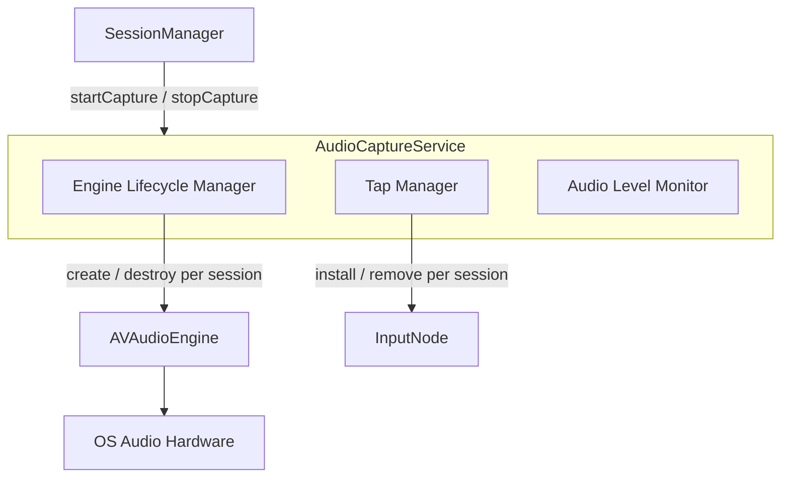
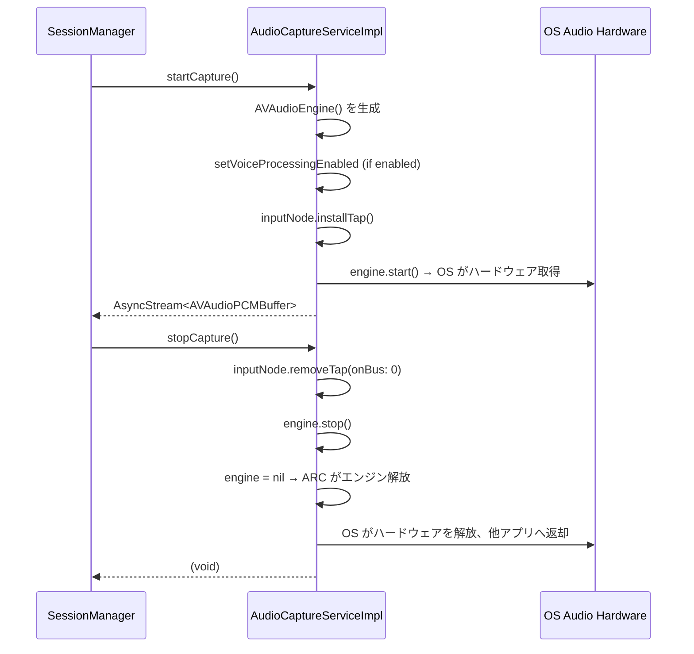

# Design Document — audio-session-idle-fix

## Overview

Kuchibi アプリが音声録音を行っていないアイドル状態においても `AVAudioEngine` インスタンスを永続保持し続けることで、OS がオーディオ I/O ユニットを解放しないため Google Meet などの他アプリのマイク・スピーカー品質を劣化させているバグを修正する。

修正の本質は `AudioCaptureServiceImpl` における `AVAudioEngine` のライフサイクル管理をセッションに紐付けること（lazy per-session instantiation）である。録音開始時にエンジンを生成し、録音停止時に nil 代入して ARC に解放させることで、OS がオーディオハードウェアを他アプリに返却できるようになる。

変更対象は `AudioCaptureService.swift` のみ。`AudioCapturing` プロトコルおよび呼び出し元（`SessionManager`）のコードは変更不要である。

### Goals

- 録音停止後にオーディオハードウェアリソースを完全に解放し、他アプリへの干渉を排除する
- `AudioCapturing` プロトコルのインターフェースを変更せず、影響範囲を最小に抑える
- Voice Processing IO ユニットの残存状態を解消する

### Non-Goals

- `AudioCapturing` プロトコルの API 変更
- `SessionManager` の修正
- `AVAudioSession` カテゴリや priority の明示的管理（macOS での挙動差異があるため採用しない）
- セッション開始レイテンシの最適化（現時点では許容範囲内）

## Requirements Traceability

| Requirement | Summary | Components | Interfaces | Flows |
|-------------|---------|------------|------------|-------|
| 1.1 | stopCapture 時にオーディオセッション解放 | AudioCaptureServiceImpl | stopCapture() | 録音停止フロー |
| 1.2 | cancelSession 時に即時解放 | AudioCaptureServiceImpl | stopCapture() | キャンセルフロー |
| 1.3 | idle 中は他アプリを妨害しない | AudioCaptureServiceImpl | — | アイドル状態 |
| 1.4 | 解放失敗時のエラーログ | AudioCaptureServiceImpl | stopCapture() | エラーハンドリング |
| 2.1 | startCapture 時に明示的セッション設定 | AudioCaptureServiceImpl | startCapture() | 録音開始フロー |
| 2.2 | startCapture 時にセッションをアクティブ化 | AudioCaptureServiceImpl | startCapture() | 録音開始フロー |
| 2.3 | アクティブ化失敗時はエンジンを起動しない | AudioCaptureServiceImpl | startCapture() | エラーハンドリング |
| 3.1 | stopCapture 時に removeTap を呼ぶ | AudioCaptureServiceImpl | stopCapture() | 録音停止フロー |
| 3.2 | tap 除去 → エンジン停止 → nil 化の順序保証 | AudioCaptureServiceImpl | stopCapture() | 録音停止フロー |
| 3.3 | 停止後に残留 tap がない状態を保証 | AudioCaptureServiceImpl | stopCapture() | 録音停止フロー |
| 4.1 | idle 中は他アプリのマイク使用を妨害しない | AudioCaptureServiceImpl | — | アイドル状態 |
| 4.2 | idle 中はスピーカー出力音量に影響しない | AudioCaptureServiceImpl | — | アイドル状態 |
| 4.3 | セッション終了後に制御をシステムへ返却 | AudioCaptureServiceImpl | stopCapture() | 録音停止フロー |

> 要件 1.1〜1.4、2.1〜2.3、3.1〜3.3、4.1〜4.3 はすべて lazy engine instantiation パターンにより一括して充足される。エンジンが nil になることで OS がオーディオ I/O ユニットを解放するため、個別のセッション API 呼び出しは不要。

## Architecture

### Existing Architecture Analysis

現状の `AudioCaptureServiceImpl`:

- `private let engine = AVAudioEngine()` — クラス生成時に確定し、アプリ終了まで生存
- `startCapture()` — VP 設定 → tap 設置 → `engine.start()`
- `stopCapture()` — `engine.inputNode.removeTap(onBus:)` → `engine.stop()`

問題: `engine.stop()` はオーディオグラフを停止させるが、OS はプロセスがまだ `AVAudioEngine` インスタンスを保有していると認識し続ける。特に `setVoiceProcessingEnabled(true)` によって追加されたシステムレベルの Voice Processing IO ユニットが残存する。

### Architecture Pattern & Boundary Map



設計の変更点:
- `AVAudioEngine` の生存期間をアプリ全体 → セッション単位に縮小
- エンジン生成・破棄を `startCapture` / `stopCapture` の責務として明確化
- `AudioCapturing` プロトコルの境界は変更しない

### Technology Stack

| Layer | Choice / Version | Role in Feature | Notes |
|-------|------------------|-----------------|-------|
| Services | AVAudioEngine (macOS 14.0+) | マイク入力キャプチャ | per-session lazy instantiation に変更 |
| Services | AVAudioInputNode | tap による PCM バッファ取得 | removeTap 呼び出し順序を明示化 |

## System Flows

### 録音セッションライフサイクル（修正後）



## Components and Interfaces

| Component | Domain/Layer | Intent | Req Coverage | Key Dependencies | Contracts |
|-----------|--------------|--------|--------------|------------------|-----------|
| AudioCaptureServiceImpl | Services | マイク I/O のセッション単位管理 | 1.1〜1.4, 2.1〜2.3, 3.1〜3.3, 4.1〜4.3 | AVAudioEngine (P0), AVAudioInputNode (P0) | Service |

### Services

#### AudioCaptureServiceImpl

| Field | Detail |
|-------|--------|
| Intent | セッション開始時にエンジンを生成し、停止時に破棄することでオーディオハードウェアをセッション単位でのみ占有する |
| Requirements | 1.1, 1.2, 1.3, 1.4, 2.1, 2.2, 2.3, 3.1, 3.2, 3.3, 4.1, 4.2, 4.3 |

**Responsibilities & Constraints**

- `startCapture()` 呼び出し時に `AVAudioEngine` インスタンスを生成する（呼び出し前は nil）
- `stopCapture()` の実行順序: `removeTap(onBus: 0)` → `engine.stop()` → `engine = nil`（この順序を厳守する）
- `engine` が nil の間は `isCapturing == false` かつオーディオハードウェアへの参照を持たない

**Dependencies**

- Inbound: `SessionManager` — `startCapture()` / `stopCapture()` を呼び出す (P0)
- Outbound: `AVAudioEngine` — オーディオグラフと I/O ユニット管理 (P0)
- Outbound: `AVAudioInputNode` — PCM バッファの tap 取得 (P0)

**Contracts**: Service [x]

##### Service Interface

```swift
// AudioCapturing プロトコルは変更なし
protocol AudioCapturing {
    var isCapturing: Bool { get }
    var currentAudioLevel: Float { get }

    func startCapture(noiseSuppressionEnabled: Bool) throws -> AsyncStream<AVAudioPCMBuffer>
    func stopCapture()
    func requestMicrophonePermission() async -> Bool
}
```

`AudioCaptureServiceImpl` 内部の変更:

```swift
// Before (問題のある実装)
private let engine = AVAudioEngine()

// After (修正後の実装)
private var engine: AVAudioEngine?
```

- `startCapture()` preconditions: `engine == nil`（二重呼び出し防止）
- `startCapture()` postconditions: `engine != nil`、`isCapturing == true`
- `stopCapture()` preconditions: `engine != nil` または noop
- `stopCapture()` postconditions: `engine == nil`、`isCapturing == false`
- invariant: `isCapturing == true` のとき `engine != nil`

**Implementation Notes**

- Integration: `startCapture()` の先頭で `guard engine == nil else { return 既存ストリーム or throw }` でガードし二重起動を防ぐ
- Validation: `stopCapture()` は `engine` が nil でも安全に noop になるよう optional chaining を使用する
- Risks: エンジン生成コストによる開始レイテンシ（50〜100ms）が発生するが、UX 上は許容範囲。詳細は `research.md` 参照

## Error Handling

### Error Strategy

`startCapture()` 内でエンジン生成または `engine.start()` が失敗した場合、既存の `KuchibiError.microphoneUnavailable` をスローする（変更なし）。失敗時は生成したエンジンを nil に戻してリソースをリークしない。

### Error Categories and Responses

- `engine.start()` 失敗: tap を除去 → engine を nil → `KuchibiError.microphoneUnavailable` をスロー（要件 2.3, 1.4）
- `stopCapture()` 時の engine nil: optional chaining により noop として安全に処理（要件 1.4）

### Monitoring

既存の `os.Logger` によるログ出力を維持。`stopCapture()` でエンジンを nil にした際に `"オーディオハードウェアを解放"` のログを追加する。

## Testing Strategy

### Unit Tests

- `startCapture()` 後に `engine != nil` かつ `isCapturing == true` であることを確認
- `stopCapture()` 後に `engine == nil` かつ `isCapturing == false` であることを確認
- `stopCapture()` を engine nil 状態で呼んでもクラッシュしないことを確認（noop）
- `startCapture()` 失敗時に engine が nil に戻ることを確認（リークなし）

### Integration Tests

- `startCapture()` → `stopCapture()` サイクルを複数回繰り返しても正常動作することを確認
- `cancelSession()` 経由（`SessionManager.cancelSession()` → `audioService.stopCapture()`）で engine が解放されることを確認