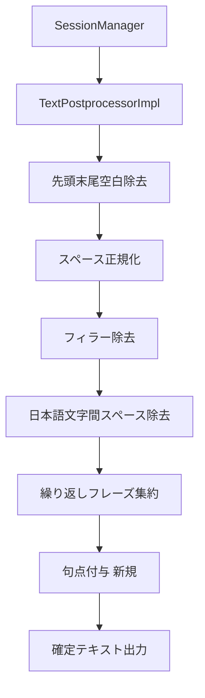
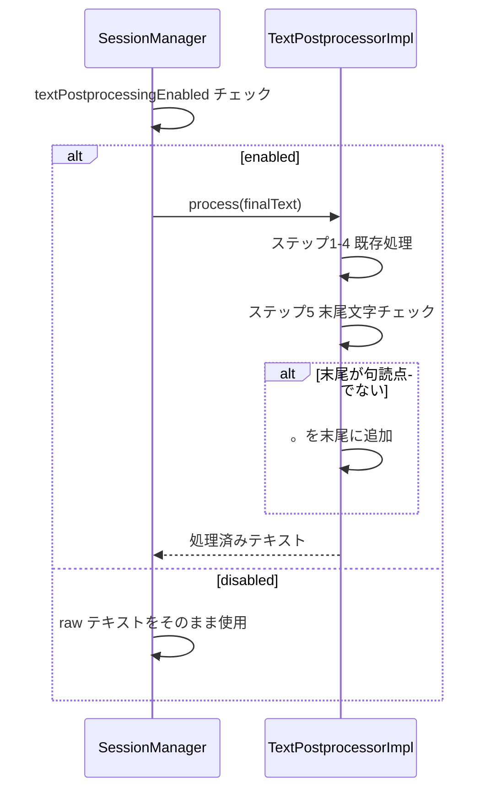

# Design Document

## Overview

音声認識（WhisperKit）が生成した確定テキストに対して、句点（。）を文末に自動付与する後処理機能。
既存の `TextPostprocessorImpl.process(_:)` パイプラインの最終ステップとして句点付与ロジックを追加する。
読点（、）は操作しない（WhisperKit が生成した読点をそのまま保持する）。

### Goals

- 確定テキストの文末に句点（。）を自動付与して読みやすさを向上させる
- 既存の終端記号（。！!？?）がある場合は付与しない（重複防止）
- `textPostprocessingEnabled` フラグとの連動により、後処理無効時は句点付与も自動でスキップされる

### Non-Goals

- 読点（、）の自動挿入・削除
- 句点付与の独立したオン・オフ設定
- ストリーミング中の部分テキスト（partial）への句点付与

---

## Requirements Traceability

| Requirement | Summary | Components | Interfaces | Flows |
|-------------|---------|------------|------------|-------|
| 1.1 | 文末に句点がなければ付与 | TextPostprocessorImpl | process(_:) | 後処理パイプライン ステップ5 |
| 1.2 | 既存終端記号があれば付与しない | TextPostprocessorImpl | process(_:) | ステップ5 内分岐 |
| 1.3 | 空文字・空白のみは付与しない | TextPostprocessorImpl | process(_:) | 既存 guard + ステップ5 |
| 1.4 | 既存後処理の後に実行 | TextPostprocessorImpl | process(_:) | ステップ5（末尾） |
| 2.1 | 読点を追加・変更しない | TextPostprocessorImpl | process(_:) | 新規ロジックなし |
| 2.2 | 既存の読点を削除しない | TextPostprocessorImpl | process(_:) | 新規ロジックなし |
| 2.3 | 読点挿入ロジックを持たない | TextPostprocessorImpl | — | 設計上の不存在 |
| 3.1 | フィラー除去・スペース正規化の後に実行 | TextPostprocessorImpl | process(_:) | ステップ5（末尾） |
| 3.2 | 句点付与前に全正規化処理が完了 | TextPostprocessorImpl | process(_:) | パイプライン順序保証 |
| 3.3 | textPostprocessingEnabled が false なら実行しない | SessionManager | handleRecognitionEvent | SessionManager の既存分岐 |

---

## Architecture

### Existing Architecture Analysis

`SessionManager` は `lineCompleted` イベントを受け取ると `textPostprocessingEnabled` フラグを確認し、true の場合のみ `TextPostprocessorImpl.process(_:)` を呼び出す。
このため、`process` 内に句点付与を追加するだけで `textPostprocessingEnabled` との連動が自動的に実現される（SessionManager の変更不要）。

現在の後処理パイプライン（`process(_:)` 内ステップ順）：

```
ステップ1: 先頭・末尾空白除去
ステップ2: 連続スペース正規化
ステップ2.5: 日本語フィラー除去
ステップ3: 日本語文字間スペース除去
ステップ4: 繰り返しフレーズ集約
[新規] ステップ5: 句点付与（本機能）
```

### Architecture Pattern & Boundary Map



既存のアーキテクチャ境界・プロトコルに変更はない。

### Technology Stack

| Layer | Choice / Version | Role | Notes |
|-------|-----------------|------|-------|
| Services | Swift 6 | TextPostprocessorImpl への追加 | 既存スタックのまま |
| Regex | Swift Regex | 末尾文字判定 | 既存パターンに倣う |

---

## Components and Interfaces

### Services

| Component | Domain/Layer | Intent | Req Coverage | Key Dependencies | Contracts |
|-----------|-------------|--------|--------------|-----------------|-----------|
| TextPostprocessorImpl | Services | 後処理パイプラインへの句点付与ステップ追加 | 1.1〜1.4, 2.1〜2.3, 3.1〜3.2 | TextPostprocessing (P0) | Service |

#### TextPostprocessorImpl

| Field | Detail |
|-------|--------|
| Intent | 既存後処理パイプラインの末尾に句点付与ロジック（ステップ5）を追加する |
| Requirements | 1.1, 1.2, 1.3, 1.4, 2.1, 2.2, 2.3, 3.1, 3.2 |

責務と制約:
- `process(_:)` の戻り値は常に String（エラーを返さない）
- 句点付与はステップ4（繰り返し集約）の後に実行する
- 読点（、）への操作は行わない

依存関係:
- Inbound: SessionManager — process() 呼び出し元 (P0)
- Outbound: なし

契約: Service

##### Service Interface

```swift
protocol TextPostprocessing {
    func process(_ text: String) -> String
}
```

- Preconditions: なし（空文字も受け付ける）
- Postconditions:
  - 空文字・空白のみ入力の場合は入力をそのまま返す（要件 1.3）
  - 末尾が `。！!？?` のいずれかで終わる場合は入力をそのまま返す（要件 1.2）
  - 上記以外の場合は末尾に `。` を付加して返す（要件 1.1）
- Invariants: 読点（、）の値は入力と同一（要件 2.1〜2.3）

実装ノート:
- Integration: `process(_:)` 末尾に終端記号チェックと句点付与を追加。プロトコル・SessionManager の変更なし
- Validation: 終端文字セット `["。", "！", "!", "？", "?"]` で末尾1文字を判定
- Risks: WhisperKit が句点を付与しているケースは終端チェックで二重付与を防止済み

---

## System Flows



---

## Testing Strategy

### Unit Tests

- `TextPostprocessorImpl.process(_:)` の句点付与ロジック
  1. 句点なし入力 → 末尾に「。」が付与されること
  2. 既に「。」で終わる入力 → そのまま返ること
  3. 「！」「!」「？」「?」で終わる入力 → そのまま返ること
  4. 空文字入力 → 空文字が返ること
  5. 空白のみ入力 → 空白のみが返ること
  6. 読点（、）を含む入力 → 読点が変化せず句点のみ末尾に付与されること
  7. フィラー除去後に文字が残らなかった場合 → 句点を付与しないこと（空文字ガード）
