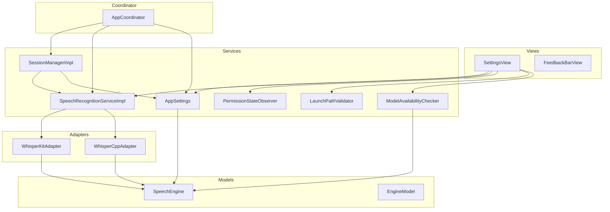
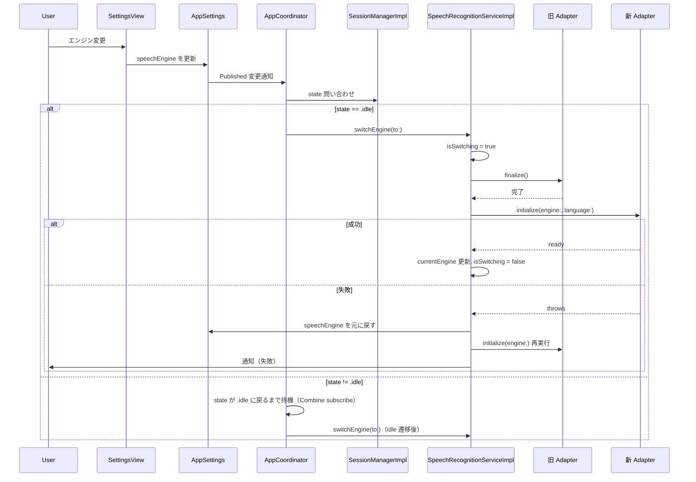
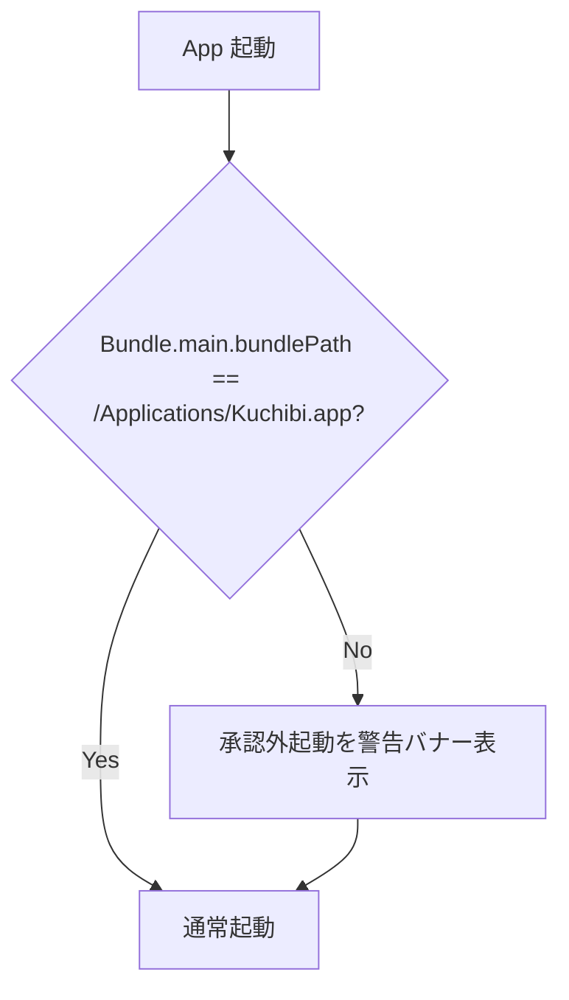
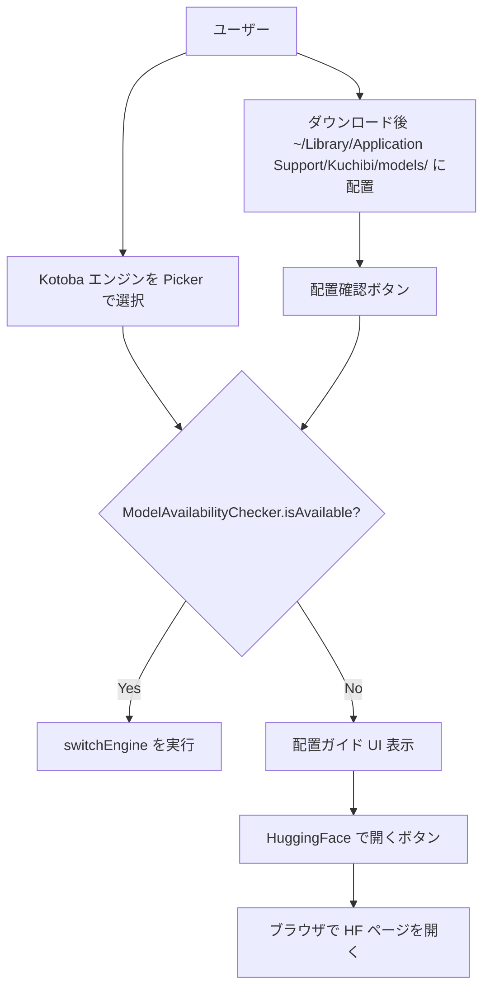
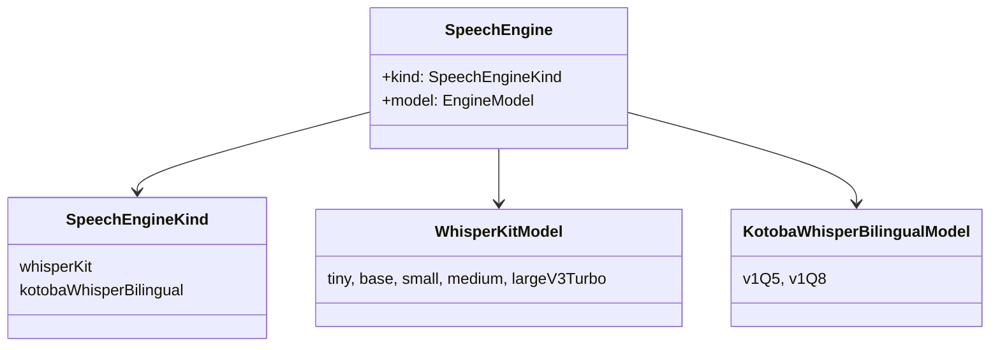
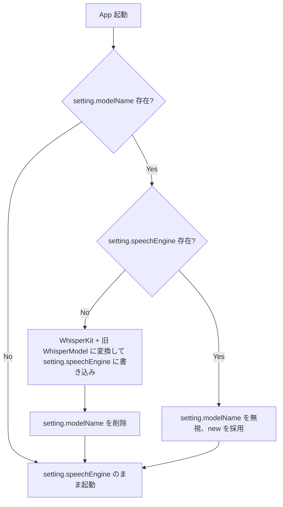

# Technical Design: speech-engine-architecture

## Overview

Kuchibi の音声認識エンジンを複数候補から UI 上で切り替え可能にする。本 spec では **WhisperKit**（既存、large-v3-turbo 追加）と **Kotoba-Whisper Bilingual v1**（新規、whisper.cpp 経由）の 2 エンジンを対象とする。SenseVoice-Small の統合は後続 spec `speech-engine-sensevoice`（予定）へ分離する。

現行の `SpeechRecognitionAdapting` を型安全に再設計し、`SpeechEngine` と対応する `EngineModel` を enum で表現する。エンジン切替はアプリ再起動を伴わず、`SpeechRecognitionServiceImpl` が adapter slot を hot-swap することで実現する。

合わせて、`/Applications/Kuchibi.app` を唯一の承認された起動経路として固定し、Makefile の codesign を安定化することで、再ビルド後もアクセシビリティ権限を維持する。Kotoba モデルは HuggingFace からの手動 DL を前提とし、初回選択時に案内 UI を表示する。

**Purpose**: 個人ユーザーが UI から 2 エンジンを主観評価し、好みのエンジンを即座に試せる環境を提供する。
**Users**: Kuchibi の唯一のユーザー（開発者本人）。
**Impact**: `SpeechRecognitionAdapting` の API 変更、`AppSettings` への新キー追加（migration 必要）、`SettingsView` の 2 段 Picker 化、Makefile の codesign 改修、新規 whisper.cpp 依存追加。既存セッション契約（`.kiro/steering/behaviors.md`）は**一切変更しない**。

### Goals

- UI から `SpeechEngine × EngineModel` を切り替え可能にする（Req 1）
- 再起動なしで adapter を hot-swap する（Req 2）
- 現在アクティブなエンジン・モデルとロード状態を可視化する（Req 3）
- 既存セッション・後処理・出力契約を一切変えない（Req 4）
- `/Applications/Kuchibi.app` を唯一の承認起動経路として固定し、再ビルド後もアクセシビリティ権限を維持する（Req 5, 6）
- Kotoba モデル未配置時に利用不可を明示し、ユーザーを DL 手順へ誘導する（Req 1.1 の「利用不可時の非表示／無効化」、Req 3.2 の「ロード状態可視化」、Req 6.4 の「サイレントフォールバック禁止」）

### Non-Goals

- **SenseVoice-Small 統合**（後続 spec `speech-engine-sensevoice` で扱う）
- 録音中のリアルタイムエンジン切替
- HuggingFace モデルの自動ダウンロード（アプリ内 URLSession 実装）
- クラウド ASR の採用
- 複数エンジンの同時アンサンブル
- Apple 開発者証明書の導入
- `AppSettings.language` 等の言語設定 UI（将来）

## Boundary Commitments

### Owns
- `SpeechEngine` と `EngineModel` 型（`Sources/Models/` 配下の新規型、WhisperKit / Kotoba の 2 種）
- `SpeechRecognitionAdapting` の再設計と 2 つの Adapter 実装（`WhisperKitAdapter` 改修と `WhisperCppAdapter` 新規）
- `SpeechRecognizing` の hot-swap インターフェースと実装
- `ModelAvailabilityChecker`（各 `EngineModel` の利用可否判定）
- `AppSettings` のエンジン・モデル選択値の永続化と migration
- `SettingsView` のエンジン／モデル 2 段 Picker、ロード状態、エンジン名・モデル名表示、モデル未配置時の DL ガイド UI
- 起動経路の検査と警告（`LaunchPathValidator`）
- Makefile の codesign 安定化（`--identifier` 明示と `--preserve-metadata`）
- 権限状態の観測用 `PermissionStateObserver`
- `AppCoordinator`: セッション状態を subscribe し、idle 遷移後に `SpeechRecognitionServiceImpl.switchEngine` を呼ぶ**配線責務のみ**。切替の本体ロジックは持たない

### Out of Boundary
- **SenseVoice-Small の統合**（後続 spec `speech-engine-sensevoice` が担う）
- セッション状態機械（idle/recording/processing）の遷移・挙動（`SessionManagerImpl` 不変）
- テキスト後処理パイプライン（空白／フィラー／繰り返し／句点）
- 出力モード（clipboard/directInput/autoInput）と ESC キャンセル動作
- WhisperKit / whisper.cpp ライブラリ内部
- CoreML / AVFoundation / AppKit の内部実装
- Whisper モデルファイルの自動更新（WhisperKit 自身の DL は除く）

### Allowed Dependencies
- SwiftPM: `argmaxinc/WhisperKit`（既存）、`soffes/HotKey`（既存）、`orchetect/SettingsAccess`（既存）、`WhisperCppKit`（ローカル、`ggml-org/whisper.cpp` v1.8.4 XCFramework binaryTarget をラップ）
- System framework: `AVFoundation`、`AppKit`、`SwiftUI`、`ServiceManagement`
- モデルファイル: `~/Library/Application Support/Kuchibi/models/` に手動配置（UI からガイド表示）

### Revalidation Triggers
- `SpeechRecognitionAdapting` の interface 変更 → 全 Adapter 再検証、`behaviors.md` との契約確認
- `AppSettings` の新キー追加 → migration コード更新
- セッション状態機械に触れる変更 → `behaviors.md` の契約に影響しないか再確認
- WhisperKit メジャーバージョンアップ → `WhisperKitAdapter` 再検証
- 後続 spec `speech-engine-sensevoice` 着手時 → `SpeechEngine` enum に `.senseVoiceSmall` case 追加でこの spec の Adapter 群が影響を受けないか確認

## Architecture

### Architecture Pattern & Boundary Map



- **パターン**: レイヤー分離 + プロトコル駆動 DI（既存踏襲）
- **Dependency direction**: `Models → Protocols → Services/Adapters → Coordinator → Views`。上位層は下位層を参照するが逆方向は許可しない
- **分離ポイント**: `SpeechRecognitionAdapting` が唯一のエンジン抽象境界。`SessionManagerImpl` はアダプタ実装を知らない。`AppCoordinator` は配線のみで、切替ロジックは `SpeechRecognitionServiceImpl` に閉じる

### Technology Stack

| Layer | Choice / Version | Role in Feature | Notes |
|:--|:--|:--|:--|
| Engine 1 | WhisperKit 0.18+（既存） | Whisper 系モデル推論 | `large-v3-turbo` 追加、既存 Adapter を新プロトコルに適合 |
| Engine 2 | WhisperCppKit（ローカル SwiftPM、`ggml-org/whisper.cpp` v1.8.4 XCFramework binaryTarget） | Kotoba-Whisper Bilingual 推論 | ggml モデルを `~/Library/Application Support/Kuchibi/models/` から読み込み |
| Install | `make run` + rsync + codesign ad-hoc | `/Applications` 固定 | `--identifier com.kuchibi.app --preserve-metadata=...` 追加 |
| Model delivery | 手動配置 + UI ガイド | Kotoba モデルの入手導線 | SettingsView から HF の URL を `NSWorkspace.shared.open` で開く |

## File Structure Plan

### 新規作成

| ファイル | 責務 |
|:--|:--|
| `Packages/WhisperCppKit/Package.swift` | ローカル SwiftPM。`ggml-org/whisper.cpp` v1.8.4 XCFramework を `binaryTarget` で取り込み、`@_exported import whisper` で C API を再公開 |
| `Packages/WhisperCppKit/Sources/WhisperCppKit/WhisperCppKit.swift` | XCFramework モジュール `whisper` を再エクスポートする薄いラッパー |
| `Sources/Models/SpeechEngine.swift` | `enum SpeechEngine`（case 2 つ）と `enum SpeechEngineKind`（UI 列挙用） |
| `Sources/Models/EngineModel.swift` | `WhisperKitModel` / `KotobaWhisperBilingualModel` 各 enum |
| `Sources/Services/WhisperCppAdapter.swift` | whisper.cpp を内包する Adapter 実装 |
| `Sources/Services/ModelAvailabilityChecker.swift` | 各 `EngineModel` のファイル存在判定と `modelPath` 解決 |
| `Sources/Services/LaunchPathValidator.swift` | `Bundle.main.bundlePath` 検査と警告 |
| `Sources/Services/PermissionStateObserver.swift` | マイク・アクセシビリティ権限の Published 観測 |
| `Sources/Services/Protocols/LaunchPathValidating.swift` | プロトコル |
| `Sources/Services/Protocols/PermissionStateObserving.swift` | プロトコル |
| `Sources/Services/Protocols/ModelAvailabilityChecking.swift` | プロトコル |
| `Tests/WhisperCppAdapterTests.swift` | whisper.cpp Adapter の単体テスト |
| `Tests/ModelAvailabilityCheckerTests.swift` | モデル存在判定のテスト |
| `Tests/LaunchPathValidatorTests.swift` | 起動経路検査のテスト |
| `Tests/PermissionStateObserverTests.swift` | 権限観測のテスト |
| `Tests/SpeechEngineTests.swift` | Codable ラウンドトリップ、displayName 等のテスト |
| `Tests/AppSettingsMigrationTests.swift` | 旧 `setting.modelName` → 新キー migration テスト |
| `Tests/Mocks/MockWhisperCppAdapter.swift` | モック |
| `Tests/Mocks/MockLaunchPathValidator.swift` | モック |
| `Tests/Mocks/MockPermissionStateObserver.swift` | モック |
| `Tests/Mocks/MockModelAvailabilityChecker.swift` | モック |

### 変更

| ファイル | 変更内容 |
|:--|:--|
| `Sources/Models/WhisperModel.swift` | 削除（`WhisperKitModel` に改名して `EngineModel.swift` へ移動、`largeV3Turbo` ケース追加） |
| `Sources/Services/Protocols/SpeechRecognitionAdapting.swift` | `initialize(engine: SpeechEngine, language: String)` に変更 |
| `Sources/Services/Protocols/SpeechRecognizing.swift` | `currentEngine` / `isSwitching` / `lastSwitchError` を Published、`switchEngine(to:) async throws` 追加 |
| `Sources/Services/WhisperKitAdapter.swift` | 新プロトコルへ適合、`large-v3-turbo` モデルを利用可能に、`language` 引数を受け取る |
| `Sources/Services/SpeechRecognitionService.swift` | adapter slot の hot-swap ロジックを実装、Published プロパティ化 |
| `Sources/Services/AppSettings.swift` | `speechEngine: SpeechEngine` を追加、旧 `setting.modelName` からの migration |
| `Sources/KuchibiApp.swift`（`AppCoordinator`） | 新コンポーネント DI 配線、`SessionState` 監視 → `switchEngine` 配線 |
| `Sources/Views/SettingsView.swift` | 2 段 Picker、ロード中表示、権限状態、起動経路警告、Kotoba モデル未配置時の DL ガイド |
| `Makefile` | `install` ターゲットの codesign に `--identifier com.kuchibi.app --preserve-metadata=entitlements,requirements,flags,runtime` を追加 |
| `project.yml` | `packages:` に ローカル `WhisperCppKit`（`path: Packages/WhisperCppKit`）を追加し、`Kuchibi` / `KuchibiTests` ターゲットの `dependencies` に `- package: WhisperCppKit` を追加 |

### 変更なし
- `Sources/Services/AudioCaptureService.swift` / `AudioPreprocessor.swift`（共通 16kHz mono 出力を維持）
- `Sources/Services/SessionManager.swift`（`switchEngine` は呼ばない、`state` を Published するのは既存）
- `Sources/Services/TextPostprocessor.swift` / `OutputManager.swift` / `ClipboardService.swift`
- `Sources/Services/EscapeKeyMonitor.swift` / `HotKeyController.swift`

## System Flows

### Hot-swap フロー（deferred 適用を含む）



**Key Decisions**:
- `recording` / `processing` 中の変更要求は `AppCoordinator` が `SessionState` を Combine で subscribe し、`.idle` 遷移後に `switchEngine` を呼ぶ（deferral 責務は Coordinator）
- `SpeechRecognitionServiceImpl.switchEngine` の precondition は `SessionManagerImpl.state == .idle`。前提違反時は `KuchibiError.sessionActiveDuringSwitch` を throw し、呼び出し側の責務違反を明示
- 失敗時は必ず直前エンジンへ戻し、`NotificationService` でユーザーに通知

### 起動経路検査フロー



### モデル入手導線フロー（Kotoba）



## Requirements Traceability

| Requirement | Summary | Components | Interfaces | Flows |
|:--|:--|:--|:--|:--|
| 1.1 | エンジン一覧の提示 | `SettingsView` / `SpeechEngine` / `ModelAvailabilityChecker` | `SpeechEngineKind.allCases`、`ModelAvailabilityChecker.isAvailable` | モデル入手導線 |
| 1.2 | エンジン選択時のモデル表示 | `SettingsView` | `SpeechEngineKind.availableModels` | - |
| 1.3 | 選択の永続化とデフォルト | `AppSettings` | `AppSettings.speechEngine` (Codable) | - |
| 2.1 | idle 時の即時切替 | `SpeechRecognitionServiceImpl` | `switchEngine(to:, language:)` | Hot-swap |
| 2.2 | 録音中の切替保留 | `AppCoordinator` | `SessionState` subscribe + deferred 呼び出し | Hot-swap |
| 2.3 | 切替中のブロッキングと UI | `SpeechRecognitionServiceImpl` / `SettingsView` | `isSwitching: Bool` Published | Hot-swap |
| 2.4 | 切替失敗時の回復 | `SpeechRecognitionServiceImpl` / `NotificationService` | rollback 分岐 | Hot-swap |
| 3.1 | アクティブエンジン・モデルの表示 | `SettingsView` | `currentEngine: SpeechEngine` Published | - |
| 3.2 | ロード中インジケータ | `SettingsView` | `isSwitching: Bool` Published、`ModelAvailabilityChecker` | - |
| 3.3 | 未ロード時のセッション開始ガード | `SessionManagerImpl` | 既存 `isModelLoaded` ガード | - |
| 4.1 | 状態機械の維持 | `SessionManagerImpl`（変更なし） | 既存 `SessionState` | - |
| 4.2 | テキスト後処理の共通適用 | `TextPostprocessorImpl`（変更なし） | 既存 | - |
| 4.3 | セッション音・出力モードの共通化 | `SessionManagerImpl` / `OutputManagerImpl`（変更なし） | 既存 | - |
| 4.4 | ESC キャンセル契約の維持 | `SessionManagerImpl`（変更なし） | 既存 `cancelSession()` | - |
| 5.1 | 承認起動場所の固定 | `LaunchPathValidator` | `isApproved: Bool` | 起動経路検査 |
| 5.2 | 再ビルドをまたぐ権限維持 | Makefile | codesign `--identifier` + `--preserve-metadata` | - |
| 5.3 | 承認外起動時の警告 | `LaunchPathValidator` / `SettingsView` | `validate()` + 警告バナー | 起動経路検査 |
| 6.1 | 起動時の権限チェックと公開 | `PermissionStateObserver` | Published 状態 | - |
| 6.2 | アクセシビリティ欠如時の復旧 | `SettingsView` / `NotificationService` | `AXIsProcessTrustedWithOptions` | - |
| 6.3 | マイク欠如時のセッション阻止 | `SessionManagerImpl`（既存） | 既存マイク権限チェック | - |
| 6.4 | サイレントフォールバックの禁止 | `SessionManagerImpl` / `NotificationService` / `ModelAvailabilityChecker` | 既存 + 新規モデル未配置通知 | - |
| 6.5 | 権限状態のランタイム反映 | `PermissionStateObserver` | `NSApplication.didBecomeActiveNotification` 購読 | - |

## Components and Interfaces

### 概要

| Component | Domain/Layer | Intent | Req Coverage | Key Dependencies (P0/P1) | Contracts |
|:--|:--|:--|:--|:--|:--|
| `SpeechEngine` | Models | エンジン × モデルの型安全表現 | 1.1, 1.2, 1.3 | - | State |
| `SpeechRecognitionAdapting`（再設計） | Protocols | エンジン抽象 | 1.1, 2.1, 4.1 | `SpeechEngine` (P0) | Service |
| `WhisperKitAdapter`（改修） | Services/Adapters | WhisperKit 実装 | 2.1 | WhisperKit (P0) | Service |
| `WhisperCppAdapter`（新規） | Services/Adapters | whisper.cpp 実装 | 2.1 | whisper.cpp (P0), ModelAvailabilityChecker (P1) | Service |
| `SpeechRecognitionServiceImpl`（改修） | Services | Hot-swap 機構 | 2.1, 2.3, 2.4, 3.1, 3.2 | Adapters (P0), AppSettings (P1) | Service, State |
| `ModelAvailabilityChecker` | Services | モデルファイル存在判定 | 1.1, 3.2, 6.4 | FileManager (P0) | Service |
| `AppCoordinator`（改修） | Coordinator | DI + SessionState 監視 + switchEngine 配線 | 2.2 | Session, Service, Settings (P0) | Service |
| `AppSettings`（改修） | Services | エンジン・モデル永続化 | 1.3 | UserDefaults (P0) | State |
| `SettingsView`（改修） | Views | 2 段 Picker + 状態 + DL ガイド | 1.1, 1.2, 3.1, 3.2, 5.3, 6.1, 6.2 | AppSettings, Service, Validator, Observer, Checker (P0-P1) | - |
| `LaunchPathValidator` | Services | 起動経路検査 | 5.1, 5.3 | Bundle (P0) | Service |
| `PermissionStateObserver` | Services | 権限状態の観測 | 6.1, 6.5 | AVCaptureDevice, AX (P0) | State |

### Models

#### SpeechEngine / EngineModel

| Field | Detail |
|:--|:--|
| Intent | 音声認識エンジン × モデルを型で表現 |
| Requirements | 1.1, 1.2, 1.3 |

**Responsibilities & Constraints**
- 新エンジンは case 追加のみで表現可能（SenseVoice は後続 spec で `.senseVoiceSmall` case を追加する）
- 各 case の associated model enum は `CaseIterable` に準拠し、UI から一覧化できる
- `Codable` 準拠で `AppSettings` が UserDefaults へ永続化

**Contracts**: State [x]

```swift
enum SpeechEngine: Equatable, Hashable, Codable, Sendable {
    case whisperKit(WhisperKitModel)
    case kotobaWhisperBilingual(KotobaWhisperBilingualModel)

    var kind: SpeechEngineKind { ... }
    var engineDisplayName: String { ... }
    var modelDisplayName: String { ... }
    var modelIdentifier: String { ... }  // ログ・識別用
    var requiresRestartOnSwitch: Bool { false }  // 将来用
}

enum SpeechEngineKind: String, CaseIterable, Identifiable, Codable {
    case whisperKit, kotobaWhisperBilingual
    var id: String { rawValue }
    var displayName: String { ... }
}

enum WhisperKitModel: String, CaseIterable, Codable, Sendable {
    case tiny, base, small, medium
    case largeV3Turbo = "openai_whisper-large-v3-v20240930_turbo"
    var displayName: String { ... }
    var sizeDescription: String { ... }
}

enum KotobaWhisperBilingualModel: String, CaseIterable, Codable, Sendable {
    case v1Q5 = "ggml-kotoba-whisper-bilingual-v1.0-q5_0.bin"
    case v1Q8 = "ggml-kotoba-whisper-bilingual-v1.0-q8_0.bin"
    var displayName: String { ... }
    var expectedFileName: String { rawValue }  // ModelAvailabilityChecker が参照
    var downloadPageURL: URL { ... }  // HuggingFace のモデルページ
}
```

**Implementation Notes**
- Validation: Codable エンコードは discriminator 付き JSON（`{"kind":"whisperKit","model":"base"}`）として実装
- Risks: UserDefaults 永続化フォーマットの互換性を migration テストで確認

### Protocols

#### SpeechRecognitionAdapting（再設計）

**Contracts**: Service [x]

```swift
protocol SpeechRecognitionAdapting {
    func initialize(engine: SpeechEngine, language: String) async throws
    func startStream(
        onTextChanged: @escaping (String) -> Void,
        onLineCompleted: @escaping (String) -> Void
    ) throws
    func addAudio(_ buffer: AVAudioPCMBuffer)
    func getPartialText() -> String
    func finalize() async -> String
}
```

- Preconditions: `initialize` は他のメソッドの前に 1 回呼ばれる
- Postconditions: `finalize` 後は再度 `initialize` すれば再利用可能
- Invariants: `addAudio` は 16kHz mono Float32 前提、非 16kHz は `AudioPreprocessor` 側でリサンプル済み

#### SpeechRecognizing（改修）

**Contracts**: Service [x] / State [x]

```swift
@MainActor
protocol SpeechRecognizing: ObservableObject {
    var currentEngine: SpeechEngine { get }
    var isModelLoaded: Bool { get }
    var isSwitching: Bool { get }
    var lastSwitchError: String? { get }

    func loadInitialEngine(_ engine: SpeechEngine, language: String) async throws
    func switchEngine(to engine: SpeechEngine, language: String) async throws
    func processAudioStream(_ stream: AsyncStream<AVAudioPCMBuffer>) -> AsyncStream<RecognitionEvent>
}
```

- `switchEngine` の precondition: 呼び出し時点で `SessionManagerImpl.state == .idle`。前提違反時は `KuchibiError.sessionActiveDuringSwitch` を throw
- deferral（recording/processing 中の保留）は呼び出し側（`AppCoordinator`）の責務

#### ModelAvailabilityChecking（新規）

**Contracts**: Service [x]

```swift
protocol ModelAvailabilityChecking {
    func isAvailable(for engine: SpeechEngine) -> Bool
    func modelPath(for engine: SpeechEngine) -> URL?
    func downloadPageURL(for engine: SpeechEngine) -> URL?
}
```

- WhisperKit 側は常に `isAvailable == true`（WhisperKit 自身が DL 管理）
- Kotoba 側は `~/Library/Application Support/Kuchibi/models/` に期待ファイル名の存在を `FileManager` で確認

### Services

#### SpeechRecognitionServiceImpl（改修）

| Field | Detail |
|:--|:--|
| Intent | Adapter 選択と hot-swap 機構の唯一の責務保持者 |
| Requirements | 2.1, 2.3, 2.4, 3.1, 3.2 |

**Responsibilities & Constraints**
- Adapter slot を 1 つ保持し、`switchEngine` で入れ替える
- 旧 adapter の `finalize()` 完了を待ってから新 adapter を `initialize`
- 失敗時は旧 engine に戻し、`lastSwitchError` を公開
- 呼び出し側が idle 前提を破った場合は throw（defensive）

**Dependencies**
- Inbound: `SessionManagerImpl`（録音時）、`AppCoordinator`（切替要求）
- Outbound: 2 種の Adapter（プロトコル経由）
- External: なし

**Implementation Notes**
- Integration: `AppCoordinator` が `AppSettings.speechEngine` 変化を観測して `switchEngine` を呼ぶ。セッション中の変化は `SessionManagerImpl.state` が `.idle` に戻るまで Coordinator 側で保留
- Validation: 各 Adapter に対する hot-swap テスト（成功・失敗・連続切替）
- Risks: `recognitionTask` のキャンセル順序を誤ると `addAudio` 継続中に adapter が差し替わる恐れ → `finalize` 完了を厳密に待機

#### AppCoordinator（改修）

| Field | Detail |
|:--|:--|
| Intent | DI の中心 + セッション状態監視による deferred switchEngine 配線 |
| Requirements | 2.2 |

**Responsibilities & Constraints**
- `AppSettings.$speechEngine` と `SessionManagerImpl.$state` の Combine 合成で切替要求を管理
- `state == .idle` のとき最新の `speechEngine` 要求を `switchEngine` に渡す
- 切替ロジック本体は持たない（`SpeechRecognitionServiceImpl` に委譲）

**Implementation Notes**
- Integration: `KuchibiApp.swift` に既存する `AppCoordinator` に `pendingEngineRequest: SpeechEngine?` を追加
- Validation: Mock の `SessionManagerImpl` 状態を `recording → idle` に遷移させて `switchEngine` が 1 回呼ばれるテスト

#### WhisperKitAdapter（改修）

| Field | Detail |
|:--|:--|
| Intent | WhisperKit ライブラリへのラッパー |
| Requirements | 2.1 |

- `initialize(engine:, language:)` は engine が `.whisperKit(let model)` の場合のみ受理、それ以外は `KuchibiError.engineMismatch`
- `language` 引数を `DecodingOptions(language:)` に渡す

#### WhisperCppAdapter（新規）

| Field | Detail |
|:--|:--|
| Intent | whisper.cpp 経由で Kotoba-Whisper Bilingual モデルを実行 |
| Requirements | 2.1 |

**Responsibilities & Constraints**
- `ModelAvailabilityChecker.modelPath(for:)` で解決したパスからロード
- ggml コンテキストを `whisper_init_from_file` で初期化、`whisper_full` で推論
- 擬似ストリーミング: VAD が検出した発話区間ごとに `whisper_full` を呼び、`onLineCompleted` に確定テキストを送る
- 30 秒窓境界では context をリセット

**External**: whisper.cpp (P0) — C API `whisper_init_from_file` / `whisper_full` / `whisper_full_get_segment_text` / `whisper_free`

**Implementation Notes**
- Integration: C ヘッダを Swift から直接呼び出し、`OpaquePointer` で context を保持
- Validation: 短い日本語／英語サンプル音声で `onLineCompleted` がテキストを返すテスト
- Risks: whisper.cpp の状態管理が自前なのでメモリリーク検知テスト必須

#### ModelAvailabilityChecker（新規）

| Field | Detail |
|:--|:--|
| Intent | 各 `EngineModel` のファイル存在判定と配置先解決 |
| Requirements | 1.1, 3.2, 6.4 |

**Responsibilities & Constraints**
- WhisperKit は `FileManager` チェック不要で常に `true`
- Kotoba は `~/Library/Application Support/Kuchibi/models/<expectedFileName>` の存在を確認
- 結果は都度計算（キャッシュしない、もしくは `NSApplication.didBecomeActiveNotification` で自動再計算）

```swift
final class ModelAvailabilityChecker: ModelAvailabilityChecking {
    private let fileManager: FileManager
    private let modelsDirectory: URL  // ~/Library/Application Support/Kuchibi/models/

    init(fileManager: FileManager = .default) {
        self.fileManager = fileManager
        let appSupport = fileManager.urls(for: .applicationSupportDirectory, in: .userDomainMask).first!
        self.modelsDirectory = appSupport.appendingPathComponent("Kuchibi/models", isDirectory: true)
    }

    func isAvailable(for engine: SpeechEngine) -> Bool {
        switch engine {
        case .whisperKit: return true
        case .kotobaWhisperBilingual(let model):
            let path = modelsDirectory.appendingPathComponent(model.expectedFileName)
            return fileManager.fileExists(atPath: path.path)
        }
    }

    func modelPath(for engine: SpeechEngine) -> URL? { ... }
    func downloadPageURL(for engine: SpeechEngine) -> URL? { ... }
}
```

#### LaunchPathValidator（新規）

| Field | Detail |
|:--|:--|
| Intent | アプリの起動場所を検査 |
| Requirements | 5.1, 5.3 |

**Contracts**: Service [x]

```swift
protocol LaunchPathValidating {
    var isApproved: Bool { get }
    var currentPath: String { get }
}

final class LaunchPathValidator: LaunchPathValidating {
    private static let approvedPath = "/Applications/Kuchibi.app"
    var isApproved: Bool { Bundle.main.bundlePath == Self.approvedPath }
    var currentPath: String { Bundle.main.bundlePath }
}
```

- `SettingsView` で `isApproved == false` のとき警告バナーを表示

#### PermissionStateObserver（新規）

| Field | Detail |
|:--|:--|
| Intent | マイク・アクセシビリティ権限の状態を Published |
| Requirements | 6.1, 6.5 |

**Contracts**: State [x]

```swift
@MainActor
protocol PermissionStateObserving: ObservableObject {
    var microphoneGranted: Bool { get }
    var accessibilityTrusted: Bool { get }
    func refresh()
}

@MainActor
final class PermissionStateObserver: ObservableObject, PermissionStateObserving {
    @Published private(set) var microphoneGranted: Bool = false
    @Published private(set) var accessibilityTrusted: Bool = false

    init() { refresh() }
    func refresh() {
        microphoneGranted = AVCaptureDevice.authorizationStatus(for: .audio) == .authorized
        accessibilityTrusted = AXIsProcessTrusted()
    }
}
```

- 起動時および `NSApplication.didBecomeActiveNotification` 発火時に `refresh()` を呼ぶ

### AppSettings（改修）

- 新キー `setting.speechEngine` を追加（JSON 文字列として永続化）
- `init` 時に旧キー `setting.modelName` があり新キーがない場合、`SpeechEngine.whisperKit(<旧 WhisperModel を mapping>)` として移行後、新キーに書き込み旧キーを削除
- デフォルト値は `SpeechEngine.whisperKit(.largeV3Turbo)`（medium から turbo へのアップグレード）

### SettingsView（改修）

認識設定タブに以下を追加:

- **エンジン Picker**（`SpeechEngineKind.allCases`）
- **モデル Picker**（選択された engine に応じた `EngineModel.allCases`）。`ModelAvailabilityChecker.isAvailable == false` のモデルは disabled + ラベルに「モデル未配置」
- **現在状態セクション**: 現在エンジン名 + モデル名 + `isSwitching` なら ProgressView
- **モデル DL ガイド**: Kotoba モデル未配置時にバナー表示、「HuggingFace で開く」ボタンで `NSWorkspace.shared.open(URL)`、「配置を確認」ボタンで `ModelAvailabilityChecker` を refresh
- **起動経路警告**: `LaunchPathValidator.isApproved == false` のとき赤いバナー + 「`/Applications` への再インストール手順（`make run`）を実施してください」のテキスト
- **権限状態表示**: マイク・アクセシビリティの 2 項目を緑/赤チェックで表示、それぞれ復旧ボタン（システム設定を開く）

## Data Models

### Domain Model



### UserDefaults キー

| Key | Type | Default | Notes |
|:--|:--|:--|:--|
| `setting.speechEngine` | JSON 文字列 | `{"kind":"whisperKit","model":"openai_whisper-large-v3-v20240930_turbo"}` | Codable JSON |
| `setting.modelName`（旧） | String | - | 起動時に `setting.speechEngine` へ migration した後、削除 |

### モデルファイル配置

| Engine | 配置先 | 入手方法 |
|:--|:--|:--|
| WhisperKit | WhisperKit の自動 DL（既存） | `WhisperKitConfig(download: true)` |
| whisper.cpp (Kotoba) | `~/Library/Application Support/Kuchibi/models/ggml-kotoba-whisper-bilingual-v1.0-q5_0.bin` | ユーザーが SettingsView の「HuggingFace で開く」経由で手動配置 |

## Error Handling

### Error Strategy

- Adapter の `initialize` 失敗 → `KuchibiError.modelLoadFailed(underlying:)` を throw、`SpeechRecognitionServiceImpl` が旧エンジンへ rollback
- Engine と Adapter の型不整合 → `KuchibiError.engineMismatch(expected:actual:)` を throw（開発時の assertion）
- Kotoba モデルファイル不在 → `ModelAvailabilityChecker.isAvailable` が false を返す → `SettingsView` が配置ガイドを表示、`switchEngine` 呼び出しはそもそも行わない
- セッション中の `switchEngine` 呼び出し → `KuchibiError.sessionActiveDuringSwitch` を throw（Coordinator の実装バグ検知）

### 新規エラーケース（KuchibiError に追加）

```swift
case engineMismatch(expected: SpeechEngine, actual: SpeechEngine)
case modelFileMissing(path: String)
case sessionActiveDuringSwitch
```

### Monitoring
- Logger category: `SpeechRecognitionService` / `WhisperKitAdapter` / `WhisperCppAdapter` / `LaunchPathValidator` / `PermissionStateObserver` / `ModelAvailabilityChecker`
- 起動時に `isApproved` を INFO ログ、false のとき WARNING

## Testing Strategy

### Unit Tests

1. `SpeechEngine` の Codable ラウンドトリップ（encode → decode で一致）— Req 1.3
2. `AppSettings` の legacy `setting.modelName` → `setting.speechEngine` migration — Req 1.3
3. `LaunchPathValidator.isApproved` の判定（`/Applications/Kuchibi.app` と DerivedData パスの両方）— Req 5.1, 5.3
4. `PermissionStateObserver.refresh()` が microphone / accessibility 状態を反映 — Req 6.1
5. `ModelAvailabilityChecker.isAvailable(for:)` がファイル存在に応じて true/false を返す — Req 1.1, 6.4

### Integration Tests

1. `SpeechRecognitionServiceImpl.switchEngine` 成功経路（WhisperKit → WhisperKit モデル変更） — Req 2.1
2. `SpeechRecognitionServiceImpl.switchEngine` 失敗時の rollback（Mock Adapter が initialize で throw） — Req 2.4
3. `AppCoordinator` が `recording → idle` 遷移時に保留中の `switchEngine` を 1 回呼び出す — Req 2.2
4. `SettingsView` で選択変更 → `AppSettings` 更新 → `SpeechRecognitionServiceImpl.currentEngine` が変わる — Req 1.3, 3.1
5. Kotoba モデル未配置状態で Picker を Kotoba にしても `switchEngine` が呼ばれずガイドが出る — Req 1.1, 6.4

### E2E / UI Tests

1. 設定画面でエンジンを選択 → モデル候補が切り替わる — Req 1.2
2. ロード中に `ProgressView` が表示され、完了後消える — Req 3.2
3. `/Applications` 外から起動したときの警告バナー表示 — Req 5.3
4. アクセシビリティ権限欠如時の復旧案内表示 — Req 6.2
5. Kotoba 初回選択時に「HuggingFace で開く」ボタン押下でブラウザが起動する — Req 1.1, 6.4

### 主観評価テスト（個人評価用）

- 同じ音声サンプル（日本語、日英混交、技術用語混じり）を 2 エンジンで順に試聴し、主観的に最も精度が高いエンジンを選ぶ
- この評価は自動テストではなくユーザーが実施

## Migration Strategy



- 1 度の起動で migration 完了、以降は新キーのみ使用
- 失敗時はデフォルト値（`SpeechEngine.whisperKit(.largeV3Turbo)`）にフォールバック

## Performance & Scalability

- **モデルロード時間目標**: 切替開始から完了まで 15 秒以内（エンジンによって差はあるが UI で許容できる範囲）
- **メモリ**: 1 エンジン常駐で最大 1.5GB、未使用エンジンは解放（hot-swap 時に旧 adapter を破棄）
- **hot-swap 中のブロッキング時間**: UI 上は `ProgressView` 表示で待機、録音開始はブロック
- **ストリーミングレイテンシ**: 既存 WhisperKit 500ms 目標を維持、whisper.cpp は VAD 境界で確定

## Security Considerations

- モデルファイルはローカル配置のみ、ネットワーク取得なし（HuggingFace への遷移はブラウザ経由）
- アクセシビリティ権限の一時的な解除・再付与フローはユーザー主導
- codesign identifier 明示は TCC 維持目的で、セキュリティレベルを下げない
