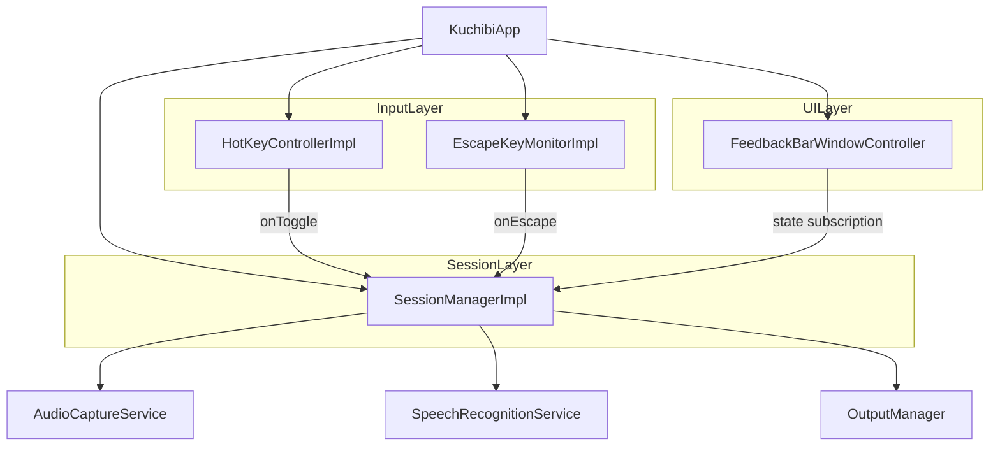
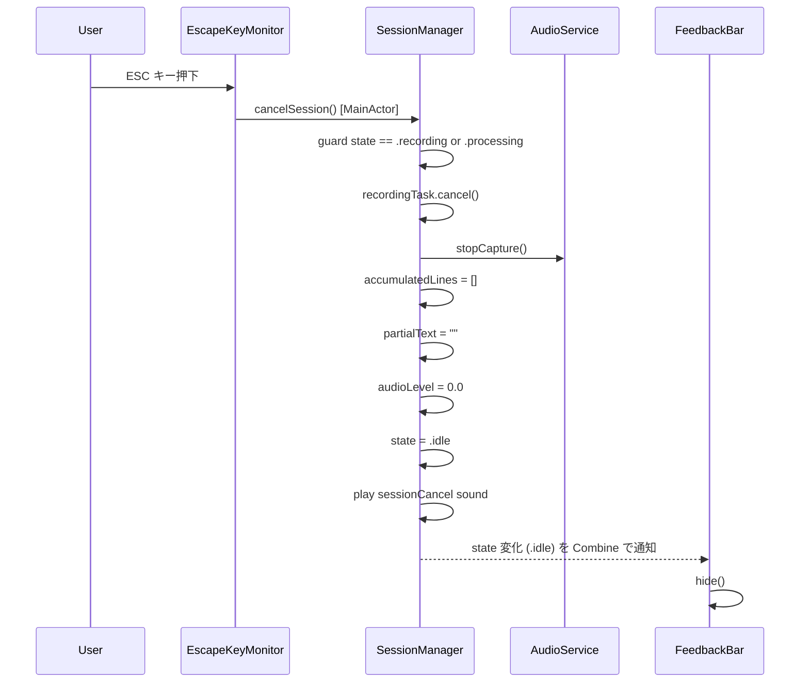

# Design Document: voice-input-escape

## Overview

この機能は、音声入力セッション中（recording / processing 状態）にユーザーが ESC キーを押すことで、録音・認識を即時キャンセルしテキスト出力を一切行わずにアイドル状態へ復帰できる手段を提供する。

対象ユーザーは本アプリの個人ユーザー一名であり、誤録音や不要な音声を入力した際に安心して取り消せるワークフローを実現する。既存の通常停止フロー（ホットキー → テキスト出力）とは完全に独立したキャンセル専用パスとして設計し、状態管理・出力・UI フィードバックの各レイヤーに最小限の変更を加える。

### Goals

- ESC キー押下による即時セッションキャンセル（recording / processing 両状態対応）
- テキスト出力の完全抑止（蓄積テキスト・部分テキストの破棄）
- セッション後の正常なアイドル状態復帰（再起動不要）

### Non-Goals

- ESC キーをキーコンビネーション（修飾キー併用）として扱う機能
- キャンセル操作の Undo / Redo
- 複数ユーザーへの配布・マルチデバイス対応

## Requirements Traceability

| Requirement | Summary | Components | Interfaces | Flows |
|-------------|---------|------------|------------|-------|
| 1.1 | recording 中の ESC でキャンセル | EscapeKeyMonitorImpl, SessionManagerImpl | EscapeKeyMonitoring, cancelSession() | ESC Cancel Flow |
| 1.2 | processing 中の ESC でキャンセル | EscapeKeyMonitorImpl, SessionManagerImpl | EscapeKeyMonitoring, cancelSession() | ESC Cancel Flow |
| 1.3 | idle 中の ESC は無視 | SessionManagerImpl | cancelSession() guard | — |
| 1.4 | 常時グローバル監視 | EscapeKeyMonitorImpl | startMonitoring() | — |
| 2.1 | accumulatedLines 破棄 | SessionManagerImpl | cancelSession() | — |
| 2.2 | partialText クリア | SessionManagerImpl | cancelSession() | — |
| 2.3 | 認識処理中でも出力しない | SessionManagerImpl | cancelSession() / recordingTask.cancel() | — |
| 2.4 | OutputManager 非呼び出し | SessionManagerImpl | cancelSession() | — |
| 3.1 | 音声キャプチャ即時停止 | SessionManagerImpl | audioService.stopCapture() | — |
| 3.2 | recordingTask キャンセル | SessionManagerImpl | recordingTask.cancel() | — |
| 3.3 | state を idle に設定 | SessionManagerImpl | cancelSession() | — |
| 3.4 | audioLevel リセット | SessionManagerImpl | cancelSession() | — |
| 3.5 | 再起動不要な状態保証 | SessionManagerImpl | cancelSession() 事後条件 | — |
| 4.1 | キャンセルサウンド再生 | SessionManagerImpl | SystemSound.sessionCancel | — |
| 4.2 | サウンド設定に従う | SessionManagerImpl | appSettings.sessionSoundEnabled | — |
| 4.3 | FeedbackBar 自動クリア | FeedbackBarWindowController | state 変化への既存 Combine 反応 | — |

## Architecture

### Existing Architecture Analysis

現在のアーキテクチャは以下のレイヤーで構成される：

- **Composition Root** (`KuchibiApp`): 全サービスをワイヤリングし `HotKeyControllerImpl` を初期化
- **Session Layer** (`SessionManagerImpl`): `@MainActor` で音声セッションライフサイクルを管理。`startSession()` / `stopSession()` / `toggleSession()` を提供
- **Input Layer** (`HotKeyControllerImpl`): `HotKey` ライブラリ経由で Cmd+Shift+Space を登録し `onToggle` を呼び出す
- **UI Layer** (`FeedbackBarWindowController`): `sessionManager.$state` を Combine で購読し、`recording` / `processing` 以外で自動的に非表示

本機能は ESC 検出のための新しい Input Layer コンポーネントを追加し、Session Layer に `cancelSession()` を追加する。

### Architecture Pattern & Boundary Map



- 選択パターン: 既存の Callback-based Input Layer パターンを踏襲し `EscapeKeyMonitorImpl` を追加
- `EscapeKeyMonitorImpl` は `SessionManagerImpl` を直接参照せず、コールバック経由で疎結合を維持
- `FeedbackBarWindowController` への変更なし（state 変化に既存 Combine で対応）

### Technology Stack

| Layer | Choice / Version | Role | Notes |
|-------|------------------|------|-------|
| Input | NSEvent (AppKit) | ESC キーのグローバル監視 | HotKey ライブラリは ESC 単体登録で全アプリ干渉のため不採用（research.md 参照） |
| Session | Swift Concurrency (Task) | recordingTask の協調的キャンセル | 既存パターン踏襲 |
| Audio | AudioToolbox | キャンセルサウンド再生 | 既存 SystemSound パターン拡張 |

## System Flows

### ESC Cancel Flow



idle 状態での ESC は `guard` で早期 return するため以降の処理は一切行われない。

## Components and Interfaces

| Component | Domain / Layer | Intent | Req Coverage | Key Dependencies | Contracts |
|-----------|---------------|--------|--------------|-----------------|-----------|
| EscapeKeyMonitorImpl | Input Layer | ESC キーグローバル監視 | 1.1, 1.2, 1.3, 1.4 | NSEvent (P0) | Service |
| SessionManagerImpl (拡張) | Session Layer | cancelSession() 追加 | 1.1–1.4, 2.1–2.4, 3.1–3.5, 4.1–4.2 | AudioCaptureService (P0), AppSettings (P1) | Service, State |

### Input Layer

#### EscapeKeyMonitorImpl

| Field | Detail |
|-------|--------|
| Intent | NSEvent グローバルモニターで ESC キーを監視し、コールバックを呼び出す |
| Requirements | 1.1, 1.2, 1.3, 1.4 |

**Responsibilities & Constraints**
- アプリ起動から終了まで常時グローバルモニターを維持する（要件 1.4）
- ESC キー（keyCode 53）検出時のみ `onEscape` コールバックを呼び出す
- `SessionManagerImpl` を直接参照せず、コールバックのみで疎結合を維持する

**Dependencies**
- External: AppKit `NSEvent` — グローバルキーイベント監視 (P0)

**Contracts**: Service [x] / API [ ] / Event [ ] / Batch [ ] / State [ ]

##### Service Interface

```swift
/// ESC キーのグローバル監視プロトコル
protocol EscapeKeyMonitoring {
    /// ESC キー監視を開始する
    /// - Parameter onEscape: ESC 検出時に呼び出されるコールバック（呼び出しスレッドは不定）
    func startMonitoring(onEscape: @escaping () -> Void)

    /// ESC キー監視を停止し、モニターを解放する
    func stopMonitoring()
}
```

- Preconditions: `startMonitoring` は一度だけ呼び出す。二重呼び出し時は既存モニターを置き換える
- Postconditions: `stopMonitoring` 後に ESC を押しても `onEscape` は呼び出されない
- Invariants: モニターオブジェクトは `stopMonitoring` まで保持される

**Implementation Notes**
- Integration: `KuchibiApp.init()` で `startMonitoring` を呼び出し、`onEscape` コールバック内で `Task { @MainActor in sessionManager.cancelSession() }` を実行することで actor isolation を保証する
- Validation: `event.keyCode == 53` による ESC フィルタリングのみ実施。状態チェックは `cancelSession()` に委譲する
- Risks: `addGlobalMonitorForEvents` はメインスレッドから呼ぶことを Apple が推奨。`KuchibiApp.init()` はメインスレッドで実行されるため問題なし

### Session Layer

#### SessionManagerImpl（cancelSession 追加）

| Field | Detail |
|-------|--------|
| Intent | テキスト出力を伴わないセッション即時キャンセル |
| Requirements | 1.1, 1.2, 1.3, 1.4, 2.1, 2.2, 2.3, 2.4, 3.1, 3.2, 3.3, 3.4, 3.5, 4.1, 4.2 |

**Responsibilities & Constraints**
- `recording` または `processing` 状態のみキャンセルを受け付ける（`idle` 時は no-op）
- `accumulatedLines` と `partialText` を破棄し `outputManager.output()` を呼び出さない
- `finishSession()` とは独立したパスで実装し、既存の通常終了フローを変更しない

**Dependencies**
- Inbound: EscapeKeyMonitorImpl — cancelSession 呼び出し (P0)
- Outbound: AudioCaptureService — stopCapture() (P0)
- Outbound: AppSettings — sessionSoundEnabled フラグ参照 (P1)
- External: AudioToolbox — SystemSound.sessionCancel 再生 (P1)

**Contracts**: Service [x] / API [ ] / Event [ ] / Batch [ ] / State [x]

##### Service Interface

```swift
/// SessionManagerImpl に追加するメソッド
@MainActor
func cancelSession()
```

- Preconditions: なし（状態チェックをメソッド内で実施）
- Postconditions: `state == .idle`, `accumulatedLines.isEmpty`, `partialText.isEmpty`, `audioLevel == 0.0`, `recordingTask == nil`
- Invariants: `outputManager.output()` は呼び出されない

##### State Management

```
State Transition:
  .recording  --[cancelSession()]--> .idle
  .processing --[cancelSession()]--> .idle
  .idle       --[cancelSession()]--> .idle（guard により no-op）
```

- Concurrency strategy: `@MainActor` により全アクセスはメインスレッドに集約。`EscapeKeyMonitorImpl` コールバックから `Task { @MainActor in ... }` 経由で呼び出す

**Implementation Notes**
- Integration: `SystemSound` の内部列挙に `sessionCancel: SystemSoundID = 1073` を追加する（Basso、キャンセル意味合いの macOS 標準音）
- Validation: `guard state == .recording || state == .processing else { return }` を先頭に配置
- Risks: `recordingTask.cancel()` は協調的キャンセルであるため、タスク内のイベントループが `Task.isCancelled` を確認しない場合は即時終了しない。ただし `audioService.stopCapture()` で入力ストリームが閉じるため、イベントストリームの `for await` ループは自然に終了する

## Error Handling

### Error Strategy

キャンセルは正常操作であり例外ではない。エラーハンドリングは以下の 1 ケースのみ：

### Error Categories and Responses

- `cancelSession()` が `idle` 状態で呼ばれた場合: `guard` で早期 return（ログ出力なし、サイレント）
- モニター登録失敗（`addGlobalMonitorForEvents` が `nil` を返した場合）: `EscapeKeyMonitorImpl` 内でログを出力し、アプリは正常継続（ESC キャンセル機能のみ無効）

### Monitoring

- `cancelSession()` 呼び出し時に `Logger` で `info` レベルのログを出力（`"セッションをキャンセルした"`）
- キャンセル時は `SessionMonitoring` の `sessionCancelled` を呼び出さない（既存の監視統計はキャンセルを除外するため）

## Testing Strategy

### Unit Tests

1. `cancelSession()` を `recording` 状態で呼び出すと `state == .idle` になること
2. `cancelSession()` を `processing` 状態で呼び出すと `state == .idle` になること
3. `cancelSession()` を `idle` 状態で呼び出しても `outputManager.output()` が呼ばれないこと
4. `cancelSession()` 後に `accumulatedLines` が空であること
5. `cancelSession()` 後に `partialText` が空であること
6. `cancelSession()` 後に `audioService.stopCapture()` が呼ばれていること

### Integration Tests

1. ESC キー検出 → `cancelSession()` 呼び出しの E2E フロー（`MockEscapeKeyMonitor` を用いた統合テスト）
2. キャンセル後に `startSession()` が正常に呼び出せること（状態復帰の確認）

### Unit Test Targets（既存 Mock 活用）

- `MockOutputManager`: `output()` 呼び出し有無の検証
- `MockAudioCaptureService`: `stopCapture()` 呼び出しの検証
- `MockEscapeKeyMonitor`（新規）: `startMonitoring` / `stopMonitoring` の呼び出し確認
